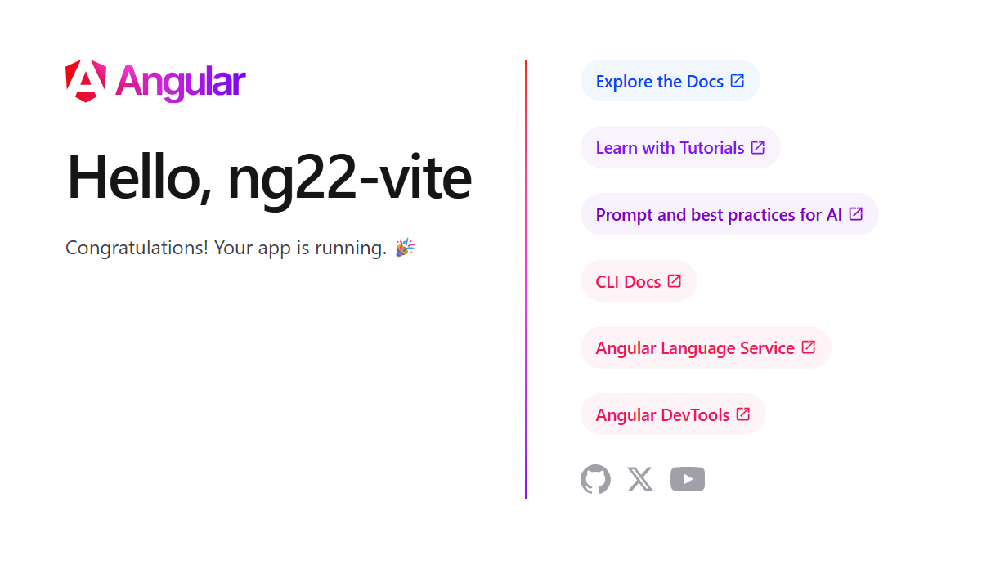

- [Entorno de Desarrollo](#entorno-de-desarrollo)
  - [Requisitos previos](#requisitos-previos)
    - [Node y su gestión de versiones](#node-y-su-gestión-de-versiones)
  - [CLI (Client Line Interface) de Angular](#cli-client-line-interface-de-angular)
- [Iniciando un proyecto en Angular](#iniciando-un-proyecto-en-angular)
  - [Creación del proyecto](#creación-del-proyecto)
    - [Workspace](#workspace)
    - [Dependencias](#dependencias)
    - [Proyecto de tipo aplicación](#proyecto-de-tipo-aplicación)
    - [Ajustes en la configuración de TypeScript](#ajustes-en-la-configuración-de-typescript)
  - [Incorporación de Linters](#incorporación-de-linters)
    - [ESLint](#eslint)
    - [Prettier](#prettier)
  - [Alternativa de creación del proyecto con Vite](#alternativa-de-creación-del-proyecto-con-vite)
  - [Scripts npm y Terminales](#scripts-npm-y-terminales)
- [Primera aproximación a Angular](#primera-aproximación-a-angular)
  - [Revisión del Scaffolding resultante](#revisión-del-scaffolding-resultante)
    - [El workspace](#el-workspace)
    - [El proyecto de tipo aplicación](#el-proyecto-de-tipo-aplicación)
  - [📕El proceso de arranque (bootstrap) de la aplicación](#el-proceso-de-arranque-bootstrap-de-la-aplicación)
  - [Revisión de las operaciones básicas con el CLI (1): scaffolding y server](#revisión-de-las-operaciones-básicas-con-el-cli-1-scaffolding-y-server)
    - [Development server](#development-server)
    - [Code scaffolding. El componente Sample](#code-scaffolding-el-componente-sample)
  - [📕COMPONENTE (PreView)](#componente-preview)
  - [Revisión de las operaciones básicas con el CLI (2): build y test](#revisión-de-las-operaciones-básicas-con-el-cli-2-build-y-test)
    - [Build](#build)
    - [_Running tests unitarios_](#running-tests-unitarios)
    - [_Running tests end-to-end_](#running-tests-end-to-end)
    - [Further help](#further-help)
- [Scaffolding del proyecto en Angular](#scaffolding-del-proyecto-en-angular)
  - [Scaffolding y Reubicación de app en nuestro proyecto](#scaffolding-y-reubicación-de-app-en-nuestro-proyecto)
    - [Reubicación de app](#reubicación-de-app)
  - [Elementos de CSS](#elementos-de-css)
  - [Variables CSS](#variables-css)
  - [Reset de estilos](#reset-de-estilos)

## Entorno de Desarrollo

### Requisitos previos

- [Node.js](https://nodejs.org/) (versión 20.19 o superior, según la [documentación oficial](https://angular.dev/installation))
- [npm](https://www.npmjs.com/) (gestor de paquetes de Node.js, incluido con Node.js) o similares como [Yarn](https://yarnpkg.com/) o [pnpm](https://pnpm.io/)
- Un editor de código ([Visual Studio Code](https://code.visualstudio.com/)) recomendado
- Un terminal o línea de comandos para ejecutar los comandos de Angular CLI
- Sus herramientas de desarrollo, recomendándose que incluya [Angular Language Service](https://angular.dev/tools/language-service)
- Extensión para las herramientas en el navegador: [Angular DevTools](https://angular.dev/tools/devtools) para depurar y analizar el rendimiento de las aplicaciones Angular
- [Git](https://git-scm.com/) (opcional, pero recomendado para el control de versiones)

#### Node y su gestión de versiones

Aunque la documentación oficial de Angular recomienda una versión mínima de Node.js, siempre que sea posible es recomendable usar la versión más reciente. En 2022 Node a anunciado que abandona la distinción entre versiones LTS (pares) y Current (impares), por lo que en nuestro caso vamos a user usar la última versión disponible, que en el momento de escribir este texto es la 26.3.0.

Dado que Angular tiene requisitos específicos de versión de Node.js, es recomendable usar una herramienta de gestión de versiones de Node.js como [nvm (POSIX)](https://github.com/nvm-sh/nvm) / [nvm-windows](https://github.com/coreybutler/nvm-windows). Otras alternativas son [Volta](https://volta.sh/) o [fnm](https://github.com/Schniz/fnm).

nvm recomienda desinstalar node, insstalar nvm y a partir de ese momento administrar con él las versionas de node

```shell
# instalar una versión específica de node
nvm install 26.3.0
# ver las versiones de node instaladas
nvm list
# usar una versión específica de node
nvm use 26.3.0
# establecer una versión por defecto de node
nvm alias default 26.3.0
``` 

### CLI (Client Line Interface) de Angular

Angular CLI es una herramienta de línea de comandos que facilita la creación, desarrollo y mantenimiento de aplicaciones Angular. Proporciona comandos para generar componentes, servicios, módulos y otros elementos de la aplicación, así como para ejecutar tareas comunes como pruebas, construcción y despliegue.

Para instalar o actualizar el Angular CLI, se puede usar el siguiente comando:

```shell
npm install -g @angular/cli
```

El atributo `-g` indica que se instalará de forma global, lo que permite usar el comando `ng` desde cualquier lugar en la terminal. Debido a este caracter global, es posible que se necesiten permisos de administrador para ejecutar este comando, dependiendo de la configuración del sistema. En Windows puede ser necesario ejecutar la terminal como administrador, mientras que en sistemas basados en Unix (Linux, macOS) se puede usar `sudo` para obtener los permisos necesarios.

Para comprobar que la instalación se ha realizado correctamente, se puede ejecutar:

```shell
ng version
```

El resultado debería ser algo similar a lo siguiente, mostrando la versión del Angular CLI, Node.js, el gestor de paquetes y el sistema operativo:

```shell
     _                      _                 ____ _     ___
    / \   _ __   __ _ _   _| | __ _ _ __     / ___| |   |_ _|
   / △ \ | '_ \ / _` | | | | |/ _` | '__|   | |   | |    | |
  / ___ \| | | | (_| | |_| | | (_| | |      | |___| |___ | |
 /_/   \_\_| |_|\__, |\__,_|_|\__,_|_|       \____|_____|___|
                |___/


Angular CLI       : 22.0.0
Node.js           : 26.3.0
Package Manager   : npm 11.16.0
Operating System  : win32 x64
```

Para conocer los comandos disponibles y su uso, se puede ejecutar:

```shell
ng help
```

- ng add <collection>            Adds support for an external library to your project.
- ng analytics                   Configures the gather- ng of Angular CLI usage metrics.
- ng build [project]             Compiles an Angular application or library into an output directory named dist/ at the given output path.             [aliases: b]
- ng cache                       Configure persistent disk cache and retrieve cache statistics.
- ng completion                  Set up Angular CLI autocompletion for your terminal.
- ng config [json-path] [value]  Retrieves or sets Angular configuration values in the angular.json file for the workspace.
- ng deploy [project]            Invokes the deploy builder for a specified project or for the default project in the workspace.
- ng e2e [project]               Builds and serves an Angular application, then runs end-to-end tests.                                                 [aliases: e]
- ng extract-i18n [project]      Extracts i18n messages from source code.
- ng generate                    Generates and/or modifies files based on a schematic.                                                                 [aliases: g]
- ng lint [project]              Runs lint- ng tools on Angular application code in a given project folder.
- ng new [name]                  Creates a new Angular workspace.                                                                                      [aliases: n]
- ng run <target>                Runs an Architect target with an optional custom builder configuration defined in your project.
- ng serve [project]             Builds and serves your application, rebuild- ng on file changes.                                                  [aliases: dev, s]
- ng test [project]              Runs unit tests in a project.                                                                                         [aliases: t]
- ng update [packages..]         Updates your workspace and its dependencies. See https://update.angular.dev/.
- ng version                     Outputs Angular CLI version.   

## Iniciando un proyecto en Angular

En esta primera parte

- veremos como crear un **workspace** de Angular e incluir en el un primer proyecto de tipo **aplicación**.
- incorporaremos ayudas a la programación como **ESLint** y **Prettier** correctamente configurado
- exploraremos el **scaffolding** del proyecto creado, para conocer sus principales elementos y como funciona una aplicación de Angular
- conoceremos las principales herramientas del **CLI** para
  - desarrollar (**ng serve**)
  - construir para producción (**ng build**)
  - testar nuestra aplicación (**ng test**)
- revisaremos el concepto de **componente standalone** en Angular y como el CLI nos ayuda a generarlos

### Creación del proyecto

#### Workspace

Generamos el proyecto con [Angular CLI](https://github.com/angular/angular-cli) version 22.0.0.

```shell
ng new ng22 --dry-run
ng new ng22 --create-application false --ai-config agents
```

El resultado es un workspace sin proyectos, con

- README inicial
- .gitignore con las exclusiones recomendadas para proyectos de Angular
- .editorconfig, .prettierrc con las configuraciones recomendadas del editor y de Prettier
- package.json con las dependencias necesarias para el desarrollo
- angular.json con la configuración del workspace
- tsconfig.json con la configuración de TypeScript para el workspace
- .vscode con las configuraciones de extensiones, launch y tasks
- AGENTS.md con la configuración de los agentes de IA para el desarrollo de la aplicación

El terminal nos muestra la creación de todos estos ficheros

```shell
CREATE ng22/.prettierrc (173 bytes)
CREATE ng22/angular.json (193 bytes)
CREATE ng22/package.json (729 bytes)
CREATE ng22/README.md (1516 bytes)
CREATE ng22/tsconfig.json (810 bytes)
CREATE ng22/.editorconfig (331 bytes)
CREATE ng22/.gitignore (666 bytes)
CREATE ng22/AGENTS.md (2249 bytes)
CREATE ng22/.vscode/extensions.json (134 bytes)
CREATE ng22/.vscode/launch.json (490 bytes)
CREATE ng22/.vscode/mcp.json (188 bytes)
CREATE ng22/.vscode/tasks.json (1020 bytes)
```

#### Dependencias

Las dependencias instaladas son las siguientes

- @angular/cli con el CLI de Angular
- @angular/... con los módulos de Angular (common, compiler, core, forms, platform-browser, router)
- typescript con el compilador de TypeScript
- rxjs con la librería de programación reactiva

```shell
npm list --depth=0
ng22@0.0.0 C:\...\ng22
├── @angular/build@22.0.0
├── @angular/cli@22.0.0
├── @angular/common@22.0.0
├── @angular/compiler-cli@22.0.0
├── @angular/compiler@22.0.0
├── @angular/core@22.0.0
├── @angular/forms@22.0.0
├── @angular/platform-browser@22.0.0
├── @angular/router@22.0.0
├── prettier@3.8.3
├── rxjs@7.8.2
├── tslib@2.8.1
└── typescript@6.0.3
```

La versión de **TypeScript** instalada a pasado a ser la 6.0.x, la última versión disponible al publicarse Angular 22, lo que permite usar las nuevas características de esta versión, como 

- el modo estricto por defecto
- Soporte para ES2025, incluyendo el tipado de Temporal
- la limpieza de palabras clave obsoletos

Esta versión sirve como puente para aligerar la carga técnica antes de la llegada de TypeScript 7.0 (reescrito de forma nativa en Go para aumentar la velocidad).

La versión de **RxJS** instalada es la 7.8.2, que es la última versión disponible al publicarse Angular 22, y que incluye mejoras de rendimiento y nuevas características.

Es importante destacar que el papel de RxJS en Angular es progresivamente menor, conforme se an ido incorporando signals en diferentes partes del framework.

#### Proyecto de tipo aplicación

En un workspace de Angular, se pueden añadir proyectos , cada uno con su propio proceso de arranque (bootstrap) y su propia configuración, de 2 tipos 

- aplicación: un proyecto que genera una aplicación ejecutable, con su interface en HTML. Es el tipo de proyecto más común en Angular, y es el que vamos a usar en este curso para desarrollar nuestras aplicaciones.
- librería: un proyecto que genera una librería de Angular, con funciones disponibles para ser utilizadas en otras aplicaciones. Es un tipo de proyecto menos común, pero puede ser útil para compartir código entre varias aplicaciones o para crear componentes reutilizables.

Al añadir un proyecto de tipo aplicación podemos indicar diversas opciones:

- el nombre del proyecto
- el estilo de los componentes (css, tailwind, scss, sass, less)
- si queremos que tenga soporte para server-side rendering (SSR)

Y modificar algunas de las opciones por defecto, 

- el prefijo de los componentes (por defecto "app")
- el uso de un único fichero que incluya el template y los estilos (por defecto ficheros diferentes),

O mantener los valores por defecto de otras opciones

- proyecto de tipo standalone, zoneless
- configuración de routing
- configuración de testing 
- guía de estilo actual en el nombrado de archivos y elementos de Angular


```shell
cd ng22
ng g app --dry-run
ng g app demo1 --style css --ssr false -p alc -t -s  
```

De esta forma, creamos el proyecto seleccionando las opciones

- estilo CSS (`--style css`)
- sin SSR (`--ssr false`)
- prefijo de selector (`p alc`)
- template inline (`-t`)
- estilos inline (`-s`) 

El resultado es un proyecto en la carpeta projects y la actualización de los ficheros package.json, angular.json y tsconfig.json para incluir la configuración del nuevo proyecto tal y como se muestra en el terminal.

```shell
CREATE projects/demo1/src/app/app.spec.ts (695 bytes)
CREATE projects/demo1/src/app/app.ts (340 bytes)
CREATE projects/demo1/src/app/app.config.ts (324 bytes)
CREATE projects/demo1/src/app/app.routes.ts (80 bytes)

CREATE projects/demo1/src/main.ts (228 bytes)
CREATE projects/demo1/src/index.html (304 bytes)
CREATE projects/demo1/src/styles.css (81 bytes)

CREATE projects/demo1/public/favicon.ico (15086 bytes)
CREATE projects/demo1/tsconfig.app.json (452 bytes)
CREATE projects/demo1/tsconfig.spec.json (464 bytes)

UPDATE angular.json (2216 bytes)
UPDATE tsconfig.json (969 bytes)
UPDATE package.json (780 bytes)
```

La actualización de package.json incluye la adición de las dependencias necesarias para poder ejecutar los tests unitarios con Vitest, que es el framework de testing incorporado en Angular 21, y que es el que se usará en este curso.

```shell
npm list --depth=0
ng22@0.0.0 C:\...\ng22
├── ...
├── jsdom@28.1.0 (actualizaremos a jsdom@29.1.1)
└── vitest@4.1.8
```

#### Ajustes en la configuración de TypeScript

En el momento de escribir este documento, con Angular 22.0.0, la configuración de TypeScript en el tsconfig.json de la carpeta src tiene un pequeño error de configuración, necesitando que se añada un `rootDir` para que el compilador de TypeScript pueda encontrar correctamente los ficheros fuente del proyecto.

```json src/tsconfig.json & src/tsconfig.spec.json
{
  "compilerOptions": {
    "rootDir": "./src"
  }
}
```

Además el Angular Language service recomienda que se añada la opción `strictTemplates` a true

```json /tsconfig.json
{
  "angularCompilerOptions": {
    //...
    "strictTemplates": true
  }
}
```

### Incorporación de Linters

#### ESLint

Aunque hace ya muchas versiones Angular dejo de instalar automáticamente un linter en los proyectos, conserva el comando `ng lint` que, cuando se ejecuta por primera vez, nos ofrece la posibilidad de instalar un linter en el proyecto.

```shell
Cannot find "lint" target for the specified project.
You can add a package that implements these capabilities.

For example:
  ESLint: ng add angular-eslint

 Would you like to add ESLint now? (Y/n)
 ```

Una alternativa es que nosotros ejecutemos directamente el comando `ng add`, que permite añadir al proyecto soporte para una librería externa que cuente con schematics, es decir los scripts necesarios para incorporar al proyecto tanto las dependencias como la configuración necesaria para que funcione correctamente.

En caso del ESLint en su versión para Angular, estos schematics se encuentran en el paquete `@angular-eslint/schematics`, por lo que podemos ejecutar el siguiente comando para añadir soporte para ESLint en nuestro proyecto de Angular

```shell
ng add @angular-eslint/schematics
```

El resultado será el siguiente

```shell
CREATE .eslintrc.json
CREATE projects/demo1/.eslintrc.json
UPDATE package.json
UPDATE angular.json
```

La actualización de package.json incluye la adición de las dependencias necesarias en el package.json junto con un script para ejecutar ESLint en el proyecto.

```shell
npm list --depth=0
ng22@0.0.0 C:\...\ng22
├── ...
├── angular-eslint@20.7.0
├── eslint@9.39.4
└── typescript-eslint@8.46.4
```

Nada más aparecer la nueva versión de Angular, las dependencias añadidas por el schematic de @angular-eslint no son las mas recientes, y dan algunos problemas, e.g. con la versión 6.0 de TypeScript, por lo que es recomendable actualizar a las últimas versiones de estas dependencias.

Una forma fácil de hacerlo es mediante la extensión de VSC **Version Lens**, que nos muestra las últimas versiones disponibles de las dependencias en el package.json, y nos permite actualizarlas fácilmente desde el editor.

El resultado sería


```shell
npm list --depth=0
ng22@0.0.0 C:\...\ng22
├── ...
├── angular-eslint@22.0.0
├── eslint@10.4.1
└── typescript-eslint@8.60.1
```

Lo más habitual es tener en VSC la extensión de ESLint instalada, para que nos muestre los errores de linting en el editor, sin necesidad de ejecutar el script de linting desde la terminal. Aun asi este script es útil para ejecutar el linting de forma manual, por ejemplo en un hook de pre-commit, configurado con herramientas como Husky, o en una GitHub action. 


#### Prettier

Hasta hace poco, para que la extensión de Prettier en VSC utilice la última versión de Prettier, capaz de formatear correctamente las nuevas estructuras de control de flujo de Angular, había que instalarla como dependencia (de desarrollo) del proyecto

```shell
  npm i -D prettier
```

Para evitar estos problemas, en la versión 22 de Angular se incluye la instalación de Prettier como dependencia en el package.json.

Además es necesario que el formateador de HTML definido en los settings de VSC sea Prettier

```json
 "[html]": {
    // "editor.defaultFormatter": "vscode.html-language-features",
    "editor.defaultFormatter": "esbenp.prettier-vscode",
    "files.insertFinalNewline": true
  },
```

### Alternativa de creación del proyecto con Vite

Otra alternativa para crear un proyecto de Angular es usar directamente Vite, que es el bundler y dev server utilizado por Angular desde hace algunas versiones, por lo que también tiene soporte para Angular. Para ello se puede usar el siguiente comando:

```shell
npm create vite@latest ng22-vite -- --template angular
```

O el comando sin indicar el template y seleccionando Angular entre las opciones disponibles

```shell
npm create vite@latest ng22-vite
```

El resultado (si elegimos Angular sin Analog) es exactamente el mismo que si usamos el CLI de Angular con el comando `ng new` con las opciones por defecto, es decir, un workspace con un proyecto de tipo aplicación llamado ng22-vite, con la configuración y el scaffolding correspondiente.

Además, es estos casos (angular CLI default o vite) aparece un ejemplo de aplicación de Angular



### Scripts npm y Terminales

Al tener varios proyectos (aplicaciones, librerías) con sus terminales para ejecutar

- el build de desarrollo (npm start -- --project ...)
- los test (npm test -- --project ...)

puede ser util ir creando nuevos scrips en npm

Otra opción es guardar los terminales con los comandos que ejecutan,
gracias a la extensión de VSC **Restore Terminals**

Las configuraciones de esta extensión se almacenan en los settings del workspace
(.vscode/setting.json)

## Primera aproximación a Angular

### Revisión del Scaffolding resultante

#### El workspace

Gitignore, Editorconfig y README inicial

- ng22/.editorconfig (274 bytes)
- ng22/.gitignore (548 bytes)
- ng22/README.md (1065 bytes)

Fichero de VSC

- ng22/.vscode/extensions.json (130 bytes)
- ng22/.vscode/launch.json (470 bytes)
- ng22/.vscode/tasks.json (938 bytes)

Ficheros de configuración

- .eslintrc.json (993 bytes)
- ng22/package.json (996 bytes)
- ng22/tsconfig.json (903 bytes)
- ng22/angular.json (139 bytes)

#### El proyecto de tipo aplicación

Ficheros de configuración actualizados

- UPDATE angular.json (2992 bytes)
- UPDATE package.json (1044 bytes)

La carpeta del proyecto: Ficheros de configuración

- projects/demo/tsconfig.app.json (285 bytes)
- projects/demo/tsconfig.spec.json (295 bytes)
- projects/demo/.eslintrc.json (647 bytes)

La carpeta sources (src): Ficheros globales en la raíz del proyecto

- projects/demo/src/main.ts (256 bytes)
- projects/demo/src/favicon.ico (15086 bytes)
- projects/demo/src/index.html (308 bytes)
- projects/demo/src/styles.scss (81 bytes)

La carpeta app: configuración del bootstrap y las rutas

- projects/demo/src/app/app.config.ts (235 bytes)
- projects/demo/src/app/app.routes.ts (80 bytes)

La carpeta app: el componente principal (app)

- projects/demo/src/app/app.component.html (21220 bytes)
- projects/demo/src/app/app.component.spec.ts (951 bytes)
- projects/demo/src/app/app.component.ts (382 bytes)
- projects/demo/src/app/app.component.scss (0 bytes)

### 📕El proceso de arranque (bootstrap) de la aplicación

En projects/demo/src/ están los ficheros responsables de que exista la aplicación

```schema
index.html + styles.scss
   (definido en angular.json)
          ┕━━━━━━━> main.ts
                    (bootstrap with)
                      ┝━━━━━━━>  app.config.ts
                      ┃                ┕━━━━━━━> rutas desde app.routes.ts
                      ┕━━━━━━━> app.component.ts
                                       ┝━━━━━━━━> app.component.html
                                       ┕━━━━━━━━> app.component.scss
```

### Revisión de las operaciones básicas con el CLI (1): scaffolding y server

#### Development server

> Ejecuta `ng serve` para iniciar un servidor de desarrollo. Navega a `http://localhost:4200/`.

Se pueden añadir diversos parámetros, por ejemplo para definir el puerto

```shell
ng serve --port 4300
```

Estando activo ng serve comprobamos como se refleja un cambio e.g. el valor del titulo almacenado en app.component. La aplicación se recargará automáticamente si modificas alguno de los archivos fuente.

#### Code scaffolding. El componente Sample

> Ejecuta `ng generate component component-name` para generar un nuevo componente.
> También puedes usar `ng generate directive|pipe|service|class|guard|interface|enum|module`.

Vemos como se generaría un componente sample en la carpeta components (también se generara)

```shell
ng g c components/sample --dry-run
```

### 📕COMPONENTE (PreView)

En AppComponent tenemos un componente Angular formado por

- Clase + decorador
  - selector
  - template (html + elementos de Angular)
  - estilos (css, scss, sass...)

En la extensión de las developer tools de Chrome, con Angular DevTools, podemos ver la estructura de componentes de la aplicación, y como se refleja el cambio que hemos hecho en el título del componente.

### Revisión de las operaciones básicas con el CLI (2): build y test

#### Build

> Ejecuta `ng build` para construir el proyecto. Los artefactos de la construcción se almacenarán en el directorio `dist/`.

Se crea la carpeta dist/demo/browser

favicon.ico
index.html

Los resultados de la compilación por parte de esbuild

main-FMCIX442.js | main | 191.64 kB | 52.66 kB
polyfills-RX4V3J3S.js | polyfills | 33.01 kB | 10.68 kB
styles-5INURTSO.css | styles | 0 bytes | 0 bytes

Este contenido es el que aparecerá en el server donde hagamos es despliegue de la aplicación (Vercel, Netlify...)

Podemos probarlo localmente, e.g. con LiveServer desde linea de comandos, si lo tenemos instalado global

```shell
npm list -g
npm i -g live-server
```

#### _Running tests unitarios_

Run `ng test` to execute the unit tests via [Vitest](https://vitest.dev/).

El test de componente fallará si hemos cambiado un valor en una propiedad sin reflejarlo en el test.
Lo corregimos y observamos la estructura de los test

El test del ejemplo ya nos muestra los **dos niveles de test**

- las propiedades del componente como clase (caja blanca)
- los elementos y comportamientos del template (caja negra: orientación UX)

Cambiamos la forma de esta última orientación sustituyendo querySelector de elemento HTML
por el debugElement de testing y sus propios métodos

```ts
// const compiled = fixture.nativeElement as HTMLElement;
// const elementH1 = compiled.querySelector('h1') as HTMLHeadingElement
const debugElement = fixture.debugElement;
const elementH1 = debugElement.query(By.css("h1"))
  .nativeElement as HTMLHeadingElement;
expect(elementH1.textContent).toContain("demo");
```

Con los cambios hechos y los test en verde, podemos hacer un **commit**

#### _Running tests end-to-end_

Ejecuta `ng e2e` para ejecutar las pruebas end-to-end. Angular CLI no incluye un framework de testing end-to-end por defecto. Puedes elegir el que mejor se adapte a tus necesidades.

```shell
ng e2e
```

La respuesta es la siguiente

```shell
Cannot find "e2e" target for the specified project.
You can add a package that implements these capabilities.

For example:
  Playwright: ng add playwright-ng-schematics
  Cypress: ng add @cypress/schematic
  Nightwatch: ng add @nightwatch/schematics
  WebdriverIO: ng add @wdio/schematics
  Puppeteer: ng add @puppeteer/ng-schematics

Would you like to add a package with "e2e" capabilities now?
  No
❯  Playwright
  Cypress
  Nightwatch
  WebdriverIO
  Puppeteer
```

Instalamos Playwright seleccionando la opción correspondiente

Se modifican los siguientes ficheros

- .gitignore
- angular.json
- package.json

Se añaden

- playwright.config.ts
- e2e/example.spec.ts

#### Further help

Para obtener más ayuda sobre Angular CLI usa `ng help` o consulta la página de [Descripción General y Referencia de Comandos de Angular CLI](https://angular.io/cli).

## Scaffolding del proyecto en Angular

En general, en cualquier proyecto Web basado en componentes podemos distinguir dos enfoques principales para organizar el código y los archivos del proyecto:

- **Enfoque basado en tipos de archivos**: En este enfoque, los archivos se organizan según su tipo (componentes, servicios, módulos, etc.). Por ejemplo, podríamos tener las siguientes carpetas separadas:
  - src
    - app
      -  componentes
      -  servicios
      -  interfaces
      -  módulos (si no usamos el enfoque standalone) 
      -  assets (imágenes, estilos, etc.)

Este enfoque puede ser útil para proyectos pequeños o cuando se desea una separación clara entre diferentes tipos de archivos.

- **Enfoque basado en características (features) o dominios**: En este enfoque, los archivos se organizan según las características o dominios de la aplicación. Por ejemplo, podríamos tener carpetas para cada característica principal de la aplicación
  - src
    - app
      - core (elementos comunes a toda la aplicación, como servicios de autenticación, interceptores, etc.)
      - usuarios
      - productos
      - pedidos

Dentro de cada carpeta tendríamos los componentes, servicios y módulos relacionados con esa característica. Según la cantidad de estos, podríamos incluso crear subcarpetas para cada tipo de archivo dentro de la carpeta de la característica. 

En algunos casos, para recalcar la separación entre el core y las características, pueden agruparse todas estas en una carpeta

  - src
    - app
      - core (elementos comunes a toda la aplicación, como servicios de autenticación, interceptores, etc.)
      - features
        - usuarios
        - productos
        - pedidos

Este enfoque puede ser más escalable y facilitar la navegación en proyectos grandes, ya que agrupa todo lo relacionado con una característica en un solo lugar. Entre otras versiones, suele relacionarse este enfoque con la arquitectura **Vertical Slice** o incluso con el **Domain-Driven Design (DDD)**.

### Scaffolding y Reubicación de app en nuestro proyecto

Utilizando un **enfoque basado en características (features) o dominios**, los archivos se organizan según las características o dominios de la aplicación.  

Se crean carpetas para cada característica principal de la aplicación y para recalcar la separación entre el core y las características, 
se agrupan todas las últimas en una carpeta

  - src
    - app
      - core (elementos comunes a toda la aplicación)
      - features
        - usuarios
        - productos
        - pedidos

Dentro de cada carpeta tendríamos los componentes, servicios, tipos o modelos y otros elementos relacionados con esa característica, agrupados en subcarpetas para cada tipo de archivo dentro de la carpeta de la característica. 

 - src
    - app
      - core 
        - components
        - services
        - types

Este enfoque puede ser más escalable y facilitar la navegación en proyectos grandes, ya que agrupa todo lo relacionado con una característica en un solo lugar. Entre otras versiones, suele relacionarse este enfoque con la arquitectura **Vertical Slice** o incluso con el **Domain-Driven Design (DDD)**.

#### Reubicación de app

Se reubica el componente raíz `App` a `core/components/app` para que sirva como contenedor principal de la aplicación, manteniendo el mismo scaffolding que el resto de los componentes del core


- sin componentes
- layout inicial y estilos

```ts

@Component({
  selector: 'alc-root',
  imports: [RouterOutlet],
  template: `
    <header>header</header>
    <main class="container">
      <router-outlet />
      <p>Este es un proyecto de demostración de Angular 22</p>
    </main>
    <footer>footer</footer>
  `,
  styles: `
    :host {
      display: grid;
      grid-template-rows: auto 1fr auto;
      min-height: 100vh;
      font-family: Arial, sans-serif;
      margin: 0;
      padding: 0;
    }
    main.container {
      padding: 1rem 2rem;
      width: 100%;
      min-height: 90%;
      display: flex;
      flex-direction: column;
      justify-content: center;
      align-items: center;
      padding: 1rem;
      position: relative;
    }
    @media (width > 600px) {
      .wide {
        align-self: stretch;
        margin-inline: 5rem;
      }
    }
  `,
})
export class App {}
```

Los estilos definen un grid de 3 filas, para el header, el main y el footer, y un main con display flex para centrar su contenido. Además se define una media query para que los elementos con clase `wide` se estiren a lo ancho de la pantalla a partir de un ancho de 600px.


### Elementos de CSS

Entre los ficheros iniciales del proyecto, se encuentra un styles.css, que es el punto de entrada de los estilos globales de la aplicación. En este fichero se pueden importar otros ficheros de estilos, como variables, mixins, etc.  

Este es el sitio recomendado para definir los estilos globales de la aplicación, como por ejemplo las 

- las variables CSS para los colores 
- las variables CSS para la tipografía (fuentes) 
- el reset de los elementos principales: *, html, body, p
- estilos comunes a toda la aplicación, como por ejemplo el estilo de los botones, formularios

Por ejemplo, partiendo de la aplicación demo creada con el CLI (sin separar workspace y primer proyecto), podríamos extraer los estilos globales a styles.css

### Variables CSS

Las variables se utilizan en toda la aplicación para mantener la consistencia visual.

Las variables CSS para los colores definen 

- una paleta de colores para el tema claro
- una paleta de colores para el tema oscuro
- una paleta final valida para ambos temas, usando la función light-dark()

Las variables CSS para tipografía definen las fuentes ba´sca y para los título

Se instalan las fuentes necesarias para la aplicación, en este caso las fuentes `Inter`
y `Inter Tight`.

```html
<link rel="preconnect" href="https://fonts.googleapis.com">
<link rel="preconnect" href="https://fonts.gstatic.com" crossorigin>
<link href="https://fonts.googleapis.com/css2?family=Inter+Tight:ital,wght@0,100..900;1,100..900&family=Inter:ital,opsz,wght@0,14..32,100..900;1,14..32,100..900&display=swap" rel="stylesheet">
```

Alternativamente podrían instalarse las fuentes localmente mediante [Fontsource](https://fontsource.org/docs/getting-started/install), utilizando el comando:

```shell
npm install @fontsource/inter @fontsource/inter-tight
```

El resultado de la definición de las variables CSS para los colores y la tipografía es el siguiente:

```css styles.css
:root {
  --electric-violet: oklch(53.18% 0.28 296.97);
  --french-violet: oklch(47.66% 0.246 305.88);
  --vivid-pink: oklch(69.02% 0.277 332.77);

  --bright-blue: oklch(51.01% 0.274 263.83);
  --hot-red: oklch(61.42% 0.238 15.34);
  --orange-red: oklch(63.32% 0.24 31.68);

  --gray-900: oklch(19.37% 0.006 300.98);
  --gray-700: oklch(36.98% 0.014 302.71);
  --gray-400: oklch(70.9% 0.015 304.04);
  --gray-100: oklch(95.11% 0.006 301.97);
  --gray-50: oklch(98.93% 0.003 301.97);

  --color-text-light: var(--gray-900);
  --color-background-light: var(--gray-50);
  --color-background-primary-light: var(--gray-100);

  /* Brand colors */
  --color-primary-light: var(--electric-violet);
  --color-primary-hot-light: var(--french-violet);
  --color-secondary-light: var(--vivid-pink);

  /* otros colores secundarios */
  --color-accent-light: var(--bright-blue);
  --color-tertiary-light: var(--orange-red);
  --color-tertiary-hot-light: var(--hot-red);

  /* Dark Theme */
  --color-text-dark: var(--gray-100);
  --color-background-dark: var(--gray-700);
  --color-background-primary-dark: var(--gray-900);

  /* Brand colors */
  --color-primary-dark: var(--electric-violet);
  --color-primary-hot-dark: var(--french-violet);
  --color-secondary-dark: var(--vivid-pink);

  /* otros colores secundarios */
  --color-accent-dark: var(--bright-blue);
  --color-tertiary-dark: var(--orange-red);
  --color-tertiary-hot-dark: var(--hot-red);

  /* Apply theme variables */
  --color-text: light-dark(var(--color-text-light), var(--color-text-dark));
  --color-background: light-dark(var(--color-background-light), var(--color-background-dark));
  --color-background-primary: light-dark(
    var(--color-background-primary-light),
    var(--color-background-primary-dark)
  );
  --color-primary: light-dark(var(--color-primary-light), var(--color-primary-dark));
  --color-primary-hot: light-dark(var(--color-primary-hot-light), var(--color-primary-hot-dark));
  --color-secondary: light-dark(var(--color-secondary-light), var(--color-secondary-dark));
  --color-accent: light-dark(var(--color-accent-light), var(--color-accent-dark));
  --color-tertiary: light-dark(var(--color-tertiary-light), var(--color-tertiary-dark));
  --color-tertiary-hot: light-dark(var(--color-tertiary-hot-light), var(--color-tertiary-hot-dark));

  --red-to-pink-to-purple-vertical-gradient: linear-gradient(
    180deg,
    var(--orange-red) 0%,
    var(--vivid-pink) 50%,
    var(--electric-violet) 100%
  );

  --red-to-pink-to-purple-horizontal-gradient: linear-gradient(
    90deg,
    var(--orange-red) 0%,
    var(--vivid-pink) 50%,
    var(--electric-violet) 100%
  );

  --pill-accent: var(--bright-blue);
}

:root {
  --fontfamily:
    'Inter', -apple-system, BlinkMacSystemFont, 'Segoe UI', Roboto, Helvetica, Arial, sans-serif,
    'Apple Color Emoji', 'Segoe UI Emoji', 'Segoe UI Symbol';

  --font-family-heading:
    'Inter Tight', -apple-system, BlinkMacSystemFont, 'Segoe UI', Roboto, Helvetica, Arial,
    sans-serif, 'Apple Color Emoji', 'Segoe UI Emoji', 'Segoe UI Symbol';
}
```

### Reset de estilos

- en todos los elementos se aplican box-sizing: border-box para facilitar el manejo de los tamaños y márgenes.

- en el elemento html se establece 
  - la fuente base
  - la altura del elemento, para que la hereda el body
  - el tema claro por defecto.
  - usando :has(#theme-toggle:checked) se cambia al tema oscuro cuando el toggle de cambio de tema está activado.

- en el body se establece la altura para que ocupe toda la pantalla, se eliminan los márgenes y se establece un fondo y un color para el texto usando las variables CSS definidas para el tema.

- en los párrafos se elimina el margen


```css styles.css

*, *::before, *::after {
  box-sizing: border-box;
}

html {
  font-family: var(--font-family);
  -webkit-font-smoothing: antialiased;
  -moz-osx-font-smoothing: grayscale;
  height: 100dvh;
  color-scheme: light dark;
}

html:has(#theme-toggle:checked) {
  color-scheme: dark;
}

body {
  margin: 0;
  padding: 0;
  width: 100%;
  min-width: 560px;
  height: 100%;
  color: var(--color-text);
  background-color: var(--color-background);
}

p {
  margin: 0;
}
```