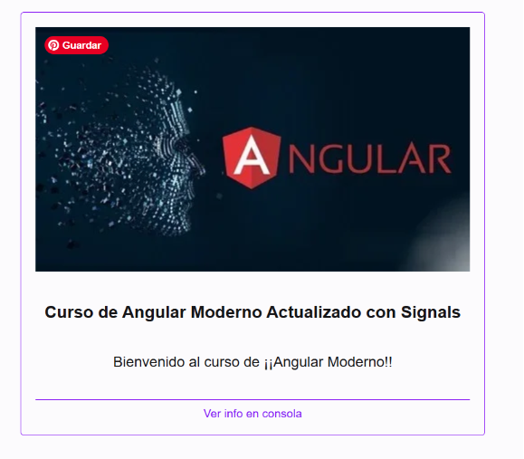
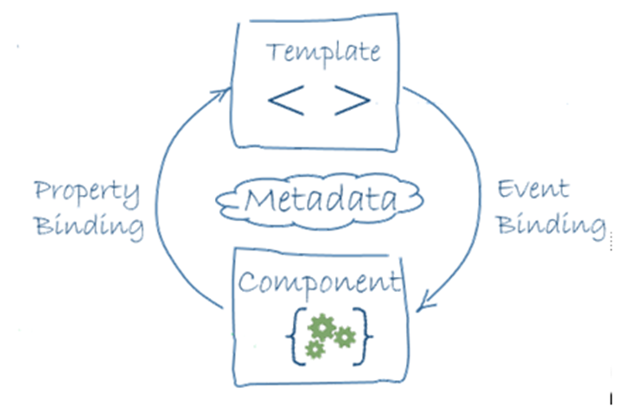
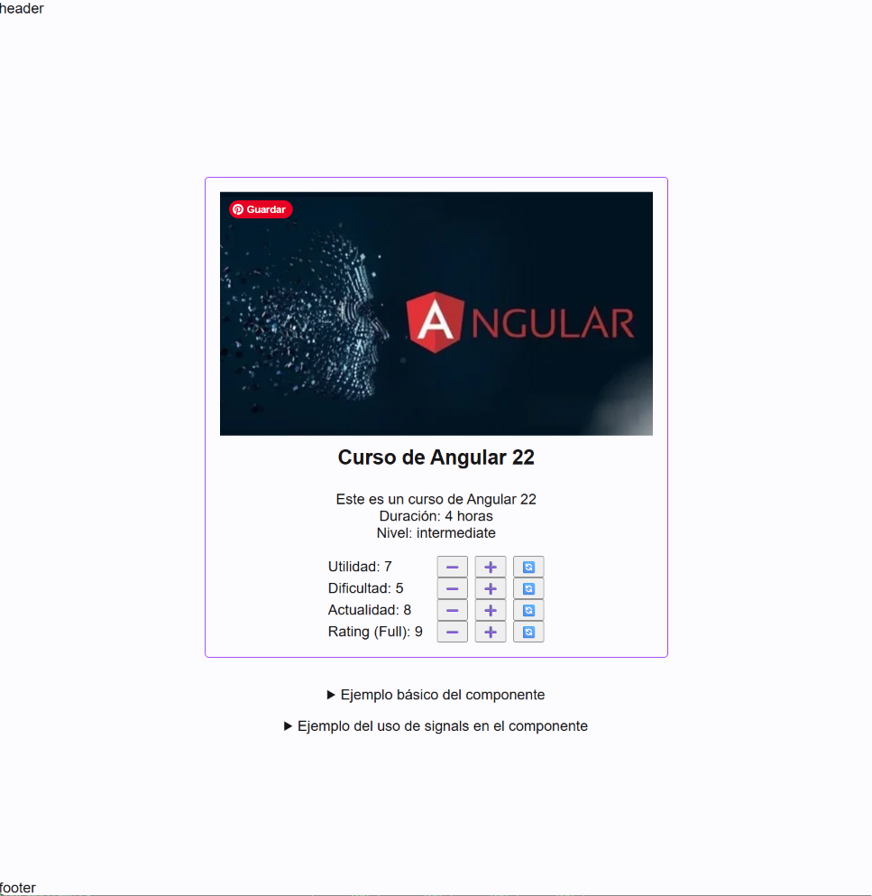

- [📕Introducción](#introducción)
  - [¿Qué es un Componente?](#qué-es-un-componente)
  - [Creación de un Componente](#creación-de-un-componente)
- [Feature Course: Los componentes en Angular](#feature-course-los-componentes-en-angular)
  - [Interface y datos de ejemplo (mock)](#interface-y-datos-de-ejemplo-mock)
  - [Almacenamiento de imágenes en Angular](#almacenamiento-de-imágenes-en-angular)
  - [🧿Componente `CourseItem` inicial](#componente-courseitem-inicial)
  - [📕Elementos básicos de los componentes](#elementos-básicos-de-los-componentes)
    - [Decorador @Component](#decorador-component)
    - [Selector](#selector)
    - [Plantillas (templates)](#plantillas-templates)
      - [El template del componente `CourseItem`](#el-template-del-componente-courseitem)
      - [Opción (ver aquí eventos)](#opción-ver-aquí-eventos)
    - [Lenguaje de plantillas](#lenguaje-de-plantillas)
    - [Estilos (styles)](#estilos-styles)
- [Lógica del componente (1)](#lógica-del-componente-1)
  - [📕Lógica del componente: Signals](#lógica-del-componente-signals)
    - [Signals en el componente](#signals-en-el-componente)
    - [Importancia de las signals en Angular Moderno](#importancia-de-las-signals-en-angular-moderno)
  - [🧿Componente `CourseItemSignals`](#componente-courseitemsignals)
- [Testing de Componentes](#testing-de-componentes)
  - [Tests unitarios en Angular con Vitest](#tests-unitarios-en-angular-con-vitest)
    - [Configuración del entorno de test](#configuración-del-entorno-de-test)
    - [📕Vitest y elementos básicos de los test unitarios](#vitest-y-elementos-básicos-de-los-test-unitarios)
    - [📕Angular Testing Utilities](#angular-testing-utilities)
      - [TestBed](#testbed)
      - [ComponentFixture](#componentfixture)
      - [DebugElement](#debugelement)
  - [Tests básicos](#tests-básicos)
    - [👁️‍🗨️Test del componente CourseItem](#️️test-del-componente-courseitem)
    - [Test por defecto con Angular CLI](#test-por-defecto-con-angular-cli)
    - [👁️‍🗨️Test del componente App](#️️test-del-componente-app)
  - [📕Coverage (Cobertura de código) y diseño de casos de prueba](#coverage-cobertura-de-código-y-diseño-de-casos-de-prueba)
  - [Tests y asincronía](#tests-y-asincronía)
    - [👁️‍🗨️Test del componente CourseItemSignals. Asincronías y FakeAsync](#️️test-del-componente-courseitemsignals-asincronías-y-fakeasync)
- [Lógica del componente (2)](#lógica-del-componente-2)
  - [📕Binding del componente y su vista](#binding-del-componente-y-su-vista)
    - [Data Binding y Event Binding](#data-binding-y-event-binding)
  - [🧿Componente `CourseItemPro` más completo: botones y eventos](#componente-courseitempro-más-completo-botones-y-eventos)
    - [Botones en el template](#botones-en-el-template)
    - [Respuesta a eventos](#respuesta-a-eventos)
    - [Componentes CourseItem(s) en App](#componentes-courseitems-en-app)
  - [📕Computed signal](#computed-signal)
  - [🧿Componente `CourseItemPro`: computed signal](#componente-courseitempro-computed-signal)
  - [👁️‍🗨️Test del componente CourseItemPro. Eventos](#️️test-del-componente-courseitempro-eventos)


## 📕Introducción

En esta segunda parte veremos inicialmente

- las principales funcionalidades de los **componentes**
  - la clase ES y su template
  - el estado y el binding con el template
  - los eventos
  - los nuevos elementos de 'control flow' de Angular 17
  - los estilos CSS
- la creación de proyectos de tipo **librería**
- la **proyección de contenidos** el los componentes
- comenzaremos el tema del **testing** completando los tests de todos los componentes creados hasta ahora
- el cambió de modelo zoned a zoneless
- la importancia de las **Signals** en el nuevo modelo de Angular

### ¿Qué es un Componente?

Un Componente en Angular es una pieza fundamental de la arquitectura de una aplicación Angular. Es una clase que controla una parte específica de la interfaz de usuario (UI) y define cómo se ve y cómo se comporta esa parte. Cada componente está compuesto por tres elementos principales:

1. **Clase TypeScript**: Define la lógica del componente, incluyendo propiedades y métodos que manejan el comportamiento del componente.
2. **Plantilla HTML**: Define la estructura y el contenido visual del componente.
3. **Estilos CSS**: Define la apariencia visual del componente, como colores, fuentes y diseño.

Estas tres partes pueden estar en archivos separados o combinadas en un solo archivo. En la reciente [guía de estilo de Angular](https://angular.dev/style-guide) solo se indica que:

> Components typically consist of one TypeScript file, one template file, and one style file.

Ha dejado de ser obligatorio extraer la plantilla a un archivo HTML si tu componente crece más de tres líneas. Queda abierta a la decisión del desarrollador usar inline template, single-file components (inline templates y styles) o plantillas separadas.

En la guía de estilos se recomienda que los nombres de los componentes ya NO sigan el patrón `nombre-componente.component.ts`, `nombre-componente.component.html` y `nombre-componente.component.css`. Los sufijos “service”, “component”, etc. se consideran redundantes y se recomienda usar nombres más simples como `nombre.ts`, `nombre.html` y `nombre.css`.

Sólo en **módulos** (que no usaremos) y en **pipes** (que veremos más adelante) se recomienda mantener el sufijo para facilitar la identificación del tipo de archivo.

### Creación de un Componente 

Para crear un componente en Angular, se puede utilizar la Angular CLI, que es una herramienta de línea de comandos que facilita la creación y gestión de proyectos Angular. El comando para crear un nuevo componente es:

```bash
ng generate component nombre-del-componente
```

Este comando genera automáticamente los archivos necesarios para el componente. Al menos la clase TypeScript y dependiendo de la configuración del proyecto, puede incluir, la plantilla HTML, los estilos CSS y un archivo de pruebas unitarias.

Esta distribución puede modificarse con las opciones que admite el comando `ng generate component`, como `--inline-template` (`-t`) o `--inline-style` (`-s`) o true o false para incluir o no la plantilla y los estilos en línea dentro del archivo TypeScript del componente.

Igualmente la opción `--skip-tests` (`-S`) permite omitir la creación del archivo de pruebas unitarias.

## Feature Course: Los componentes en Angular

Para reaprovecharlo más adelante, crearemos los siguientes elementos en la `feature course`

- interface `Course` y `CourseStats` 
- datos de ejemplo (mock) para un curso
- componente `CourseItem`

### Interface y datos de ejemplo (mock)

Definimos los elementos que representan un curso, con su interface que creamos en `features/course/types/course.ts`. Enn el caso de los interfaces, prescindimos del Angular CLI, que únicamente crea el fichero con el interface vacío y lo creamos directamente con el contenido, que incluye la interface `Course` y la interface `CourseStats` para los datos de estadísticas del curso.

```ts
export interface Course {
  id: number;
  title: string;
  description: string;
  duration: string;
  level: "beginner" | "intermediate" | "advanced";
  image: string;
  courseStats: CourseStats;
}

export interface CourseStats {
  difficulty: number;
  actualization: number;
  utility: number;
}
```
Añadimos un array de datos de ejemplo (mock) para poder iterar sobre ellos en el template del componente. De momento es suficiente con un único curso.

```ts
import { Course } from '../types/course';

export const COURSES: Course[] = [
  {
    id: 1,
    title: 'Curso de Angular 22',
    description: 'Este es un curso de Angular 22',
    duration: '40 horas',
    level: 'intermediate',
    image: '/assets/course_angular.webp',
    courseStats: {
      utility: 7,
      difficulty: 5,
      actualization: 8,
    },
  },
];
```

### Almacenamiento de imágenes en Angular

En el proyecto de Angular, las imágenes se almacenan en la carpeta `public`, al mismo nivel que `src` que es la carpeta por defecto de recursos estáticos de la aplicación, tal como viene definida en `angular.json`. 

Esta carpeta se incluye automáticamente en el build de la aplicación y se puede acceder a sus archivos mediante rutas relativas desde el código de la aplicación.

En nuestro caso añadimos la imagen `course_angular.webp` a la carpeta `public/assets`, y la referenciamos en el array de datos de ejemplo (mock) mediante la ruta relativa `/assets/course_angular.webp`. 

En la carpeta podemos ver la diferencia de peso entre la imagen original en formato PNG y la imagen optimizada en formato WebP, que es un formato de imagen moderno que ofrece una mejor compresión y calidad de imagen que otros formatos como PNG o JPEG.

### 🧿Componente `CourseItem` inicial

Creamos un componente de ejemplo llamado `course-item` con plantilla y estilos en línea, como hemos definido en la configuración del proyecto:

```bash
ng g c features/courses/components/course-item --project demo-01
```

Lo incluimos en app, sustituyendo el texto que teníamos previamente

```html
<acl-course-item />
```

Desde hace bastantes versiones, los componentes de Angular se pueden invocar utilizando el formato `<acl-course-item />` o `<acl-course-item></acl-course-item>`, aunque el primero es más conciso y se asemeja al uso de los **custom elements** en HTML.

Modificando el template y los estilos del componente que acabamos de crear, tenemos un ejemplo básico de un componente de Angular que muestra la información de un curso.

```typescript
import { Component } from "@angular/core";
@Component({
  selector: 'alc-course-item',
  imports: [],
  template: `
    
    <h3 [title]="'Curso ID: ' + course().id">{{ course().title }}</h3>
  `,
  styles: [
    ` :host {
        display: flex;
        flex-direction: column;
        align-items: center;
        gap: 1rem;
        margin: 1rem;
        padding: 1rem;
        border: 1px solid var(--color-primary);
        border-radius: 4px;
      }
    `,
  ],
})
export class CourseItem {
  protected readonly course = signal<Course>(COURSES[0]);
  // Lógica del componente aquí
}
```


### 📕Elementos básicos de los componentes

#### Decorador @Component

Para definir un componente en Angular, se utiliza el decorador `@Component`, que es una función que añade metadatos a la clase del componente. Estos metadatos indican a Angular cómo debe procesar, instanciar y utilizar el componente. 

En nuestro ejemplo vemos algunos de los metadatos más importantes:

- **selector**: Define el nombre del elemento HTML que representará este componente. En este caso, `<alc-course-item />`.
- **template**: Contiene el HTML que define la estructura visual del componente. Aquí se utiliza una plantilla en línea.
- **styles**: Contiene los estilos CSS específicos para este componente, también en línea, incluyendo el uso de la pseudo-clase `:host` para aplicar estilos al elemento host del componente.


Entre el resto de los metadatos posibles, destacan:

- **imports**: Permite especificar otros módulos o componentes que se importan y se utilizan dentro del componente actual.
- **templateUrl**: Permite especificar un archivo HTML externo que contiene la plantilla del componente.
- **styleUrls**: Permite especificar uno o más archivos CSS externos que contienen los estilos del componente.
- **encapsulation**: Define el modo de encapsulación de los estilos del componente, que puede ser `Emulated`, `None` o `ShadowDom`.
- **changeDetection**: Define la estrategia de detección de cambios del componente, que puede ser `Default` o `OnPush`.
- **providers**: Permite especificar servicios que serán inyectados en el componente y sus descendientes.

#### Selector

En angular el componente da lugar a un **custom element** en el DOM. Para respetar las convenciones de HTML, los nombres de los selectores deben contener al menos un guion medio, delimitando el prefijo del elemento.

Su valor sera `app` o el prefijo que se haya definido en la configuración del proyecto, mediante la opción --prefix o -p al crear el proyecto con Angular CLI. En este caso el prefijo es `acl`, por lo que el selector del componente será `acl-course-item`.

#### Plantillas (templates)

Permiten definir la **vista** en función de la información del componente. Así la vista se genera en función de dos elementos principales:

- el **estado del componente**, definido por el valor de los atributos de la clase en un determinado momento
- la plantilla o template que tiene asociado el componente, donde además de HTML puede haber referencia a dichos atributos mediante el lenguaje de plantillas de Angular

La plantilla (template):

- representan el **desarrollo declarativo** en Angular, al expandir las características del HTML, añadiéndole funcionalidades sin necesidad de escribir código JavaScript, que sería el desarrollo imperativo

- Se puede ver como una forma de agregar **valor semántico** al HTML.

##### El template del componente `CourseItem`

En nuestro componente ejemplo tenemos el siguiente template: 

```html

<h3 [title]="'Curso ID: ' + course().id">{{ course().title }}</h3>
```

En estos componentes vemos 
 
- el **binding de expresiones JS** (interpolación de expresiones) en el template, usando `{{ }}` para mostrar el título,
- binding de propiedades `[prop]="value"`, en este caso usando `[src]` para mostrar la imagen del curso
- uso de imágenes con rutas relativas a la carpeta public/assets

##### Opción (ver aquí eventos)

```ts,
template: `
  
  <h3 [title]="'Curso ID: ' + course().id">{{ course().title }}</h3>
  <button (click)="showAlert()">Haz clic aquí</button>
`,
 // ... 
export class CourseItem {
  protected readonly course = signal<Course>(COURSES[0]);
  // Lógica del componente aquí
  
  showAlert() {
    alert("¡Has hecho clic en el botón!");
  }
}
```

#### Lenguaje de plantillas 

El **lenguaje de las plantillas** incluye, además de HTML, diversos elementos propios de Angular, como:

- **{{}}** -> **binding de expresiones JS** que permite **interpolar expresiones** y acceder a las propiedades (variables) y métodos del component

- **[]** -> **binding de propiedades** que  permite **asignar una propiedad** del componente a cualquier atributo HTML (realmente a las propiedades del DOM)

- **()** -> **binding de eventos** que permite **asignar un método** del componente a cualquier evento de un elemento HTML de la plantilla

- **[()]** -> **binding de datos bidireccionales** (two way binding)

- **\#** -> permite declarar una variable local en la vista, lo que se conoce com **referencia local**

- **@** -> permite invocar los recientes mecanismos de control de flujo, incluyendo @if, @for, @switch, @let y otros, que han venido a sustituir a las antiguas directivas estructurales como *ngIf, *ngFor, etc.

- **directivas** -> permiten modificar el comportamiento o la apariencia de los elementos HTML en función de ciertas condiciones o eventos. Pueden ser las que proporciona Angular o directivas personalizadas creadas por el desarrollador.

#### Estilos (styles)

- permiten definir la apariencia visual del componente mediante **CSS** o alguno de sus **pre-procesadores** (Sass o Less)

- los estilos definidos en un componente son **scoped** (aislados) al propio componente, evitando que afecten a otros componentes de la aplicación

Existen diferentes niveles de encapsulación del CSS del componente

- Se definen en el metadato encapsulation

```ts
import { Component, ViewEncapsulation } from "@angular/core";
@Component({
  selector: "app-course-item",
  templateUrl: "./course-item.html",
  styleUrls: ["./course-item.css"],
  encapsulation: ViewEncapsulation.Emulated,
})
export class CourseItem {
  // Lógica del componente aquí
}
```

- Sus posibles valores corresponden al enum ViewEncapsulation, que incluye tres valores
  - **None** - sin encapsulación, los estilos afectan a toda la aplicación
  - **Emulated** - encapsulación emulada (valor por defecto)
  - **ShadowDom** - usando ShadowDOM nativo del navegador

El valor por defecto, Emulated:

- crea un conjunto de atributos que luego incorpora al CSS para limitar los efectos del CSS al elemento en el que se crea, simulando así el comportamiento del ShadowDOM
- no evita que los CSS definidos fuera afecten al componente
- tradicionalmente no tenía el problema de la incompleta implementación de ShadowDOM en los navegadores

En el CSS de angular existe un pseudo-elemento especial `:host`, que permite aplicar estilos al elemento host del componente desde el propio CSS del componente. Por ejemplo:

```css
:host {
  display: flex;
  flex-direction: column;
  align-items: center;
  gap: 1rem;
  margin: 1rem;
  padding: 1rem;
  border: 1px solid var(--color-primary);
  border-radius: 4px;
}
```

## Lógica del componente (1)

### 📕Lógica del componente: Signals

La clase de TypeScript del componente define la **lógica** del mismo, incluyendo el estado y los métodos que manejan el comportamiento del componente.

Angular ha introducido el concepto de **Signals** como una forma de gestionar el estado reactivo dentro de los componentes. 

En la nueva **API de signals** de Angular, la primitiva principal, es `signal()`, que permite definir propiedades reactivas en los componentes. 

- una **Signal** es una primitiva reactiva que representa un valor que puede cambiar con el tiempo: nos permite cambiar ese mismo valor de forma controlada y realizar un seguimiento de sus cambios a lo largo del tiempo, ya que notifica automáticamente a los componentes que dependen de él cuando ese valor cambia.

- las señales son objetos que actúan como wrappers alrededor de un valor, correspondientes al tipo `WritableSignal<T>` donde `T` es el tipo del valor que contiene la signal. 
- proporcionan métodos para leer y actualizar ese valor de manera reactiva.
- el getter para leer el valor de la signal es la propia signal, que se invoca como una función, por ejemplo `course()`, y devuelve el valor actual de la signal.
- tenemos sos setters para actualizar el valor de la signal, que son `set()` y `update()`. El primero permite asignar un nuevo valor a la signal, mientras que el segundo permite actualizar el valor actual de la signal en función de su valor anterior, que se lee internamente.
- en estos métodos no hay memonización, no guarden en cache los valores calculados

Ademas existe un método `asReadonly()` que permite crear una señal de solo lectura a partir de una señal existente, lo que permite exponer el valor de la señal a otros componentes sin permitirles modificarlo directamente. En este caso

- el tipo es `Signal<T>` donde `T` es el tipo del valor que contiene la signal
- no existen métodos setters para actualizar el valor de la signal, solo se puede leer su valor actual mediante la invocación de la signal como una función. 

En la práctica, una signal es una variable especial que puede notificar a Angular cuando su valor cambia, lo que permite que la interfaz de usuario se actualice automáticamente en respuesta a esos cambios sin necesidad de usar Zone.js.

#### Signals en el componente

Para usar Signals en Angular, debes importar las funciones necesarias desde `@angular/core`:

```ts
import { Component, signal } from "@angular/core";

// ...
template: `
  
  <h3 [title]="'Curso ID: ' + course().id">{{ course().title }}</h3>
`,
 // ... 
export class CourseItem {
  protected readonly course = signal<Course>(COURSES[0]);
  // Lógica del componente aquí
}
```

Como vemos en el componente ejemplo,

- la propiedad `course` se definen como signals utilizando la función `signal()`.
- la función admite tipados genéricos y la asignación del valor inicial de la signal, que en este caso es el primer curso del array de datos de ejemplo (mock).
- el tipo del valor interno de la signal puede ser tanto primitivo, como un número o un string, como un objeto complejo, como en este caso, que es un objeto de tipo `Course`.
- Cuando el valor de un signal cambia, Angular detecta ese cambio y actualiza automáticamente cualquier parte de la plantilla que dependa de ese signal.
- para utilizar el valor de un signal en la plantilla, se llama como una función, por ejemplo, `{{ course().title }}`.

Más adelante veremos con más detalle el uso de signals en Angular.

Angular recomienda la definición del estado del componente mediante **signals**, para definir propiedades reactivas en los componentes, incluso cuando no este previsto que cambien, como el título y el subtítulo del header, que crearemos más adelante.

#### Importancia de las signals en Angular Moderno

En el contexto de Angular Moderno, incluyendo el modo **ZoneLess** y la detección de cambios **OnPush**,  las **signals** son una característica clave que permite definir propiedades reactivas en los componentes. 

Esto significa que cuando el valor de una señal cambia, incluso si lo hace de forma **asíncrona**, Angular automáticamente actualiza la vista para reflejar ese cambio, sin necesidad de escribir código adicional para manejar la actualización de la interfaz de usuario.

### 🧿Componente `CourseItemSignals`

Vamos a utilizar una copia de nuestro componente que llamaremos `CourseItemSignals` para mostrar cómo se puede actualizar el valor de una señal de forma asíncrona y cómo Angular actualiza automáticamente la vista para reflejar ese cambio.

```ts
@Component({
  selector: 'alc-course-item-signals',
  imports: [],
  template: `
    
    <h3 [title]="'Curso ID: ' + course().id">{{ course().title }}</h3>
    <p>{{ plainMessage}}</p>
    <footer>Ver info en consola</footer>
  `,
  styles: `
    :host {
      display: flex;
      flex-direction: column;
      align-items: center;
      gap: 1rem;
      margin: 1rem;
      padding: 1rem;
      border: 1px solid var(--color-primary);
      border-radius: 4px;
    }
    footer {
      margin-block-start: 1rem;
      font-size: 0.8rem;
      width: 100%;
      color: var(--color-primary);
      border-top: 1px solid var(--color-primary);
      padding-block-start: 0.5rem;
      text-align: center;
    }
  `,
})
export class CourseItemSignals {
  protected readonly course = signal<Course>(COURSES[0]);
  protected  plainMessage = 'Bienvenido al curso';
}
```

Tenemos
- una señal `course` de la que obtenemos su propiedad `image` y `title` para mostrar la imagen y el título del curso
- una propiedad `plainMessage` que contiene un mensaje de bienvenida al curso, que se muestra en un párrafo debajo del título del curso.

En el constructor del componente, se utiliza `setTimeout()` para simular un cambio asíncrono en la señal `course`, y en el texto `plainMessage`. 

```ts
  constructor() {
    setTimeout(() => {
      this.plainMessage = 'Bienvenido al curso de ¡¡Angular Moderno!!';
      // No se actualizara la vista porque no se esta usando signals para el mensaje
      console.log('Mensaje actualizado después de 2 segundos', this.plainMessage);
    }, 2000);

    setTimeout(() => {
      this.course().title = 'Curso de Angular Moderno Actualizado';
      // No se actualizara la vista porque no actualizando la signal del titulo
      // sino una de sus propiedades como objeto
      console.log('Título actualizado después de 3 segundos', this.course().title);
    }, 3000);

    setTimeout(() => {
      // Se actualiza la vista
      // incluyendo el cambio pendiente de actualizar del mensaje
      this.course.update((currentCourse) => ({
        ...currentCourse,
        title: 'Curso de Angular Moderno Actualizado con Signals',
      }));
      console.log('Título actualizado con signals después de 4 segundos', this.course().title);

    }, 4000);
  }
```

Los dos primeros cambios aparecen en consola, pero NO se reflejan en la vista, porque no se está utilizando la API de signals para actualizar el valor de la señal `course`.

El tercer cambio, que utiliza el método `update()` de la señal `course`, sí se refleja en la vista, porque Angular detecta el cambio en la señal y actualiza automáticamente la interfaz de usuario.

Además, el cambio en la señal dispara en Angular el ciclo de detección de cambios, que actualiza la vista para reflejar el nuevo valor de la señal, junto con los cambios que se habían producido en la propiedad `plainMessage`, que aunque no es una señal, se ve afectada y se actualiza en el mismo ciclo de detección de cambios.



## Testing de Componentes

### Tests unitarios en Angular con Vitest

#### Configuración del entorno de test

Angular incluye un entorno de pruebas ya configurado por defecto, que permite crear y ejecutar tests unitarios para los componentes y otros elementos de la aplicación.

HAsta la versión 20 de Angular, el entorno de pruebas se basaba en Jasmine y Karma, pero a partir de Angular 21 se ha adoptado [Vitest](https://vitest.dev/) como framework de pruebas por defecto.

De esta forma, el entorno de pruebas incluye:

- Vitest como framework de pruebas
- jsdom como entorno de ejecución simulado del DOM
- Angular Testing Utilities (@angular/core/testing) para facilitar la configuración y ejecución de tests

Una alternativa a esto último sería la [Testing Library](https://testing-library.com/) para Angular como biblioteca de utilidades para pruebas de componentes.

#### 📕Vitest y elementos básicos de los test unitarios

Como framework de test Vitest ofrece una serie de características que facilitan la escritura y ejecución de pruebas unitarias en Angular.

Su sintaxis es compatible con Jest y similar a Jasmine lo que facilita la transición para los desarrolladores familiarizados con este último framework.

En todos los casos los tests se escriben en archivos con extensión `.spec.ts` o `.test.ts` y se localizan a lo largo del proyecto, en la carpeta del componente que prueban.

También comparten todos ellos los elementos básicos de los test unitarios:

- **Test suite**: Es un conjunto de test unitarios que se agrupan en una estructura jerárquica. En una test suite se pueden agrupar los test unitarios por funcionalidad, por módulo o por cualquier otro criterio que se considere adecuado. Para definir una test suite se utiliza la función `describe`.

- **Test unitario**: Es una prueba que se realiza sobre una unidad de código, como una función o una clase, de forma aislada. Un test unitario debe ser independiente de otros test y no debe depender de la ejecución de otros test. Para definir un test unitario se utiliza la función `it` o `test`.

- **Aserción**: Es una expresión que se evalúa para verificar que el resultado de un test es el esperado. En JavaScript, las aserciones se realizan utilizando la función `expect` de la librería de aserciones que estemos utilizando. Para comprobar la validez de una aserción, se utilizan una seria de funciones booleanas que se encargan de comparar el valor esperado con el valor obtenido. Una de las funciones más comunes para realizar aserciones es la función `toBe`.

- **Setup y teardown**: Son funciones que se ejecutan antes y después de cada test unitario. En estas funciones se pueden realizar tareas de inicialización y limpieza que sean necesarias para la ejecución del test. Se definen utilizando las funciones

  - `beforeEach`
  - `afterEach`
  - `beforeAll`
  - `afterAll`

Estas funciones se conocen como **hooks** porque se ejecutan automáticamente en momentos concretos del ciclo de vida de un test.

#### 📕Angular Testing Utilities

Angular Testing Utilities es un conjunto de herramientas que facilitan la creación y ejecución de pruebas unitarias para componentes y otros elementos de Angular.

Proporciona una serie de funciones y clases que permiten crear un entorno de pruebas simulado para los componentes, incluyendo la creación de instancias de componentes, la simulación de eventos y la verificación del estado del DOM.

##### TestBed

El TestBed es una clase que proporciona un entorno de pruebas simulado para los componentes de Angular. Permite crear instancias de componentes, servicios y otros elementos de Angular, y configurar el entorno de pruebas para que se asemeje al entorno de ejecución real de la aplicación.

Para utilizar el TestBed, es necesario importarlo desde el módulo `@angular/core/testing`. Una vez importado, se puede utilizar para configurar el entorno de pruebas y crear instancias de componentes y otros elementos de Angular.

```ts
import { TestBed } from "@angular/core/testing";

beforeEach(() => {
  TestBed.configureTestingModule({
    declarations: [MyComponent],
    imports: [MyModule],
    providers: [MyService],
  });
});
```

La función `configureTestingModule` permite configurar el entorno de pruebas, incluyendo la declaración de componentes, la importación de módulos y la provisión de servicios. Gracias a ello, se pueden crear instancias de componentes y otros elementos de Angular en el entorno de pruebas simulado.

##### ComponentFixture

El ComponentFixture es una clase que proporciona una interfaz para interactuar con un componente en el entorno de pruebas simulado. Permite acceder a la instancia del componente, al DOM asociado y a otros elementos relacionados con el componente.

```ts
let fixture = TestBed.createComponent(MyComponent);
let component = fixture.componentInstance;
```

La función `createComponent` permite crear una instancia de la **fixture**, que a su vez contiene la instancia del componente y el DOM asociado. Con la fixture, se puede:

- acceder a la instancia del componente para realizar pruebas unitarias orientadas a la implementación de la lógica del componente, accediendo a sus propiedades y métodos

- acceder al DOM asociado para realizar pruebas unitarias orientadas a la interfaz de usuario del componente, verificar su comportamiento en respuesta a las interacciones del usuario.

##### DebugElement

El DebugElement es una clase que proporciona una interfaz para interactuar con los elementos del DOM en el entorno de pruebas simulado. Permite acceder a los elementos del DOM, sus propiedades y atributos, y simular eventos.

Es una alternativa al uso directo de los selectores del DOM, como `querySelector` o `getElementById`, y proporciona una forma más segura y eficiente de interactuar con los elementos del DOM en el entorno de pruebas.

DebugElement proporciona, entre otras propiedades y métodos:

- `nativeElement`: Permite acceder al elemento nativo del DOM asociado al DebugElement.
- `query`: Permite buscar un elemento del DOM utilizando un selector CSS.
- `queryAll`: Permite buscar todos los elementos del DOM que coinciden con un selector CSS.
- `triggerEventHandler`: Permite simular un evento en el elemento del DOM asociado al DebugElement.

Para las búsquedas de elementos en el DOM, DebugElement utiliza la clase `By` del módulo `@angular/platform-browser`, que proporciona una serie de métodos para buscar elementos utilizando selectores CSS, directivas y otros criterios.

### Tests básicos 

#### 👁️‍🗨️Test del componente CourseItem

Tomando como ejemplo nuestro componente CourseItem, podemos crear un test básico para verificar que se crea correctamente y que muestra el título esperado.

```ts
import { Component } from "@angular/core";
@Component({
    selector: 'alc-course-item',
  imports: [],
  template: `
    
    <h3 [title]="'Curso ID: ' + course().id">{{ course().title }}</h3>
  `,
})
export class CourseItem {
   protected readonly course = signal<Course>(COURSES[0]);
```

En la preparación del test, se crea una instancia del TestBed y se configura el entorno de pruebas para incluir el componente CourseItem.

```ts
describe("CourseItem", () => {
  let component: CourseItem;
  let fixture: ComponentFixture<CourseItem>;
  let debugElement: DebugElement;

  beforeEach(async () => {
    await TestBed.configureTestingModule({
      imports: [CourseItem],
    }).compileComponents();

    fixture = TestBed.createComponent(CourseItem);
    component = fixture.componentInstance;
    await fixture.whenStable();
    debugElement = fixture.debugElement;
  });

  // tests aquí
});
```

En los primeros test, se verifica que el componente se crea correctamente con determinadas propiedades, como ejemplo del enfoque orientado a la implementación.

```ts
  it('should create', () => {
    expect(component).toBeTruthy();
  });

  // Tests de implementación (caja blanca)

  it('should have a course signal', () => {
    expect(component['course']).toBeDefined();
    expect(component['course']().title).toContain('Angular');
    expect(component['course']()).toEqual(COURSES[0]);
  });
```

En los siguiente test, se verifica que el título y la imagen se muestran correctamente en la vista, como ejemplo del enfoque orientado a la interfaz de usuario.

```ts
  // Tests de funcionalidad (caja negra)

  it('should render course title', async () => {
    const element = fixture.nativeElement as HTMLElement;
    expect(element.querySelector('h3')?.textContent).toContain('Angular');
  });

  it('should render course image', async () => {

    const imgDebugElement = fixture.debugElement.query(By.css('img'));
    const imgElement = imgDebugElement.nativeElement as HTMLImageElement;
    expect(imgElement.src).toContain('angular.webp');
    expect(imgElement.alt).toContain('Angular');
  });
```

Los dos conjuntos de tests comprueban lo mismo, pero desde enfoques diferentes: la implementación del componente y su interfaz de usuario.

Esta es una diferencia con la Testing library y su enfoque exclusivamente orientado a la interfaz de usuario.

Volviendo a los test de funcionalidad, vemos que hay dos enfoques posibles:

- utilizar las funciones nativas del DOM, como `querySelector` o `getElementById`, para buscar elementos en la vista y verificar su contenido
- utilizar la clase DebugElement y sus métodos `query` y `queryAll`, que proporcionan una forma más segura y eficiente de interactuar con los elementos del DOM en el entorno de pruebas de Angular.

#### Test por defecto con Angular CLI

Si comprobamos los tests generados por defecto al crear un componente con el CLI de Angular, veremos que siguen el mismo patrón que el test básico que hemos visto.

En cuanto a aserciones, se limitan a comprobar que el componente se crea correctamente.

El único ejemplo creado con más comprobaciones en el test de App, que verifica que el título se muestra correctamente en la vista.

En los demás componentes, los test iniciales pueden considerarse test "de humo" (smoke tests), que se limitan a comprobar que el componente se crea correctamente y sin embargo dan un coverage incluso del 100%, con una falsa sensación de seguridad, aunque en realidad no se ha probado ninguna funcionalidad.

Para nuestros componentes del core, podemos modificar estos test básicos, limitándonos a comprobar como se renderizan en la vista los detalles de cada componente.

#### 👁️‍🗨️Test del componente App

Corregimos los test generados por defecto para el componente App, siguiendo el patron de los demás componentes, eliminando la comprobación del título y limitándonos a comprobar que se renderiza correctamente el componente CourseItem.

```ts
import { ComponentFixture, TestBed } from "@angular/core/testing";
import { By } from "@angular/platform-browser";
import { App } from "./app.component";
import { CourseItem } from '../../../features/courses/components/course-item/course-item';

describe("AppComponent", () => {
  let component: App;
  let fixture: ComponentFixture<App>;

  beforeEach(async () => {
    await TestBed.configureTestingModule({
      imports: [App],
    }).compileComponents();

    fixture = TestBed.createComponent(App);
    component = fixture.componentInstance;
    await fixture.whenStable();
  });

  it("should create the app", () => {
    expect(component).toBeTruthy();
  });

  it('should render main content', async () => {
    const element = fixture.nativeElement as HTMLElement;
    expect(element.querySelector('main')).toBeDefined();
  });

  it('should render course-item', async () => {
    const elementCourseItem = fixture.debugElement.query(By.directive(CourseItem));
    expect(elementCourseItem).toBeDefined();
  });
});
```

Utilizamos de nuevo la clase DebugElement y su método `query` para buscar el componente CourseItem en la vista del componente App, y verificamos que se renderiza correctamente. En este caso vemos el uso de `By.directive()` para buscar un componente específico en la vista, en lugar de utilizar un selector CSS.

### 📕Coverage (Cobertura de código) y diseño de casos de prueba

El coverage o cobertura de código es una métrica que nos indica el porcentaje de código que está cubierto por los test. El objetivo del coverage es asegurarnos de que todos los caminos de ejecución de nuestro código están cubiertos por los test, es decir que han sido ejecutadas todas las líneas de código y todas las ramas de decisión.

El coverage se mide en porcentaje y se calcula dividiendo el número de líneas de código que han sido ejecutadas por los test entre el número total de líneas de código del programa. Un coverage del 100% significa que todas las líneas de código han sido ejecutadas por los test.

El coverage es una métrica muy útil para evaluar la calidad de los test y para identificar las partes del código que no están cubiertas por los test. Sin embargo, aunque puede entenderse como condición necesaria, un coverage del 100% no es suficiente para garantizar la calidad del software porque puede haber casos de uso que no se hayan contemplado.

Para obtener el coverage de nuestro proyecto Angular, podemos utilizar el comando:

```shell
ng test --coverage
```

O crear un script en el package.json:

```json
"scripts": {
  "test:c": "ng test --coverage"
}
```

### Tests y asincronía

#### 👁️‍🗨️Test del componente CourseItemSignals. Asincronías y FakeAsync

En este caso el test del componte presenta una dificultad añadida, porque el existen efectos asíncronos que modifican el estado del componente y por tanto su vista, y debemos esperar a que se completen para poder verificar los cambios en la vista.

Hacer esta espera real puede ser poco eficaz, alargando innecesariamente el tiempo de ejecución de los tests, y además puede dar lugar a resultados inconsistentes si el tiempo de espera no es suficiente.

La alternativa es utilizar la función `fakeAsync()` de Angular Testing Utilities, que permite simular el paso del tiempo en los tests y controlar la ejecución de los efectos asíncronos.

Además como los efectos asíncronos de producen en el constructor, es decir durante la instanciación, no podemos completar el montaje de los componentes en el beforeEach(), sino que usaremos una función definida por nosotros para tener un mayor control de como se invoca. 

```ts
describe('CourseItemSignals', () => {
  let component: CourseItemSignals;
  let fixture: ComponentFixture<CourseItemSignals>;

  afterEach(() => {
    vi.clearAllMocks();
    vi.useRealTimers();
  });

  beforeEach(async () => {
    await TestBed.configureTestingModule({
      imports: [CourseItemSignals],
    }).compileComponents();
  });

  async function createComponent() {
    fixture = TestBed.createComponent(CourseItemSignals);
    component = fixture.componentInstance;
    fixture.detectChanges();
    await fixture.whenStable();
  }

  // Tests
}
```

En la preparación del test, 

- se utiliza en el afterEach() la función `vi.clearAllMocks()` para limpiar los mocks y spies creados durante la ejecución de los tests (en este caso no es necesaria), y `vi.useRealTimers()` para restaurar el uso de temporizadores reales después de cada test.
- se utiliza en el beforeEach() la función `configureTestingModule()` para configurar el entorno de pruebas, incluyendo la declaración del componente CourseItemSignals.
- se define una función `createComponent()` que crea la instancia del componente y su fixture, y espera a que se complete la inicialización del componente antes de continuar con el test.

Cada test unitario se ejecuta de forma independiente, por lo que la función `createComponent()` se invoca en cada test para crear una nueva instancia del componente y su fixture.

En los primeros test, se verifica que el componente se crea correctamente y que muestra el título y el mensaje iniciales.

```ts
  it('should create', async () => {
    await createComponent();
    expect(component).toBeTruthy();
  });

  it('should render initial title and message', async () => {
    await createComponent();

    const element = fixture.nativeElement as HTMLElement;
    const h3Element = element.querySelector('h3');
    const pElement = element.querySelector('p');

    expect(h3Element?.textContent).toContain(COURSES[0].title);
    expect(pElement?.textContent).toContain('Bienvenido al curso');
  });
```

En cada uno de los test siguientes, 

- se inicializa el `fakeTimer` con la función `vi.useFakeTimers()` para simular el paso del tiempo y controlar la ejecución de los efectos asíncronos.
- se invoca la función `createComponent()` para crear una nueva instancia del componente y su fixture.
- se utiliza la función `vi.advanceTimersByTime()` para avanzar el tiempo simulado y ejecutar los efectos asíncronos que se producen en el constructor del componente.

```ts
  it('should NOT update message WITHOUT SIGNALS after 2 seconds', async () => {
    vi.useFakeTimers();
    await createComponent();

    vi.advanceTimersByTime(2100);
    fixture.detectChanges();
    await fixture.whenStable();

    const element = fixture.nativeElement as HTMLElement;
    const pElement = element.querySelector('p');

    expect(pElement?.textContent).toContain('Bienvenido al curso');
    expect(pElement?.textContent).not.toContain('¡¡Angular Moderno!!');
  });

  it('should NOT update title WITH SIGNAL PROPERTY after 3 seconds', async () => {
    vi.useFakeTimers();
    await createComponent();

    vi.advanceTimersByTime(3000);
    fixture.detectChanges();
    await fixture.whenStable();

    const element = fixture.nativeElement as HTMLElement;
    const h3Element = element.querySelector('h3');

    expect(h3Element?.textContent).toContain('Curso de Angular 22');
    expect(h3Element?.textContent).not.toContain('Curso de Angular Moderno Actualizado');
  });

  it('should update title WITH SIGNALS after 4 seconds', async () => {
    vi.useFakeTimers();
    await createComponent();

    vi.advanceTimersByTime(4000);
    fixture.detectChanges();
    await fixture.whenStable();

    const element = fixture.nativeElement as HTMLElement;
    const h3Element = element.querySelector('h3');

    expect(h3Element?.textContent).toContain('Curso de Angular Moderno Actualizado con Signals');
  });
```

## Lógica del componente (2)

### 📕Binding del componente y su vista



Angular permite una relación bidireccional entre la lógica del componente (clase TypeScript) y su vista (plantilla HTML) mediante un mecanismo específico para cada dirección de la comunicación:

- Desde el componente hacia la vista: **data binding**
- Desde la vista hacia el componente: **event bindings**

#### Data Binding y Event Binding

El **data binding** permite que los datos fluyan desde el componente hacia la vista

- angular permite manipular las propiedades del DOM, aunque aparentemente haga referencia a los atributos HTML
- este acceso a las propiedades (Input Property Binding) utiliza el formato [<atributo/propiedad>]="<expresión>"
- en la misma dirección esta la posibilidad de interpolar expresiones en la plantilla usando 
- hasta ahora el mecanismo permitía cambiar los valores pero no conocer cuando se producen esos cambios
- con el uso de signals, angular puede detectar los cambios en las propiedades del componente y actualizar automáticamente la vista cuando sea necesario

Los **event bindings** permiten a la vista informar de los cambios que se producen (e.g. interacciones del usuario) al componente

- los eventos generados en la vista sean manejados por el componente
- el operador () indicando dentro el evento, permite definir el manejador de cualquier evento estándar para un determinado elemento del DOM
- el manejador es un método definido en la clase del componente que se ejecuta cuando se produce el evento: <form (submit)="onSubmit()"></form>
- aunque es un callback y que angular se encarga de invocarlo cuando se produce el evento, se include en la plantilla CON paréntesis
- esto facilita el paso de cualquier parámetro al manejador, incluyendo el propio evento ($event) del tipo Event estándar de JavaScript

### 🧿Componente `CourseItemPro` más completo: botones y eventos

Para completar nuestro componente vamos a reproducirlo como `CourseItemPro`,  utilizando un template externo, en un fichero independiente. Si se añade la referencia a `templateUrl` en el decorador `@Component`, Angular buscará el template en el fichero especificado, ignorando si existe el templete inline definido en la propiedad `template`. 

```ts
@Component({
  selector: 'alc-course-item-pro',
  imports: [],
  templateUrl: './course-item-pro.html',
  styles: []
})  
```

El contenido del fichero es exactamente el mismo que podríamos incluir inline. Sólo se utiliza para der un ejemplo de cómo se puede separar el template del componente en un fichero independiente, lo que puede ser útil para componentes más complejos o para mantener el código organizado de la forma más tradicional en Angular.

```html course-item-pro.html
<header>
  
  <h3 class="course-title" [title]="'Curso ID: ' + course().id">{{ course().title }}</h3>
</header>

<section class="details">
  <p>{{ course().description }}</p>
  <p>Duración: {{ course().duration }}</p>
  <p>Nivel: {{ course().level }}</p>
</section>

<section class="stats">
  <div class="course-stats" aria-label="Utilidad">
    <span
      >Utilidad: <output>{{ course().courseStats.utility }}</output></span
    >
    <div class="course-courseStats-buttons">
      <button
        [disabled]="course().courseStats.utility === STAT_MIN"
        (click)="changeStats('utility', -1)"
      >
        ➖
      </button>
      <button
        [disabled]="course().courseStats.utility === STAT_MAX"
        (click)="changeStats('utility')"
      >
        ➕
      </button>
      <button
        [disabled]="course().courseStats.utility === 0"
        (click)="changeStats('utility', 0)"
        [title]="'Reset ' + 'utilidad' + ' a 0'"
      >
        🔄️
      </button>
    </div>
  </div>
  <div class="course-stats" aria-label="Dificultad">
    <span
      >Dificultad: <output>{{ course().courseStats.difficulty }}</output></span
    >
    <div class="course-courseStats-buttons">
      <button
        [disabled]="course().courseStats.difficulty === STAT_MIN"
        (click)="changeStatsFull('difficulty', -1)"
      >
        ➖
      </button>
      <button
        [disabled]="course().courseStats.difficulty === STAT_MAX"
        (click)="changeStatsFull('difficulty')"
      >
        ➕
      </button>
      <button
        [disabled]="course().courseStats.difficulty === 0"
        (click)="changeStatsFull('difficulty', 0)"
        [title]="'Reset ' + 'difficulty' + ' a 0'"
      >
        🔄
      </button>
    </div>
  </div>
  <div class="course-stats" aria-label="Actualidad">
    <span
      >Actualidad: <output>{{ course().courseStats.actualization }}</output></span
    >
    <div class="course-courseStats-buttons">
      <button
        [disabled]="course().courseStats.actualization === STAT_MIN"
        (click)="changeStatsFull('actualization', -1)"
      >
        ➖
      </button>
      <button
        [disabled]="course().courseStats.actualization === STAT_MAX"
        (click)="changeStatsFull('actualization')"
      >
        ➕
      </button>
      <button
        [disabled]="course().courseStats.actualization === 0"
        (click)="changeStatsFull('actualization', 0)"
        [title]="'Reset ' + 'actualidad' + ' a 0'"
      >
        🔄
      </button>
    </div>
  </div>
</section>
```

Añadimos la información restante del curso, en la sección details, y añadimos la sección de estadísticas, con botones para incrementar o decrementar los valores de cada estadística.

#### Botones en el template

Nos centramos en el funcionamiento de los botones

```html
<button
  [disabled]="course().courseStats.actualization === STAT_MIN"
  (click)="changeStatsFull('actualization', -1)"
>
  ➖
</button>
<button
  [disabled]="course().courseStats.actualization === STAT_MAX"
  (click)="changeStatsFull('actualization')"
>
  ➕
</button>
<button
  [disabled]="course().courseStats.actualization === 0"
  (click)="changeStatsFull('actualization', 0)"
  [title]="'Reset ' + 'actualidad' + ' a 0'"
>
  🔄
</button>
```

- La propiedad `disabled` nos da otro ejemplo de **binding de propiedades**, en este caso para deshabilitar los botones cuando el valor de la estadística alcanza el valor mínimo o máximo permitido.

- Añadimos el **binding de eventos**, con el caos del `(click)` que permite vincular los eventos de html con el método del componente creado para manejar los clics en los botones y actualizar el valor de la estadística correspondiente.

Los estilos también se definen en un fichero independiente, `course-item.css`, para mostrar un ejemplo de cómo mantener el código CSS separado del componente. En este caso, dada la estructura de cascada del CSS, se aplican todos los CSS indicados, en el orden en que se mencionan, con independencia de que estén en el mismo fichero o en ficheros separados.

```css course-item.css
.details {
  text-align: center;
}

.course-title {
  font-weight: bolder;
  font-size: 1.4rem;
  margin-block: 0.5rem;
  text-align: center;
}

.course-stats {
  display: flex;
  gap: 1rem;
  justify-content: space-between;
  align-items: center;

  .course-courseStats-buttons {
    display: flex;
    gap: 0.5rem;
  }
}

.average {
  margin-block-start: 0.5rem;
  padding-block-start: 0.5rem;
  border-top: 1px solid var(--color-primary);
}

/* clase de aplicación opcional */
.course-advanced {
  background-color: var(--color-primary);
  color: var(--color-background);
}
```

#### Respuesta a eventos  

De acuerdo con la reciente modificación de la [guía de estilo de Angular](https://angular.dev/style-guide), el método manejador (handler) del evento no se nombra en función del momento en el que se invocan añadiendo el prefijo `on`, sino por la acción que realiza. En nuestro caso se ha usado simplemente `changeStats()` en lugar de `onClick()`

Tenemos dos versiones del manejador de eventos del click de los botones

En el primero modificamos directamente el valor de las propiedades del objeto referenciado en la signal, lo que puede hacerse precisamente por su carácter referenciado y la forma en que funciona. La razón de que se actualice la vista es que el evento click, al ser un evento de Angular, dispara el ciclo de detección de cambios, que actualiza la vista para reflejar el nuevo valor síncrono de la señal. 

```ts
protected changeStats(stat: keyof Course['courseStats'], delta: number = 1): void {
  const value = this.course().courseStats[stat];

  if (delta === 0) {
    this.course().courseStats[stat] = 0;
    return;
  }

  if ((delta === 1 && value < this.STAT_MAX) || (delta === -1 && value > this.STAT_MIN)) {
    this.course().courseStats[stat] += delta;
  }
}
```

Como prueba de que este método no es correcto, podemos ver que, aunque permite cambiar los valores de un stat, reflejándose en la pantalla al depender de un click y no ser asíncrono, no se actualiza la propiedad calculada correspondiente a la media de los stats, que se calcula a partir de los valores de los stats.

En el segundo caso utilizamos el método `update()` de la señal para actualizar el valor de la señal, lo que permite que Angular detecte el cambio y actualice automáticamente la vista, incluso si se trataran de cambios asíncronos. Este sería el método más seguro de gestionar una signal.

```ts
protected changeStatsFull(stat: keyof Course['courseStats'], delta: number = 1): void {
  const value = this.course().courseStats[stat];
  const newValue = delta === 0 ? 0 : value + delta;

  if (
    delta === 0 ||
    (delta === 1 && value < this.STAT_MAX) ||
    (delta === -1 && value > this.STAT_MIN)
  ) {
    this.course.update((course) => {
      return {
        ...course,
        courseStats: {
          ...course.courseStats,
          [stat]: newValue,
        },
      };
    });
  }
}
```

#### Componentes CourseItem(s) en App



En el componente App podemos incluir la llamada a las tres versiones del componente que hemos hecho. Para mejorarlo visualmente, dos de ellas las hemos envuelto en la etiqueta nativa `<details>` que permite mostrar u ocultar el contenido de forma interactiva, con un resumen visible en todo momento.

```html app.ts
<header>header</header>
<main class="container">
  <router-outlet />
  <alc-course-item-pro />
  <details>
    <summary>Ejemplo básico del componente</summary>
    <alc-course-item />
  </details>
  <details>
    <summary>Ejemplo del uso de signals en el componente</summary>
    <alc-course-item-signals />
  </details>
</main>
<footer>footer</footer>
```

### 📕Computed signal

La segunda primitiva de signal, `computed()`, permite crear una signal **derivada**, cuyo valor depende de otras señales.

- su tipo es Signal<T>, en lugar de WritableSignal<T>, y por tanto no puede ser modificada directamente, sino que
se calcula a partir de otras señales.
- en consecuencia solo tiene getter, pero ninguno de los métodos setters de una signal (`set()` y `update()`).
- solo se re-calcula cuando es necesario (Lazy Evaluation)
- para ello dispone de **memoization**, que evita re-cálculos innecesarias almacenando el resultado.
- su actualización es reactiva: se actualiza automáticamente cuando cambian las señales de las que depende.

```ts
export class CounterComputedComponent {
  count0: number = 0; // Plain property
  readonly count1: WritableSignal<number> = signal(0); // Writable signal
  readonly count2: Signal<number> = this.count1.asReadonly(); // Readonly signal

  // Computed signal for double the count1 value
  readonly doubleCount: Signal<number> = computed(() => this.count1() * 2);
```

Recordemos que también se puede obtener una signal de solo lectura a partir de una signal de escritura, utilizando el método `asReadonly()`, que devuelve una signal de solo lectura que refleja exactamente el valor de la signal original, sin que se pueda añadir ningún cálculo.

### 🧿Componente `CourseItemPro`: computed signal

Para crear una variable que dependa de otras señales, podemos utilizar un **computed signal**, que nos permite definir una señal cuyo valor se calcula a partir de otras señales. En nuestro caso, vamos a crear una señal `averageRate` que calcule la media de las estadísticas del curso.

```ts
protected readonly averageRate = computed(() => {
  const stats = this.course().courseStats;
  const total = Object.values(stats).reduce((acc, stat) => acc + stat, 0);
  return total / Object.keys(stats).length;
});
```

En el template, después de los botones, mostramos la información de la media de las estadísticas, utilizando el binding de propiedades para mostrar el valor de la señal `averageRate` con dos decimales.

```html
<div class="course-stats average" aria-label="Rating">
  <span>
    Rating (Average):
    <output>
      {{averageRate().toFixed(2)}}
    </output>
  </span>
  <div class="course-courseStats-buttons">

    <button
      [disabled]="averageRate() === 0"
      (click)="resetStatsAll()"
      [title]="'Reset todo a 0'"
    >
      🔄
    </button>
  </div>
</div>
```

Finalmente, añadimos un método `resetStatsAll()` que permite resetear todas las estadísticas a 0, utilizando el método `update()` de la signal para actualizar el valor de la señal.

```ts 
protected resetStatsAll(): void {
  this.course.update((course) => {
    return {
      ...course,
      courseStats: {
        utility: 0,
        difficulty: 0,
        actualization: 0,
      },
    };
  });
}
```

### 👁️‍🗨️Test del componente CourseItemPro. Eventos

A los tests que ya incluía el componente CourseItem, añadimos los tests de los botones que modifican las estadísticas del curso, para verificar que se actualizan correctamente y que se deshabilitan cuando alcanzan los valores mínimo o máximo.

Para testar la respuesta a un evento, tenemos que simularlo, lo que puede conseguirse de tres formas:

- en el caso del evento click, podemos utilizar el método `click()` del elemento del DOM, que simula un clic en el elemento y dispara el evento click correspondiente.
- utilizar el método `dispatchEvent()` del elemento del DOM, que permite disparar cualquier evento en el elemento, incluyendo el evento click. En este caso, se crea un nuevo objeto Event con el tipo de evento que queremos simular y se pasa como argumento al método `dispatchEvent()`. Esta forma es más genérica y permite simular cualquier tipo de evento, no sólo el click.
- usar el método `triggerEventHandler()` del elemento del DebugElement de Angular, que permite simular la ejecución de un manejador de evento específico. Esta forma es útil cuando se quiere simular la respuesta a un evento personalizado.

Enn todos los casos, después de simular el evento, es necesario llamar a `fixture.detectChanges()` para que Angular actualice la vista y refleje los cambios en el DOM. En las versiones recientes de Angular, esta llamada es implícita si invocamos a `fixture.whenStable()`, método que devuelve una promesa que se resuelve cuando Angular ha completado la actualización de la vista y el DOM. Esto explica que sea imprescindible que los tests sean asíncronos, para poder esperar a que se complete la actualización de la vista antes de verificar el contenido del DOM.

El primer paso del test es dar valor al atributo `course` del componente, para determinar el valor inicial de la estadística que vamos a modificar y que se renderice en la vista. De esta moda el test no depende de los valores que realmente se utilicen inicialmente en el componente, sino que puede establecerse de forma independiente para cada test.

```ts
it('should update UTILITY stat when clicking the buttons (using changeStats', async () => {
  const initialUtility = 5;
  component['course'].set({
    ...COURSES[0],
    courseStats: { ...COURSES[0].courseStats, utility: initialUtility },
  });
  await fixture.whenStable();

  const debugElement = fixture.debugElement;
  const debugUtilityOutput = debugElement.query(By.css('[aria-label="Utilidad"] output'));
  const utilityOutput = debugUtilityOutput?.nativeElement as HTMLOutputElement;
  const debugUtilityButtons = debugElement.queryAll(By.css('[aria-label="Utilidad"] button'));
  const utilityButtons = debugUtilityButtons.map(
    (btn) => btn?.nativeElement as HTMLButtonElement,
  );
  expect(utilityOutput.value).toBe(initialUtility.toString());

  // Click on the increment button
  // Ejemplo del uso del método click()
  utilityButtons[1].click();
  fixture.detectChanges();
  await fixture.whenStable();
  expect(utilityOutput.value).toBe((initialUtility + 1).toString());

  // Click on the decrement button
  // Ejemplo del uso de dispatchEvent para simular un click
  utilityButtons[0].dispatchEvent(new Event('click'));
  fixture.detectChanges();
  await fixture.whenStable();
  expect(utilityOutput?.value).toBe(initialUtility.toString());

  // Click on the reset button
  // Ejemplo del uso de triggerEventHandler para simular un click
  debugUtilityButtons[2].triggerEventHandler('click', null);
  fixture.detectChanges();
  await fixture.whenStable();
  expect(utilityOutput?.value).toBe('0');
});
```

El coverage incompleto de este test se debe a que no se han probado los casos extremos (corner cases) en los que la estadística alcanza el valor mínimo o máximo y, aunque los botones se deshabilitan, incluso disparando el evento no es posible superar los límites. Para completar el coverage, podemos añadir un test adicional que verifique que los botones se deshabilitan correctamente cuando la estadística alcanza el valor mínimo o máximo.

```ts
  it('should not go below STAT_MIN when clicking the buttons (using changeStats)', async () => {
    const initialUtility = component['STAT_MIN'];
    component['course'].set({
      ...COURSES[0],
      courseStats: { ...COURSES[0].courseStats, utility: initialUtility },
    });
    await fixture.whenStable();

    const debugElement = fixture.debugElement;
    const debugUtilityOutput = debugElement.query(By.css('[aria-label="Utilidad"] output'));
    const utilityOutput = debugUtilityOutput?.nativeElement as HTMLOutputElement;
    const debugUtilityButtons = debugElement.queryAll(By.css('[aria-label="Utilidad"] button'));
    const utilityButtons = debugUtilityButtons.map((btn) => btn?.nativeElement as HTMLButtonElement);
    expect(utilityOutput.value).toBe(initialUtility.toString());

    // Click on the decrement button (should decrease)
    utilityButtons[0].dispatchEvent(new Event('click'));
    fixture.detectChanges();
    await fixture.whenStable();
    expect(utilityOutput?.value).toBe((initialUtility).toString());
  });


  it('should not exceed STAT_MAX when clicking the buttons (using changeStats)', async () => {
    const initialUtility = component['STAT_MAX'];
    component['course'].set({
      ...COURSES[0],

      courseStats: { ...COURSES[0].courseStats, utility: initialUtility },
    });
    await fixture.whenStable();

    const debugElement = fixture.debugElement;
    const debugUtilityOutput = debugElement.query(By.css('[aria-label="Utilidad"] output'));
    const utilityOutput = debugUtilityOutput?.nativeElement as HTMLOutputElement;
    const debugUtilityButtons = debugElement.queryAll(By.css('[aria-label="Utilidad"] button'));
    const utilityButtons = debugUtilityButtons.map((btn) => btn?.nativeElement as HTMLButtonElement);
    expect(utilityOutput.value).toBe(initialUtility.toString());

    // Click on the increment button (should not exceed STAT_MAX)
    utilityButtons[1].click();
    fixture.detectChanges();
    await fixture.whenStable();
    expect(utilityOutput.value).toBe(initialUtility.toString());
  });
```

Los mismos test deberían repetirse para las otras stats, 

- `difficulty` 
- `actualization`,

Con eso se completaría el coverage de los tests de los botones, incluyendo la función correcta `changeStatsFull()` que utiliza el método `update()` de la signal para actualizar el valor de la señal y reflejar los cambios en la vista.

Para completar el test del componente necesitamos comprobar el funcionamiento de la señal computada, y como cambia cuando actualizamos los valores de las stats.

```ts
it('should update RATING stat when other stats change', async () => {
  const initialRating = 5;
  let expected: number
  component['course'].set({
    ...COURSES[0],
    courseStats: { utility: 5, difficulty: 5, actualization: 5 },
  });
  await fixture.whenStable();

  expect(component['averageRate']()).toBe(initialRating);

  const debugElement = fixture.debugElement;
  const debugRatingOutput = debugElement.query(By.css('[aria-label="Rating"] output'));
  const ratingOutput = debugRatingOutput?.nativeElement as HTMLOutputElement;
  expect(ratingOutput.value).toBe(initialRating.toString());

  component['changeStatsFull']('utility', 1);
  expected = initialRating + 1 / 3
  fixture.detectChanges();
  await fixture.whenStable();
  expect(component['averageRate']()).toBeCloseTo(expected);
  expect(ratingOutput.value).toBe(expected.toFixed(2));

  component['changeStatsFull']('difficulty', -1);
  fixture.detectChanges();
  await fixture.whenStable();
  expect(component['averageRate']()).toBeCloseTo(initialRating);
  expect(ratingOutput.value).toBe(initialRating.toFixed(2));

  component['changeStatsFull']('actualization', 0);
  expected = initialRating - 5 / 3
  fixture.detectChanges();
  await fixture.whenStable();
  expect(component['averageRate']()).toBeCloseTo(expected);
  expect(ratingOutput.value).toBe(expected.toFixed(2));
});
```

Como los botones ya están testados, en este caso podríamos combinar el enfoque de implementación con el de funcionalidad:

- cambiar los valores de las signals directamente en el componente, innovando el manejador de eventos de los botones, `changeStatsFull`
- verificar que se actualizan correctamente en las computed signal. En esta verificación utilizamos el matcher `toCloseTo()` para comparar los valores de la media  calculada a partir de los stats, evitando posibles problemas de precisión de los números decimales, propias de JavaScript.
- sobre todo, verificar que se actualiza correctamente en la vista.

Finalmente, añadimos un test para verificar que el botón de reset de todas las estadísticas funciona correctamente y que la media se actualiza a 0.

```ts
  it('should reset all stats to 0 when clicking the reset button', async () => {
    component['course'].set({
      ...COURSES[0],
      courseStats: { utility: 5, difficulty: 3, actualization: 2 },
    });
    await fixture.whenStable();

    const debugElement = fixture.debugElement;
    const debugResetButton = debugElement.query(By.css('[aria-label="Rating"] button'));
    const resetButton = debugResetButton?.nativeElement as HTMLButtonElement;

    // Click on the reset button
    resetButton.click();
    fixture.detectChanges();
    await fixture.whenStable();

    const debugUtilityOutput = debugElement.query(By.css('[aria-label="Utilidad"] output'));
    const utilityOutput = debugUtilityOutput?.nativeElement as HTMLOutputElement;
    const debugDifficultyOutput = debugElement.query(By.css('[aria-label="Dificultad"] output'));
    const difficultyOutput = debugDifficultyOutput?.nativeElement as HTMLOutputElement;
    const debugActualizationOutput = debugElement.query(By.css('[aria-label="Actualidad"] output'));
    const actualizationOutput = debugActualizationOutput?.nativeElement as HTMLOutputElement;

    expect(utilityOutput.value).toBe('0');
    expect(difficultyOutput.value).toBe('0');
    expect(actualizationOutput.value).toBe('0');
  });
```

