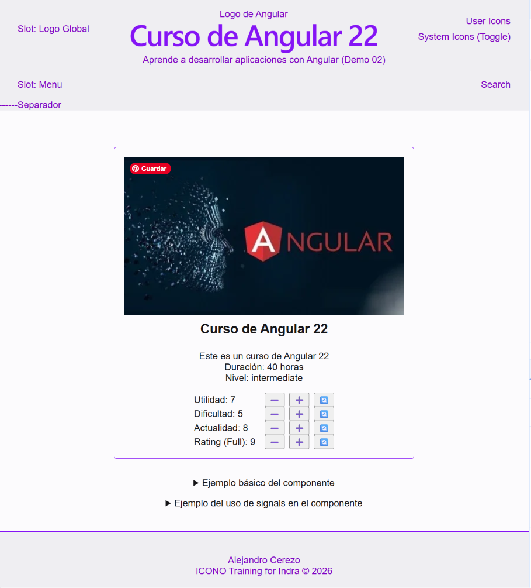
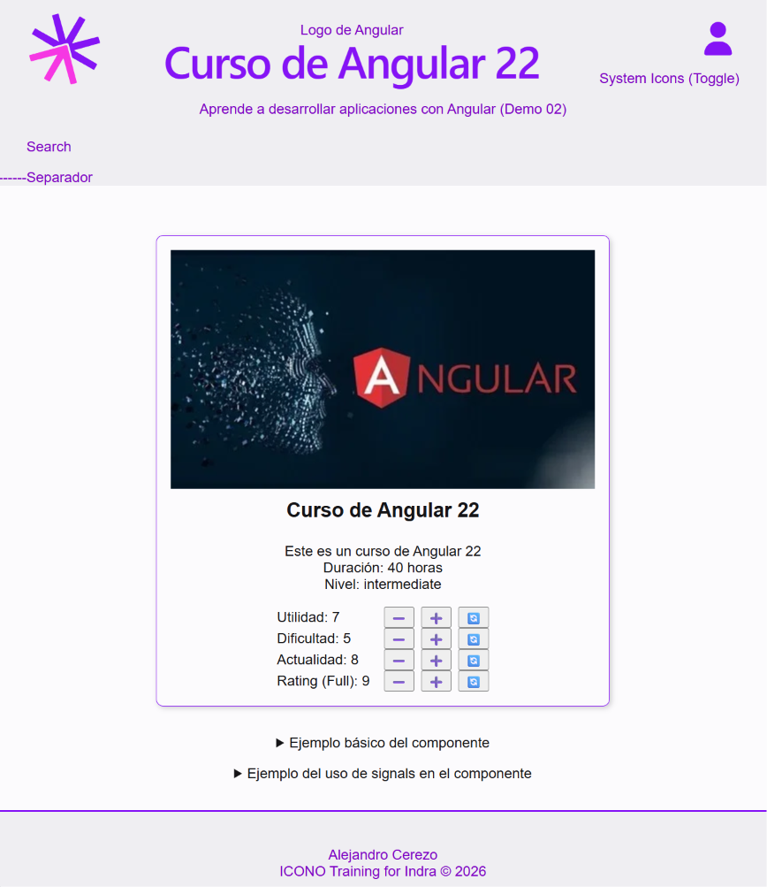
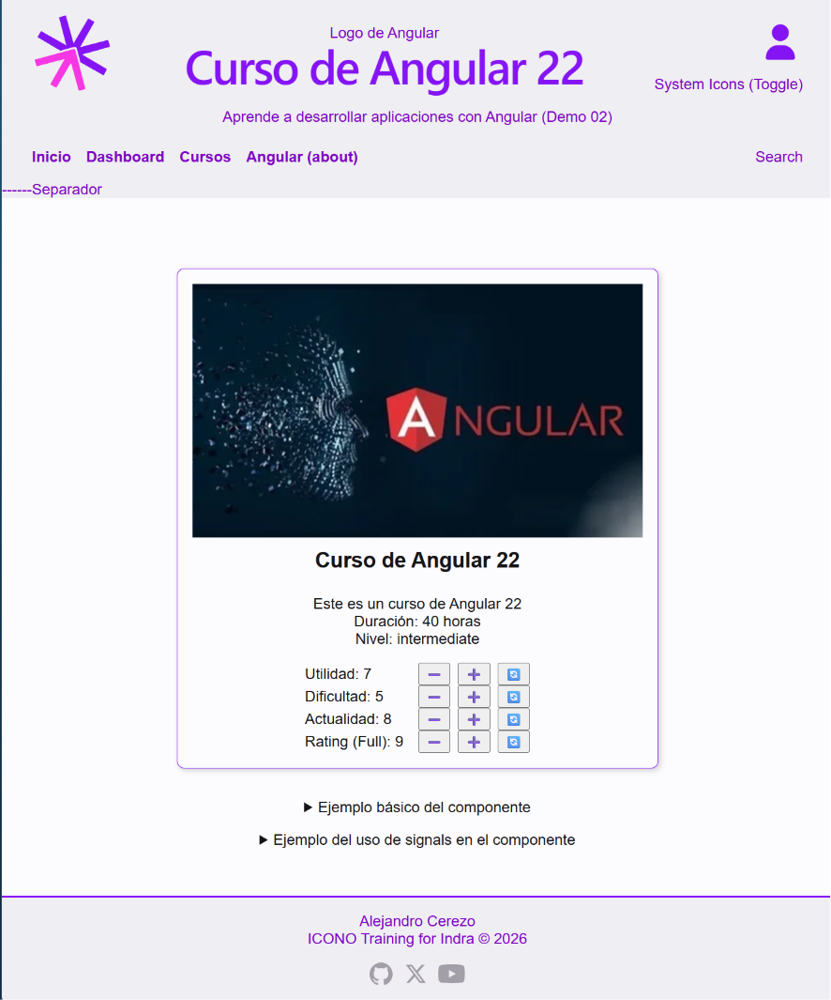
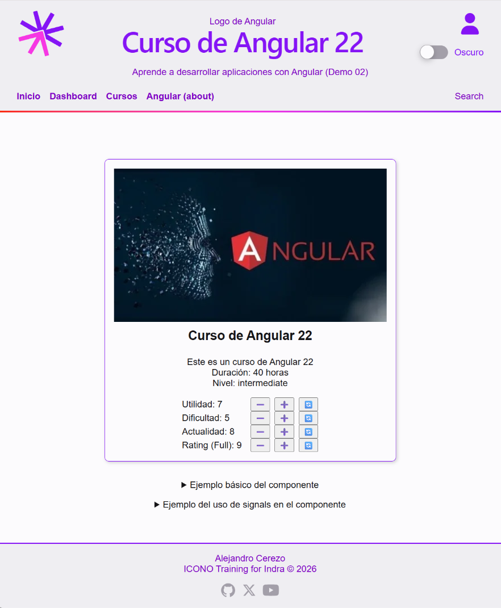
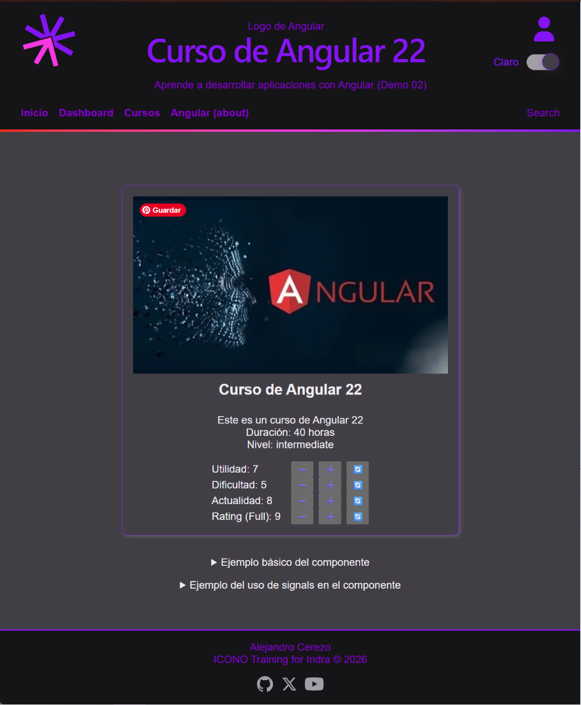
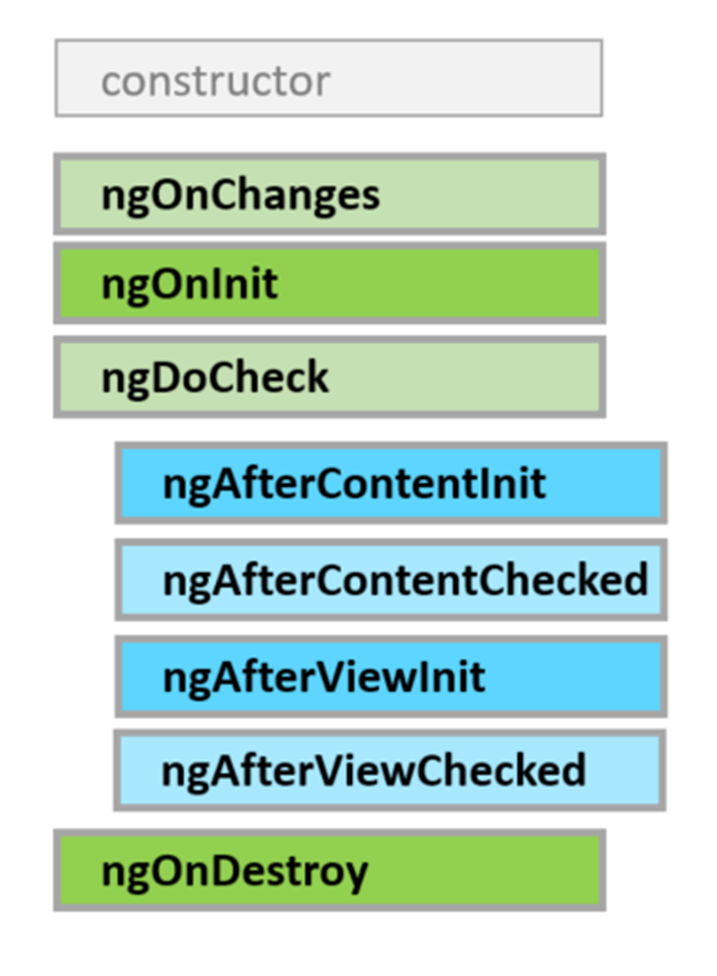
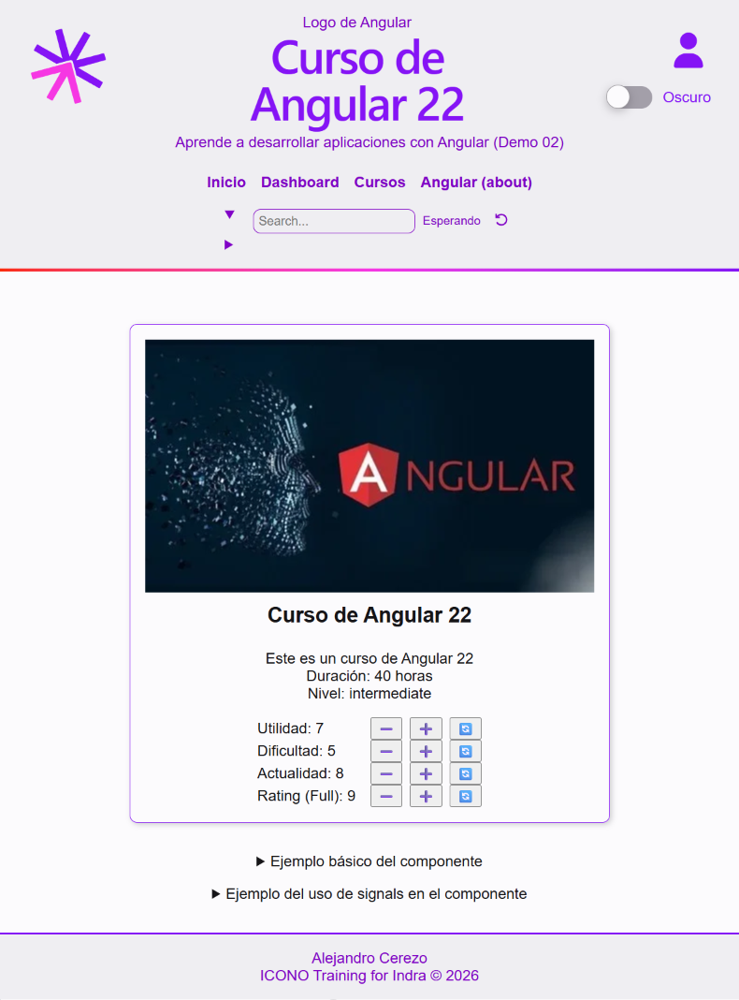

- [Scaffolding de Componentes](#scaffolding-de-componentes)
- [Componentes del core (1): Layout](#componentes-del-core-1-layout)
  - [🧿Componente App `alc-app`](#componente-app-alc-app)
  - [🧿Componente Header `alc-header`: contiene un grid con dos filas](#componente-header-alc-header-contiene-un-grid-con-dos-filas)
    - [👁️‍🗨️Test del Componente Header \[DocumentoPrevio\]](#️️test-del-componente-header-documentoprevio)
  - [🧿Componente Footer `alc-footer`](#componente-footer-alc-footer)
    - [👁️‍🗨️Test del componente Foot](#️️test-del-componente-foot)
  - [Resultados: Componentes del layout](#resultados-componentes-del-layout)
- [📕SVG y componentes](#svg-y-componentes)
- [Componentes del Core (2) - Componentes basados en SVG](#componentes-del-core-2---componentes-basados-en-svg)
  - [Elementos de Angular en los componentes SVG](#elementos-de-angular-en-los-componentes-svg)
  - [🧿Componente LogoCoders `alc-logo-coders`](#componente-logocoders-alc-logo-coders)
  - [🧿Componente User `alc-user`](#componente-user-alc-user)
- [📕Test Stubs: Mocks y Spies](#test-stubs-mocks-y-spies)
- [Test de los componentes SVG](#test-de-los-componentes-svg)
  - [👁️‍🗨️Test del componente LogoCoders](#️️test-del-componente-logocoders)
  - [👁️‍🗨️Test del componente User](#️️test-del-componente-user)
- [📕Proyección de contenido](#proyección-de-contenido)
  - [Posible componente Main](#posible-componente-main)
  - [Wrappers](#wrappers)
- [Componentes del Core (3) - Componentes wrapper](#componentes-del-core-3---componentes-wrapper)
  - [Elementos de Angular en los componentes wrappers](#elementos-de-angular-en-los-componentes-wrappers)
  - [🧿Componente Card `alc-card`. Wrappers y proyección de contenido](#componente-card-alc-card-wrappers-y-proyección-de-contenido)
    - [👁️‍🗨️Tests del componente Card](#️️tests-del-componente-card)
  - [Proyección de contenido en el componente Header](#proyección-de-contenido-en-el-componente-header)
  - [Resultados: Componentes SVG y Wrappers](#resultados-componentes-svg-y-wrappers)
- [📕 Directivas v. Estructuras de control en el template](#-directivas-v-estructuras-de-control-en-el-template)
- [Componentes del Core (4) - Componentes de navegación (Menu, Socials)](#componentes-del-core-4---componentes-de-navegación-menu-socials)
  - [Elementos de Angular en los componentes de navegación](#elementos-de-angular-en-los-componentes-de-navegación)
  - [Tipos y datos para el menú](#tipos-y-datos-para-el-menú)
  - [🧿Componente Menu `alc-menu`: muestra las opciones de navegación.](#componente-menu-alc-menu-muestra-las-opciones-de-navegación)
    - [Iteración en el template](#iteración-en-el-template)
    - [Incorporación del menú](#incorporación-del-menú)
    - [👁️‍🗨️Test del componente Menu](#️️test-del-componente-menu)
  - [🧿Componente Socials `alc-socials`](#componente-socials-alc-socials)
    - [👁️‍🗨️Test del componente Socials](#️️test-del-componente-socials)
  - [Resultados: Componentes de navegación](#resultados-componentes-de-navegación)
- [Componentes del Core (5) - Componentes y CSS](#componentes-del-core-5---componentes-y-css)
  - [Elementos de Angular en los componentes CSS](#elementos-de-angular-en-los-componentes-css)
  - [🧿Componente Toggle `alc-toggle`](#componente-toggle-alc-toggle)
    - [👁️‍🗨️Test del componente Toggle](#️️test-del-componente-toggle)
  - [🧿Componente Separator `alc-separator`](#componente-separator-alc-separator)
    - [👁️‍🗨️Test del componente Separator](#️️test-del-componente-separator)
  - [Resultados: Componentes de CSS](#resultados-componentes-de-css)
- [Componentes del Core (6) - Componentes Search](#componentes-del-core-6---componentes-search)
  - [Elementos de Angular](#elementos-de-angular)
  - [📕 Two Way Data Binding](#-two-way-data-binding)
  - [🧿Componente Search `alc-search`: Two Way Data Binding](#componente-search-alc-search-two-way-data-binding)
    - [Formato inicial](#formato-inicial)
    - [La directiva ngModel](#la-directiva-ngmodel)
        - [👁️‍🗨️Test del componente Search](#️️test-del-componente-search)
  - [📕 Referencias Locales. Signal Primitives y Queries](#-referencias-locales-signal-primitives-y-queries)
    - [Signal Queries](#signal-queries)
    - [Signal Primitives](#signal-primitives)
  - [🧿Componente SearchRef `alc-search-ref`](#componente-searchref-alc-search-ref)
    - [Lógica en el componente SearchRef](#lógica-en-el-componente-searchref)
    - [Lógica en el componente SearchRef: Effect()](#lógica-en-el-componente-searchref-effect)
    - [Incorporación de SearchRef en el header](#incorporación-de-searchref-en-el-header)
    - [👁️‍🗨️Test del componente SearchRef con referencia local](#️️test-del-componente-searchref-con-referencia-local)
  - [📕Ciclo de vida de los componentes y accesos a la vista (DOM)](#ciclo-de-vida-de-los-componentes-y-accesos-a-la-vista-dom)
    - [Hooks del ciclo de vida](#hooks-del-ciclo-de-vida)
- [Core - versión final](#core---versión-final)
  - [Components en la versión final](#components-en-la-versión-final)
  - [Elementos de Angular utilizados](#elementos-de-angular-utilizados)
  - [🧿Componente App](#componente-app)
    - [👁️‍🗨️Test del componente App](#️️test-del-componente-app)


## Scaffolding de Componentes

Se conoce como scaffolding la estructura de archivos y carpetas en las que se distribuyen los componentes y demás elementos de una aplicación Angular.

Esta estructura no condiciona las relaciones entre los elementos ni tiene ningún efecto en la ejecución de la aplicación, como sucedía anteriormente con los módulos, pero facilita la organización y el mantenimiento del código.

Es frecuente organizar los componentes en carpetas que reflejen su funcionalidad o características comunes, como:

- **feature**: componentes relacionados con una funcionalidad específica de la aplicación
- **core**: componentes y servicios esenciales para el funcionamiento de la aplicación

En cada uno de ellos se pueden crear subcarpetas para agrupar elementos de distinto tipo, como:

- **components**: para componentes reutilizables
- **services**: para servicios
- **models**: para modelos de datos
- **pipes**: para pipes personalizados
- **directives**: para directivas personalizadas

El componente que representa una la vista principal de una funcionalidad (la página) puede ir directamente en la carpeta de la funcionalidad, mientras que los componentes secundarios (hijos) pueden ir en la subcarpeta components.

## Componentes del core (1): Layout

Creamos los componentes de layout que se utilizarán en toda la aplicación, como el header, el footer y el menú de navegación.

```shell
ng g c core/components/header --project course-01
ng g c core/components/footer  --project course-01
```

La relación entre estos componentes y el componente raíz `alc-app` se puede representar en un diagrama de árbol:

- `alc-app`
  - `alc-header`
  - `router-outlet` 
  - `alc-footer`


### 🧿Componente App `alc-app`

Incluye en su template los componentes `alc-header` y `alc-footer`, junto con la etiqueta <main> envolviendo el `router-outlet`. El `alc-header` reserva espacio para el menú,  que se proyectará en el componente header mediante content projection. 

```ts app.ts
import { Component } from '@angular/core';
import { RouterOutlet } from '@angular/router';
import { Header } from '../header/header';
import { Footer } from '../footer/footer';

@Component({
  selector: 'alc-root',
  imports: [RouterOutlet, Header, Footer, Menu],
  template: `
    <alc-header>
      <!-- aquí irá <alc-menu /> -->
    </alc-header>
    <main class="container">
      <router-outlet />
      <p>Páginas de la aplicación</p>
      <alc-course-item />
      <details>
        <summary>Sample of signals in async operations</summary>
        <alc-course-item-signals />
      </details>
    </main>
    <alc-footer />
  `,
  styles: `
    :host {
      display: grid;
      grid-template-rows: auto 1fr auto;
      min-height: 100vh;
      font-family: Arial, sans-serif;
      margin: 0;
      padding: 0;
    }
    main.container {
      padding: 1rem 2rem;
      width: 100%;
      min-height: 90%;
      display: flex;
      justify-content: center;
      align-items: center;
      padding: 1rem;
      position: relative;
    }
  `,
})
export class App {}
```

### 🧿Componente Header `alc-header`: contiene un grid con dos filas

La primera incluye un dos divs, clases `right-side` y `left-side`, para colocar logos e iconos, junto con un hgroup en el centro, para el heading `h1`.
La segunda fila incluye un párrafo con el subtítulo y un div con clase `desktop-only` para proyectar el menú en la versión de escritorio.

```ts header.ts
import { Component, signal } from '@angular/core';

@Component({
  selector: 'alc-header',
  imports: [],
  template: `
    <header class="container">
      <div class="left-side">Slot: Logo Global</div>
      <hgroup>
        Logo de Angular
        <h1>{{ title() }}</h1>
      </hgroup>
      <div class="right-side">
        <div class="user-icons">User Icons</div>
        <div class="system-icons">System Icons (Toggle)</div>
      </div>
      <div class="bottom-row">
        <p class="first-line">{{ subtitle() }}</p>
        <div class="second-line">
          <div>Slot: Menu</div>
          <div>Search</div>
        </div>
      </div>
    </header>
    <div>------Separador</div>
  `,
  styles: `
    :host {
      margin-bottom: 1.5rem;
      min-height: 15vh;
      color: var(--color-primary-hot);
      background-color: var(--color-background-primary);
    }

    header {
      padding: 1rem 2rem;
      display: grid;
      grid-template-columns: minmax(auto, max-content) 1fr minmax(auto, max-content);
      justify-items: center;
      align-items: center;
      text-align: center;
    }

    .left-side {
      min-width: 5rem;
    }

    hgroup {
      max-width: 15rem;
    }

    @media (width > 850px) {
      hgroup {
        max-width: none;
      }
    }

    h1 {
      color: var(--color-primary);
      font-family: var(--font-family-heading);
      font-optical-sizing: auto;
      font-size: 3.125rem;
      font-weight: 500;
      line-height: 100%;
      letter-spacing: -0.125rem;
      margin: 0;
    }

    .right-side {
      min-width: 5rem;
      display: flex;
      flex-direction: column;
      align-items: flex-end;
      gap: 0.5rem;

      .icons {
        display: flex;
        gap: 1rem;
      }
    }

    .bottom-row {
      gap: 0.5rem;
      grid-column: span 3;
      margin-top: 0.6rem;
      display: flex;
      flex-direction: column;
      width: 100%;
      .second-line {
        display: flex;
        justify-content: space-between;
        align-items: center;
        gap: 1rem;
        margin-top: 1rem;
      }
    }
  `,
})
export class Header {
  protected readonly title = signal('Curso de Angular 22');
  protected readonly subtitle = signal('Aprende a desarrollar aplicaciones con Angular');
}
```

En el html del template se indica donde irán los elementos de la cabecera, con un grid de dos filas y tres columnas, incluyéndose 'slots'para proyectar elementos externos.

En los estilos vemos como se puede incorporar una media-query a nivel de componente usando la nueva sintaxis de media queries: `@media (width > 800px)`. Con ella hacemos que el menú móvil se oculte y el menú de escritorio se muestre a partir de un ancho de 800px. 

#### 👁️‍🗨️Test del Componente Header [DocumentoPrevio]

Tomando como ejemplo nuestro componente Header, podemos recordar las diferencias entre los tests de implementación y los de interfaz de usuario.

Como sabemos, en la preparación del test, se crea una instancia del TestBed y se configura el entorno de pruebas para incluir el componente Header.

```ts
describe("Header", () => {
  let component: Header;
  let fixture: ComponentFixture<Header>;
  let debugElement: DebugElement;

  beforeEach(async () => {
    await TestBed.configureTestingModule({
      imports: [Header],
    }).compileComponents();

    fixture = TestBed.createComponent(Header);
    component = fixture.componentInstance;
    await fixture.whenStable();
    debugElement = fixture.debugElement;
  });

  // tests aquí
});
```

En el primer test, se verifica que el componente se crea correctamente con determinadas propiedades, como ejemplo del enfoque orientado a la implementación.

```ts
it("should create", () => {
  expect(component).toBeTruthy();
  // Tests de implementación
  expect(component["title"]()).toContain("Angular");
  expect(component["subtitle"]()).toContain("Aprende");
});
```

En el segundo test, se verifica que el título se muestra correctamente en la vista, como ejemplo del enfoque orientado a la interfaz de usuario.

```ts
it("should render title", async () => {
  await fixture.whenStable();
  const elementH1 = debugElement.query(By.css("h1"))
    .nativeElement as HTMLHeadingElement;
  const eParagraph = debugElement.query(By.css("p"))
    .nativeElement as HTMLParagraphElement;
  expect(elementH1.textContent).toContain("Angular");
  expect(eParagraph.textContent).toContain("Aprende");
});
```

Los dos tes comprueban lo mismo, pero desde enfoques diferentes: la implementación del componente y su interfaz de usuario.

Esta es una diferencia con la Testing library y su enfoque exclusivamente orientado a la interfaz de usuario.

Como nuestro componente es un layout para completarlo mÁs adelante, podemos comprobar que hemos incluido todos los elementos de HTML que vamos a necesitar.

```ts
it("should render layout elements", async () => {
  await fixture.whenStable();
  const elementHeader = debugElement.query(By.css("header")).nativeElement as HTMLElement;
  const elementLeftSide = debugElement.query(By.css(".left-side")).nativeElement as HTMLElement;
  const elementHgroup = debugElement.query(By.css("hgroup")).nativeElement as HTMLElement;
  const elementRightSide = debugElement.query(By.css(".right-side")).nativeElement as HTMLElement;
  const elementUserIcons = debugElement.query(By.css(".user-icons")).nativeElement as HTMLElement;
  const elementSystemIcons = debugElement.query(By.css(".system-icons")).nativeElement as HTMLElement;
  const elementBottomRow = debugElement.query(By.css(".bottom-row")).nativeElement as HTMLElement;
  const elementFirstLine = debugElement.query(By.css(".first-line")).nativeElement as HTMLElement;
  const elementSecondLine = debugElement.query(By.css(".second-line")).nativeElement as HTMLElement;

  expect(elementHeader).toBeInstanceOf(HTMLElement);
  expect(elementLeftSide).toBeInstanceOf(HTMLElement);
  expect(elementHgroup).toBeInstanceOf(HTMLElement);
  expect(elementRightSide).toBeInstanceOf(HTMLElement);
  expect(elementUserIcons).toBeInstanceOf(HTMLElement);
  expect(elementSystemIcons).toBeInstanceOf(HTMLElement);
  expect(elementBottomRow).toBeInstanceOf(HTMLElement);
  expect(elementFirstLine).toBeInstanceOf(HTMLElement);
  expect(elementSecondLine).toBeInstanceOf(HTMLElement);
});
```

### 🧿Componente Footer `alc-footer`

Contiene un párrafo con el texto "Copyright 2024" (más adelante añadiremos el componente `alc-socials` para mostrar los iconos de redes sociales).

```ts footer.ts
import { Component, signal } from '@angular/core';

@Component({
  selector: 'alc-footer',
  template: `
    <footer>
      <address>
        <p>{{ autor() }}</p>
        <p>{{ brand() }} © {{ today().getFullYear() }}</p>
      </address>
    </footer>
  `,
  styles: `
    :host {
      background-color: var(--color-background-primary);
      color: var(--color-primary-hot);
      display: flex;
      justify-content: center;
      align-items: center;
      border-top: 2px solid var(--color-primary);
      margin-top: 1rem;
      padding-block-start: 1rem;
      min-height: 10vh;
    }
    footer {
      text-align: center;
    }
    address {
      font-style: normal;
    }
  `,
})
export class Footer {
  protected readonly autor = signal('Alejandro Cerezo');
  protected readonly brand = signal('ICONO Training for Indra');
  protected readonly today = signal(new Date());
}
```

#### 👁️‍🗨️Test del componente Foot

Aunque ya tiene un 100% de coverage, deberíamos testar que renderiza realmente lo esperado.

- Añadimos el debugElement a partir de la fixture
- Buscamos él con el selector de la etiqueta p
- Nos quedamos con los correspondientes nativeElement
- Comprobamos que contienen cada uno el texto esperado, que hemos obtenido de las propiedades del componente

```ts
  it('should render a address with 2 paragraphs', async () => {
    const autor = component['autor']();
    const brand = component['brand']();

    const today = 2000
    component['today'].set(new Date('2000-01-01'));
    await fixture.whenStable();

    const addressElement: HTMLElement = debugElement.query(By.css('address')).nativeElement;
    expect(addressElement).toBeTruthy();
    const pElements: HTMLParagraphElement[] = debugElement
      .queryAll(By.css('p'))
      .map((de) => de.nativeElement);
    expect(pElements[0].textContent).toEqual(autor);
    expect(pElements[1].textContent).toContain(brand);
    expect(pElements[1].textContent).toContain(today.toString());
  });
});
```

Opcionalmente, como hacemos con la fecha, podemos redefinir las propiedades del componente (asignarles un valor mock) para comprobar que se renderizan correctamente en la vista.

En ese caso, al modificar nosotros el estado del componente, debemos lanzar **fixture.detectChanges()** para que la vista se actualice con los nuevos valores. Esto se debe a que en los tests de Angular no se produce la detección automática de cambios como en la ejecución normal de la aplicación.

Actualmente, para conseguir este efecto, hacemos el test asíncrono y esperamos a que la fixture esté estable con **await fixture.whenStable()** antes de hacer las comprobaciones. Esto asegura que todos los cambios en el estado del componente se han procesado y la vista está actualizada antes de realizar las aserciones.

### Resultados: Componentes del layout

En estos componentes hemos visto

- de nuevo el **binding de expresiones JS** en el template, usando `{{ }}` para mostrar el título y el subtítulo del header, y para mostrar el año actual en el footer.
- igualmente el uso de **signals** para definir propiedades reactivas en los componentes, incluso cuando no este previsto que cambien, como el título y el subtítulo del header, y el año actual en el footer.
- el uso de `router-outlet` que más adelante servirá para mostrar las páginas de la aplicación
- los **estilos** de cada componente, usando displays de CSS (grid, flex) y media queries para adaptar el diseño a diferentes tamaños de pantalla.



## 📕SVG y componentes

El formato SVG (Scalable Vector Graphics) es un estándar abierto para describir gráficos vectoriales en XML. Los gráficos vectoriales se definen mediante geometría, como puntos, líneas y curvas, en lugar de píxeles, lo que permite que se escalen a cualquier tamaño sin perder calidad.

En Angular, podemos usar SVG de varias maneras:

- **Como ficheros independientes**: podemos crear ficheros SVG y referenciarlos en los templates de los componentes, usando la etiqueta `` o la directiva `ngSrc`. Esto nos permite reutilizar los mismos gráficos en diferentes partes de la aplicación.

- **Como templates de componentes**: podemos crear componentes que tengan un fichero SVG como template, usando la propiedad `templateUrl` del decorador `@Component`. Esto nos permite aplicar binding de propiedades y eventos a los elementos del SVG, y personalizar su apariencia y comportamiento desde el componente padre.

- **Como elementos dentro de templates**: podemos incluir la etiqueta `<svg>` directamente en el template de un componente, y definir los elementos gráficos dentro de ella. Esto nos permite usar todas las características de Angular, como binding de propiedades y eventos, y crear gráficos dinámicos que respondan a cambios en el estado del componente.

## Componentes del Core (2) - Componentes basados en SVG

Creamos los componentes basados en SVG que se utilizarán en el header, como el logo, que se añadirá en el lado izquierdo, y el icono de usuarios, que se añadirá en el lado derecho.  

```shell
ng g c core/components/logo-coders --project course-01
ng g c core/components/user --project course-01
```

- `alc-logo-coders`
- `alc-user`

### Elementos de Angular en los componentes SVG

Veremos 

- uso de **ficheros svg como template**, con la posibilidad de aplicar en ellos todos los elementos de Angular, como binding de propiedades y eventos
- uso de la **etiqueta svg** dentro de un template de un componente, con la posibilidad de aplicar binding de propiedades y eventos
- el uso de **signal** para definir propiedades reactivas que se vinculan al svg o al html del template, permitiendo que los cambios en estas propiedades se reflejen automáticamente en la vista.

### 🧿Componente LogoCoders `alc-logo-coders`

Es un componente que muestra el logo de "Coders" como logo de la aplicación, en formato SVG. Como en el caso anterior, el SVG es un fichero independiente que se vincula como template del componente.

```svg logo-coders.svg
<!DOCTYPE svg PUBLIC "-//W3C//DTD SVG 20010904//EN"
 "http://www.w3.org/TR/2001/REC-SVG-20010904/DTD/svg10.dtd">
<svg version="1.0" xmlns="http://www.w3.org/2000/svg"
 [attr.width]="size" [attr.height]="size" viewBox="0 0 1039.000000 1037.000000"
 preserveAspectRatio="xMidYMid meet">

<g transform="translate(0.000000,1037.000000) scale(0.100000,-0.100000)">

<path id="upper" [attr.fill]="upperColor" (click)="handleClick('upper')" d="..."/>

<path id="down" [attr.fill]="downColor" d="..."/>
</g>
</svg>
```

En el svg se utiliza attr para vincular los atributos de tamaño y color con las propiedades del componente, lo que permite personalizar el logo desde el componente padre.

Además en cada uno de los paths se añade un evento de click para manejar la interacción con el logo, lo que permitiría más adelante definir alguna acción, como mostrar un modal con diferente información al hacer click en cada parte concreta del logo.

```ts logo-coders.ts
import { Component } from '@angular/core';

@Component({
  selector: 'alc-logo-coders',
  imports: [],
  templateUrl: './logo-coders.svg',
  styles: `
    :host {
      display: block;
    }
  `,
})
export class LogoCoders {
  size = '5.5rem';
  upperColor = 'var(--color-primary)';
  downColor = 'var(--color-secondary)';

  handleClick(source: string) {
    console.log('LogoCoders clicked from:', source);
  }
}
```

En el componente se definen las propiedades para el tamaño y los colores del logo, que se vinculan con los atributos del svg. Además se define un método para manejar el evento de click en el logo, que por ahora solo muestra un mensaje en la consola, pero que más adelante se utilizará para mostrar un modal con información sobre la aplicación.

De momento, el componente `alc-logo-coders` se incorpora en el `alc-header`, en el div con la clase `left-side`, que asegura su posición a la izquierda.

### 🧿Componente User `alc-user`

Componente que muestra un icono de usuario, que se utilizará en el futuro para mostrar información sobre el inicio de sesión del usuario o para acceder a opciones relacionadas con la cuenta. 

Incorpora nuevamente un icon svg, obtenido igual que los anteriores. En este case se añade al template, dentro de una etiqueta \<a>, ya que en principio navegará a la página de gestión del usuario. Como en casos anteriores se vinculan atributos del svg con propiedades del componente para permitir su personalización desde el componente padre.

```ts user.ts
import { Component, signal } from '@angular/core';

@Component({
  selector: 'alc-user',
  imports: [],
  template: `
    <nav>
      <a href="#" id="menu-icon" (click)="toggleUser()">
        <svg
          xmlns="http://www.w3.org/2000/svg"
          viewBox="0 0 640 640"
          [attr.width]="size()"
          [attr.height]="size()"
          fill="currentColor"
        >
          <title>Login</title>
          <path
            d="M320 312C386.3 312 440 258.3 440 192C440 125.7 386.3 72 320 72C253.7 72 200 125.7 200 192C200 258.3 253.7 312 320 312zM290.3 368C191.8 368 112 447.8 112 546.3C112 562.7 125.3 576 141.7 576L498.3 576C514.7 576 528 562.7 528 546.3C528 447.8 448.2 368 349.7 368L290.3 368z"
          />
        </svg>
      </a>
    </nav>
  `,
  styles: ``,
})
export class User {
  protected readonly size = signal('3rem');

  toggleUser() {
    console.log('User Login');
  }
}
```

El evento de click en el icono de usuario se maneja con un método que por ahora solo muestra un mensaje en la consola, pero que más adelante se utilizará para mostrar un modal con información sobre el usuario o para iniciar sesión.

El componente se incorpora en el `alc-header`, en el div con la clase `right-side`, para mostrar el icono de usuario a la derecha del header.

## 📕Test Stubs: Mocks y Spies

En el desarrollo de test unitarios es muy común que necesitemos simular el comportamiento de ciertas partes del código para poder probar otras partes del código. Para ello, utilizamos los **stubs**, que son objetos que simulan el comportamiento de otros objetos. Los stubs se utilizan para simular el comportamiento de objetos que no están disponibles en el entorno de test o que no se pueden utilizar en el entorno de test.

La utilidad de los stubs radica en que nos permiten aislar la parte del código que queremos probar, evitando dependencias externas que puedan afectar al resultado del test. De esta forma, podemos centrarnos en probar la lógica del código que estamos desarrollando, sin preocuparnos por el comportamiento de otros objetos. Además existen matchers específicos para verificar que los stubs se han utilizado correctamente (`toHaveBeenCalled` y similares).

Existen varios dos de stubs:

- Los **mocks** son objetos que simulan el comportamiento de otros objetos y permiten verificar que se han llamado los métodos correctos con los argumentos correctos.

  - En Vitest se generan automáticamente con la función `vi.fn()`
  - Por defecto, los mocks no tienen ningún comportamiento, y devuelven `undefined`, pero se les puede añadir comportamiento personalizado si es necesario.

- Los **spies** son objetos que permiten verificar que se han llamado los métodos correctos con los argumentos correctos.

  - En Vitest se generan automáticamente con la función `vi.spyOn()`
  - Por defecto, los spies mantienen el comportamiento original del método espiado,
  - Se puede modificar su comportamiento si es necesario, con lo que se comportarían como mocks.

Como vemos, la distinción no es siempre clara y depende mucho del framework de testing. Por ejemplo, en Vitest, los mocks y los spies son conceptos diferentes tal como se ha explicado, pero los spies pueden convertirse en mocks si se les añade la capacidad de simular el comportamiento de un objeto. En Mocha, los mocks y los spies son conceptos diferentes y se utilizan de forma independiente. En Jasmine, los mocks y los spies son conceptos similares y se utilizan indistintamente.

## Test de los componentes SVG

### 👁️‍🗨️Test del componente LogoCoders

El procedimiento, montaje y ejecución es el mismo que en cualquier otro componente, con independencia da que el template sea SVG.  El objetivo de los test será comprobar la funcionalidad del componente y la correcta renderización del SVG, así como la interacción con el usuario a través de eventos.

En relación con el segundo aspecto, tenemos que tener en cuenta que, en este momenta, la respuesta a esas interacciones se limita a un mensaje por consola, por lo que para testarlo debemos usar un **spy** para comprobar que se ha llamado al método correspondiente.

```ts
// Test de implementación
  // Podría dar lugar a un falso test
  it('should handle click event', () => {
    vi.spyOn(console, 'log');
    component.handleClick('testSource');
    expect(console.log).toHaveBeenCalledWith('LogoCoders clicked from:', 'testSource');
  });
```

Este ejemplo de test de implementación es un buen ejemplo de los problemas que puede conllevar esa estrategia. Al comprobar el resultado de un método ejecutándolo, no nos aseguramos que ses ocurra también en respuesta a las interacciones del usuario. El método podría no estar vinculado al evento, y sin embargo el test pasaría. Por ello, es preferible hacer un test de interfaz de usuario, que simule la interacción del usuario y compruebe que se produce la respuesta esperada.

```ts
// Test de funcionalidad
// Más adecuado, especialmente en este caso
it('should run console.log when user clicks on the logo', () => {
  vi.spyOn(console, 'log');
  const debugPathElements = fixture.debugElement.queryAll(By.css('path'));

  debugPathElements[0].triggerEventHandler('click', null);
  expect(console.log).toHaveBeenLastCalledWith('LogoCoders clicked from:', 'upper');

  debugPathElements[1].triggerEventHandler('click', null);
  expect(console.log).toHaveBeenLastCalledWith('LogoCoders clicked from:', 'lower');
});
```

### 👁️‍🗨️Test del componente User

De forma similar al anterior, tenemos que espiar el console.log para comprobar que se llama al método toggleUser() cuando el usuario hace click en el icono de usuario. 

```ts
it('should run console.log when user clicks on the logo', () => {
  vi.spyOn(console, 'log');
  const debugPathElements = fixture.debugElement.queryAll(By.css('a'));

  debugPathElements[0].triggerEventHandler('click', null);
  expect(console.log).toHaveBeenLastCalledWith('User Login');
});
```

## 📕Proyección de contenido

Cuando utilizamos componentes de Angular, a veces necesitamos que un componente hijo pueda mostrar contenido que se define en el componente padre. Para ello, Angular proporciona la **proyección de contenido** (content projection), que permite insertar contenido dinámico en un componente hijo desde su componente padre.

- El contenido incluido entre la apertura y el cierre de una componente Angular puede ser recogido por el componente
- Para ello se utiliza el elemento ng-content en el template del componente indicando donde se inserta el contenido \<ng-content></ng-content>
- Opcionalmente, el atributo `select=""` del elemento permite indicar el selector del contenido que se debe insertar en cada bloque ng-content, Se puede usar el selector del componente (no deja de ser una etiqueta HTML), una clase un id o cualquier selector CSS válido.

### Posible componente Main

El elemento main es un contenedor semántico para el contenido principal de la página, que se muestra entre el header y el footer. En él se renderiza el contenido de las páginas a través del `router-outlet`, que es un marcador de posición para los componentes que se cargan según la ruta activa. 

Podría ser también un componente Main, que se incluiría en el template de App y que contendría el router-outlet y el resto del contenido de la página.

```shell
ng g c core/components/main --project course-01
```

Para crear este componente necesitaríamos usar proyección de contenido para que el router-outlet y el resto del contenido se rendericen dentro del componente Main. 

En lugar de crear este componente Main, veremos otros ejemplos de proyección de contenido.

### Wrappers

La proyección de contenido, como técnica que permite insertar contenido dinámico en un componente Angular desde su componente padre, permite crear componentes wrapper o contenedores. Su función es envolver otros componentes o elementos HTML, proporcionando una estructura común y un estilo consistente. En ellos cobra
especial importancia el css.

Un ejemplo típico de componente wrapper es una **tarjeta** (card), que puede envolver cualquier contenido, proporcionando un diseño y estilo uniforme.

## Componentes del Core (3) - Componentes wrapper

Creamos los componentes wrapper como el componente de tarjeta.

```shell

 ng g c core/components/card --project course-01
```

- `alc-card`

Este componentes, `alc-card`, muestra la **proyección de contenido** en Angular. Es un componente de utilidad para mostrar contenido en formato de tarjeta, con estilos predefinidos para el fondo, los bordes, las sombras y el padding. Este componente se utilizará más adelante para mostrar el contenido de las páginas de la aplicación.

### Elementos de Angular en los componentes wrappers

En estos componentes vemos

- el uso de la **proyección de contenido** (content projection) para proyectar contenidos dentro de card o componentes dentro del header
- componentes de **utilidad** (utility components) o del **sistema de diseño** (design system), como `alc-card`, que se pueden reutilizar en toda la aplicación para mostrar contenido en formato de tarjeta, con estilos predefinidos para el fondo, los bordes, las sombras y el padding.

### 🧿Componente Card `alc-card`. Wrappers y proyección de contenido

Es un componente de utilidad para mostrar contenido en formato de tarjeta, con estilos predefinidos para el fondo, los bordes, las sombras y el padding. Este componente se utilizará más adelante para mostrar el contenido de las páginas de la aplicación.

```ts card.ts
import { Component } from '@angular/core';

@Component({
  selector: 'alc-card',
  imports: [],
  template: ` <ng-content></ng-content> `,
  styles: `
    :host {
      display: block;
      margin: 1rem 0;
      padding: 1rem;
      border: 1px solid var(--color-primary);
      border-radius: 8px;
      box-shadow: 2px 2px 6px color-mix(in srgb, var(--color-text) 20%, transparent);
      text-align: center;
    }
  `,
})
export class Card {}
```

En este componente tenemos un ejemplo muy sencillo de proyección de contenido: se utiliza ng-content para permitir que el contenido de la tarjeta sea dinámico y se pueda personalizar desde el componente padre. Los estilos predefinidos aseguran que todas las tarjetas tengan una apariencia consistente en toda la aplicación.

Como ejemplo, podemos refactorizar CourseItemPro y utilizar Card en el componente App para envolverlos.

```ts app.ts
  template: `
    <alc-header />
    <main class="container">
      <router-outlet />

      <alc-card>
        <alc-course-item-pro />
      </alc-card>
      
      <details>
        <summary>Ejemplo básico del componente</summary>
        <alc-course-item />
      </details>
      <details>
        <summary>Ejemplo del uso de signals en el componente</summary>
        <alc-course-item-signals />
      </details>
    </main>
    <alc-footer />
  `,
```

#### 👁️‍🗨️Tests del componente Card

Para testar un componente que recibe contenido proyectado (ng-content), como Layout o Card, necesitamos crear en el test un componente Host, que renderice nuestro componente pasándole algún contenido.

```ts
const TEXT = "Hello World";

@Component({
  imports: [Card],
  template: `<alc-card> {{ text }} </alc-card>`,
})
class TestHostComponent {
  protected readonly text = TEXT;
}
```

A continuación testamos el componente Host, creando su fixture y accedemos al debugElement del componente Card para comprobar que renderiza el contenido proyectado correctamente.

```ts
describe("Card", () => {
  let component: TestHostComponent;
  let fixture: ComponentFixture<TestHostComponent>;
  let debugElement: DebugElement;

  beforeEach(async () => {
    await TestBed.configureTestingModule({
      imports: [TestHostComponent],
    }).compileComponents();

    fixture = TestBed.createComponent(TestHostComponent);
    component = fixture.componentInstance;
    await fixture.whenStable();
    debugElement = fixture.debugElement;
  });

  it("should create", () => {
    expect(component).toBeTruthy();
    const cardElement: HTMLElement = debugElement.query(
      By.directive(Card)
    ).nativeElement;
    expect(cardElement).toBeTruthy();
    expect(cardElement.textContent).toContain(TEXT);
  });
});
```

### Proyección de contenido en el componente Header

El componente `alc-header` utiliza la proyección de contenido para permitir que el logo de Coders se proyecte en el div con la clase `left-side`, lo que permite mantener la estructura del header y la posición del logo sin necesidad de modificar el componente `alc-header`.

```ts header.ts
  template: `
   <header class="container">
      <div class="left-side">
        <ng-content select="[slot='left']"></ng-content>
      </div>
      ...
    </header>
  `,
```

Para definir diferentes slots de proyección de contenido, se utiliza el atributo `select` en el ng-content, que permite seleccionar los elementos que se proyectarán en cada slot utilizando cualquier selector válido. En este caso, se utiliza el selector de atributo '[slot='left']' para proyectar el logo de Coders, marcado con ese atributo, en el div con la clase `left-side`.

```ts app.ts
  template: `
    <alc-header>
      <alc-logo-coders slot="left" />
    </alc-header>
    ...
  `,
```

Esto permitirá, tener en el componente `alc-header` otros slots, con su correspondiente selector, o un slot por defecto, sin selector, para poder proyectar otros elementos. 

En concreto, añadimos un slot en el div con la clase `second-line` de la segunda fila del grid, con el selector `[slot='menu']`, para proyectar
el menú de navegación

```ts
  template: `
   <header class="container">
      ...
      <div class="bottom-row">
        <p class="first-line">{{ subtitle() }}</p>
        <div class="second-line">
          <ng-content select="[slot='menu']" />
          <div>Search</div>
        </div>
      </div>
    </header>
  `,
```

### Resultados: Componentes SVG y Wrappers



## 📕 Directivas v. Estructuras de control en el template

Antes de la versión 16 de Angular, existían una serie de **directivas estructurales** para controlar la renderización de elementos en el template, como `*ngIf`, `*ngFor` y `*ngSwitch`. Estas directivas se utilizaban con el asterisco (*) para indicar que se trataba de una directiva estructural, y se aplicaban a un elemento HTML para controlar su presencia o repetición en el DOM.

Igualmente existían **directivas de atributos** para controlar la apariencia o el comportamiento de los elementos del DOM, pero sin modificar su estructura, como `ngClass`, `ngStyle` y `ngModel`. Estas directivas se utilizaban sin el asterisco, y se aplicaban a un elemento HTML para modificar sus clases, estilos o valores.

En la versión 17 de Angular, las directivas estructurales han sido sustituidas por una serie de **estructuras de control**:

 - `@for`: permite la iteración sobre colecciones, a nivel del template
 - `@if`:  permite la renderización condicional de elementos, a nivel del template
 - `@switch`: permite la renderización condicional de elementos según un valor, a nivel del template

- no son directivas, por lo que es necesario importar nada en el componente
- invocan directamente al compilador de Angular, lo que las hace mucho más eficientes y rápidas que las directivas estructurales
- se simplifica el template, permitiendo un uso más intuitivo y legible de las estructuras de control.

En nuestros próximos componentes de navegación, veremos ejemplos de iteración sobre un array de opciones de menú usando `@for`, y un ejemplo de selección de iconos de redes sociales usando `@switch`.

Más adelante veremos también el uso de la estructura de control `@if` para mostrar u ocultar elementos según el estado de la aplicación.

## Componentes del Core (4) - Componentes de navegación (Menu, Socials)

Creamos los componentes de navegación que se utilizarán en toda la aplicación, como el menú de navegación (ya creado), el menú móvil y los iconos de redes sociales.

```shell
ng g c core/components/menu  --project course-01
ng g c core/components/socials  --project course-01
```

- `alc-menu`
- `alc-socials`

### Elementos de Angular en los componentes de navegación

En estos componentes vemos

- de nuevo, la creación de **interfaces** para definir **datos** útiles para la aplicación, como las opciones de menú y las opciones de redes sociales.
- **iteración** sobre arrays de datos en el template, usando **`@for`** para mostrar cada opción como un enlace de navegación.
- uso de **svg** dentro del template, personalizándolos con propiedades y atributos vinculados a propiedades del componente, como el color, el tamaño y el evento de click.
- **vinculación (binding) de eventos** de click a métodos del componente, que más adelante se utilizará para abrir un modal con el menú de navegación en la versión móvil.
- el uso de **`@switch`** en el template para mostrar el icono correspondiente a cada red social según su nombre.

### Tipos y datos para el menú

Definimos un tipo para las opciones del menú:

```ts
export type MenuOption = {
  label: string;
  path: string;
};
```

Alternativamente, podemos definirlo como una interface, e incluso podríamos crearla desde el CLI de Angular

```shell
  ng g i core/types/menu.option --project course-01
```

Realmente el CLI solo crea un fichero vacío, y en este caso no existe fichero de tests (no puede haber test de un interface o tipo), por lo que usar el CLI no aporta ninguna ventaja, y es más rápido crear el fichero manualmente.

En el fichero de rutas (`app.routes.ts`) se define un array de opciones de menú, cada una con una etiqueta y una ruta:

```ts app.routes.ts 
const MENU_OPTIONS: MenuOption[]   = [
  { label: 'Inicio', path: '#home' },
  { label: 'Dashboard ', path: '#dashboard' },
  { label: 'Cursos', path: '#courses' },
  { label: 'Angular (about)', path: '#about' },
];
];
```

### 🧿Componente Menu `alc-menu`: muestra las opciones de navegación.

En el componente se crea una señal que contiene las opciones del menú, y se itera sobre ellas en el template para mostrar cada opción como un enlace de navegación:

```ts menu.ts
import { Component, signal } from '@angular/core';
import { MenuOption } from '../../types/menu.option';
import { MENU_OPTIONS } from '../../../app.routes';

@Component({
  selector: 'alc-menu',
  imports: [],
  template: `
    <nav>
      <ul>
        @for (option of options(); track option.path) {
          <li>
            <a href="{{ option.path }}">
              {{ option.label }}
            </a>
          </li>
        }
      </ul>
    </nav>
  `,
  styles: `
    nav {
      ul {
        list-style: none;
        margin: 0;
        padding: 0;
        display: flex;
        gap: 1rem;
      }

      .vertical {
        flex-direction: column;
        a {
          font-size: 1.8rem;
        }
      }

      a {
        color: inherit;
        text-decoration: none;
        font-weight: bold;
      }
    }
  `,
})
export class Menu {
  protected readonly options = signal<MenuOption[]>(MENU_OPTIONS);
}
```

Siguiendo los estándares de HTML, al incluir un elemento `<nav>` en la plantilla del componente, se mejora la semántica del documento y se facilita la accesibilidad para los usuarios y dispositivos que utilizan tecnologías asistivas.

En la misma línea, sería recomendable que formara parte del header de nuestro html, que entre otras cosas debe incluir los elementos de navegación principales de la aplicación. Para ello, podríamos incluir el componente menu dentro del componente header, modificando su plantilla para que incluya el menú de navegación. 

Otra opción sería utilizar **proyección de contenido** (ng-content) para permitir que el menú se inserte dinámicamente en el header desde el componente padre (app.component.html).

#### Iteración en el template

En el template del componente `alc-menu` se utiliza la directiva `@for` para iterar sobre el array de opciones de menú importado desde `app.routes.ts` y mostrar cada una como un enlace (\<a>) a la ruta correspondiente.

De momento la etiquetas anchor (\<a>) utilizan `href` y referencias internas (`#`) para navegar dentro de una misma página haciendo scroll, pero más adelante se cambiará a `routerLink` para aprovechar el enrutamiento de Angular.

#### Incorporación del menú

El componente `alc-menu` se incorpora en el `alc-app` con el atributo `slot="logo"`, y se proyecta en el `alc-header`, en el div con la clase `right-side`, y se muestra u oculta según el ancho de la pantalla, usando media queries en los estilos del componente `alc-header`.

```html app.ts
<alc-header>
  <alc-logo-coders slot="logo" />
  <alc-menu slot="menu" />
</alc-header>
```  

```html header.ts
<div class="second-line">
  <!-- Slot: Menu -->
  <ng-content select="[slot=menu]" />
  <div>Search</div>
</div>
```     

#### 👁️‍🗨️Test del componente Menu

Como la funcionalidad del menu depende únicamente de las enlaces de HTML (\<a>), el test inicial de Angular ya da un 100% de coverage. Sin embargo, podemos hacer un test más completo, comprobando que se renderizan correctamente todas las opciones del menú, y que el contenido de cada enlace coincide con la etiqueta de la opción correspondiente.

A diferencia de lo que sucede en Testing Library, tenemos acceso a las propiedades de la instancia.
Por ejemplo podemos ler las opciones del menu y comprobar que se renderiza cada uan de ellas. Asi nuestro test seguirá siendo válido aunque se defina otra lista de opciones en el componente.

```ts
it("should render the menu items", () => {
  const options = component["options"]();
  options.forEach((option, index) => {
    const itemElement: HTMLLIElement = debugElement.queryAll(By.css("li"))[
      index
    ].nativeElement;
    expect(itemElement.textContent).toContain(option.label);
  });
});
```

### 🧿Componente Socials `alc-socials`

Contiene los iconos de redes sociales para mostrar en el footer. 

Por una parte definimos un tipo para las opciones de redes sociales, con una etiqueta, una url y el svg correspondiente:

```ts
export interface SocialLink {
  name: string;
  href: string;
  ariaLabel: string;
}
```

El componente `alc-socials` declara como signal un array de opciones de redes sociales y su template itera sobre el, mostrando cada una como un enlace (\<a>) a la url correspondiente.

Por otro lado obtenemos los iconos en formato SVG, en alguna de las fuentes ya citadas y se incorporan al template dentro de un `@switch`, mostrando el icono correspondiente a cada red social según su nombre. Para asignarle el color del contenedor, se utiliza el valor `currentColor` en el atributo `fill` del svg, lo que hace que herede el color del contenedor padre.

#### 👁️‍🗨️Test del componente Socials

De forma muy similar a lo que hemos hecho con el componente Menu, podemos hacer un test más completo, comprobando que se renderizan correctamente todas las opciones de redes sociales, y que el contenido de cada enlace coincide con la etiqueta de la opción correspondiente.

```ts
it('should render the social links', () => {
  const socialLinks = component["socials"]();
  const element = fixture.nativeElement as HTMLElement;
  const linkElements = element.querySelectorAll('a');

  expect(linkElements.length).toBe(socialLinks.length);

  socialLinks.forEach((link, index) => {
    const linkElement = linkElements[index];
    const listElement = linkElement.parentElement as HTMLLIElement;
    expect(linkElement.getAttribute('href')).toBe(link.href);
    expect(listElement.title).toContain(link.name);
  });
});
```

Para completar el coverage testamos un "corner case": que exista una red social de la que no tenemos svg.

```ts
it('should NOT render svg when not disposable', async () => {
  component['socials'].set([
    { name: 'Some Link', href: 'https://some_link.com', ariaLabel: 'Some Link' },
  ]);
  await fixture.whenStable();

  const element = fixture.nativeElement as HTMLElement;
  const linkElements = element.querySelectorAll('a');

  expect(linkElements.length).toBe(1);

  const linkElement = linkElements[0];
  const listElement = linkElement.parentElement as HTMLLIElement;
  expect(linkElement.getAttribute('href')).toBe('https://some_link.com');
  expect(listElement.title).toContain('Some Link');

  const svgElement = linkElement.querySelector('svg');
  expect(svgElement).toBeNull();
});
```

El test nos ayuda a no perder de vista esta situación y puede llevar a una mejora del componente, añadiendo un svg genérico para los casos en los que no tengamos un svg específico para la red social.

### Resultados: Componentes de navegación



## Componentes del Core (5) - Componentes y CSS

- `alc-separator`
- `alc-toggle`

```shell
ng g c core/components/separator --project course-01
ng g c core/components/toggle --project course-01
```

Son componentes visuales que se utilizan la aplicación como un separador entre el header y el contenido principal o un toggle para cambiar entre el modo claro y oscuro de la aplicación, que se incorpora en el lado derecho del header se añade el componente `alc-toggle`. 

### Elementos de Angular en los componentes CSS

En estos componentes vemos

- **widgets** basados en css puro, como el toggle, que no necesitan JS para parte de su funcionalidad, pero que se encapsulan en un componente Angular para poder reutilizarlos y personalizarlos desde el componente padre.
- **componentes de presentación** (presentational components) o componentes visuales mínimos, que no tienen lógica de negocio ni estado propio, y que se limitan a mostrar contenido  **encapsulando estilos CSS** apartando semántica y homogeneidad de los elementos de la aplicación, siendo todos componentes
- el uso de **signal** para definir propiedades reactivas que se vinculan al html del template, permitiendo que los cambios en estas propiedades se reflejen automáticamente en la vista.

### 🧿Componente Toggle `alc-toggle`

Componente que muestra un toggle para cambiar entre el modo claro y oscuro de la aplicación, lo que permitirá a los usuarios personalizar la apariencia de la aplicación según sus preferencias.

Es un widget básicamente creado en CSS a partir de un input de tipo checkbox y encapsulado en un componente Angular.

```html
<label for="theme-toggle" aria-label="Theme">
  <span [hidden]="!isChecked()">{{ leftLabel() }}</span>
  <input type="checkbox" id="theme-toggle" (change)="isChecked.set(!isChecked())" />
  <span [hidden]="isChecked()">{{ rightLabel() }}</span>
</label>
```

Para gestionar la alternancia entre los modos claro y oscuro, mediante JS usaríamos un manejador del evento change en el input o un **effect** que respondiera al cambio de valor de la signal (Veremos los Effects en el próximo apartado).

En cualquiera de los dos casos deberíamos implementar el cambio del atributo `data-theme` del elemento raíz del documento (`document.documentElement`) según el estado del toggle, para que los estilos CSS dependientes de ese atributo se aplicaran correctamente.

```ts
constructor() {
  effect(() => {
    const theme = this.isChecked() ? 'dark' : 'light';
    document.documentElement.setAttribute('data-theme', theme);
  });
}
```

Sin embargo, gracias a las modificaciones recientes de CSS no necesita JS para conseguir esta funcionalidad. 

- El checkbox con `id` "theme-toggle" cambia su estado a chequeado o no 
  `<input type="checkbox" id="theme-toggle" [(ngModel)]="isChecked" />` 
- los estilos a nivel de HTML dependen de ese estado gracias a la función has()  

```css
html:has(#theme-toggle:checked) {
  color-scheme: dark;
}
```

El código en Angular añade la alternancia de la etiqueta izquierda o derecha, para que solo se vea el valor al que el toggle cambiara si se pulsa

- el cambio de valor del input (**evento change**) de vincula a un cambio en la propiedad signal, que así queda siempre sincronizada al valor del input, y esta propiedad se vincula al atributo [hidden] de las etiquetas span que muestran los valores izquierdo y derecho, para que solo se vea el valor contrario al estado actual del toggle.

```ts
import { Component, signal, effect } from '@angular/core';
import { FormsModule } from '@angular/forms';

@Component({
  selector: 'alc-toggle',
  imports: [FormsModule],
  template: `
    <label for="theme-toggle" aria-label="Theme">
      <span [hidden]="!isChecked()">{{ leftLabel() }}</span>
      <input type="checkbox" id="theme-toggle" (change)="isChecked.set(!isChecked())" />
      <span [hidden]="isChecked()">{{ rightLabel() }}</span>
    </label>
  `,
  styles: `
    :host {
      /* Theming variables
        Text: --color-text
        Checked/UnChecked button background: --color-background
        Checked background --color-secondary
        Checked button border --color-primary:
      */
      
      /* UnChecked background */
      --color-accent:var(--gray-400);
      /* UnChecked button border */
      --color-tertiary: var(--gray-700);
      width: fit-content;
    }

    label {
      display: flex;
      align-items: center;
      gap: 0.5rem;
      width: fit-content;
      color: var(--color-primary);    
    }

    input[type='checkbox'] {
      position: relative;
      height: 1.5rem;
      width: 3rem;
      cursor: pointer;
      appearance: none;
      -webkit-appearance: none;
      border-radius: 9999px;
      background-color: var(--color-accent);
      transition: all 0.3s ease;

      &:checked {
        background-color: var(--color-accent);
      }

      &::before {
        position: absolute;
        content: '';
        left: calc(1.5rem - 1.6rem);
        top: calc(1.5rem - 1.6rem);
        display: block;
        height: 1.6rem;
        width: 1.6rem;
        cursor: pointer;
        border: 1px solid color-mix(in srgb, var(--color-tertiary) 52%, transparent);
        border-radius: 9999px;
        background-color: var(--color-background);
        box-shadow: 0 3px 10px color-mix(in srgb, var(--color-tertiary) 32%, transparent);
        transition: all 0.3s ease;
      }

      &:hover::before {
        box-shadow: 0 0 0px 8px color-mix(in srgb, var(--color-text) 15%, transparent);
      }

      &:checked:before {
        transform: translateX(100%);
        border-color: var(--color-primary);
      }

      &:checked:hover::before {
        box-shadow: 0 0 0px 8px color-mix(in srgb, var(--color-primary) 32%, transparent);
      }
    }
  `,
})
export class Toggle {
  protected readonly leftLabel = signal('Claro');
  protected readonly rightLabel = signal('Oscuro');
  protected readonly isChecked = signal(false);
}
```

El componente se incorpora en el `alc-header`, en el div con la clase `right-side`, para mostrar el toggle a la derecha del header, debajo de los iconos de usuario y del menu mobile (si se muestra).

#### 👁️‍🗨️Test del componente Toggle

Agrupamos los tests en un describe, para poder hacer un `beforeEach` que cree el fixture y el componente, y así evitar repetir código.

```ts
describe('Given the Toggle component', () => {
  let elementSpanLight: HTMLSpanElement;
  let elementSpanDark: HTMLSpanElement;
  let elementInput: HTMLInputElement;

  beforeEach(() => {
    elementSpanLight = fixture.nativeElement.querySelector('span[aria-label="Light Theme"]');
    elementSpanDark = fixture.nativeElement.querySelector('span[aria-label="Dark Theme"]');
    const debugElementInput = fixture.debugElement.query(By.css('input'));
    elementInput = debugElementInput.nativeElement as HTMLInputElement;
  });
});
```

Primero comprobamos que en estado inicial, `unchecked`, se muestra la etiqueta izquierda y no la derecha,

```ts
it('should have left label when unchecked', () => {
  expect(elementSpanLight.hidden).toBe(true);
  expect(elementSpanDark.textContent).toBe('Oscuro');
  expect(elementSpanDark.hidden).toBe(false);
  expect(elementInput.checked).toBe(false);
});
```
A continuación comprobamos que al hacer click en el toggle, se cambia el estado y se muestra la etiqueta derecha y no la izquierda.

```ts
it('should have right label when checked', async () => {
  elementInput.click();
  await fixture.whenStable();
  expect(elementSpanLight.textContent).toBe('Claro');
  expect(elementSpanLight.hidden).toBe(false);
  expect(elementSpanDark.hidden).toBe(true);
  expect(elementInput.checked).toBe(true);
});
```

### 🧿Componente Separator `alc-separator`

Es un componente que muestra una línea horizontal de separación entre el header y el contenido principal. Se limita a aplicar en un div un gradiente definido en el css utilizando la paleta de colores de la aplicación.

```ts separator.ts
import { Component } from '@angular/core';

@Component({
  selector: 'alc-separator',
  imports: [],
  template: ` <div role="separator" aria-label="Divider" class="divider"></div> `,
  styles: `
    .divider {
      width: 100%;
      height: 3px;
      background: var(--red-to-pink-to-purple-horizontal-gradient);
      margin-block: 0rem;
    }
  `,
})
export class Separator {}
```

El componente `alc-separator` se incorpora en el `alc-header`, justo debajo del <header>, para separar visualmente el header del contenido principal de la aplicación.

#### 👁️‍🗨️Test del componente Separator

Para un componente que simplemente renderiza un elemento de HTML, nos limitamos a comprobar que se renderiza correctamente y que tiene el rol y el aria-label adecuados.

```ts
it('should have a div with role separator and aria-label Divider', () => {
  const elementDiv = fixture.nativeElement.querySelector('div[role="separator"][aria-label="Divider"]');
  expect(elementDiv).toBeInstanceOf(HTMLDivElement);
});
```

### Resultados: Componentes de CSS




## Componentes del Core (6) - Componentes Search

- `alc-search` / `alc-search-ref`

```shell
ng g c core/components/search --project course-01
```

En la fila inferior del header se añade el componente `alc-search`, que incorpora un input de búsqueda y un botón para resetear el valor del input.

### Elementos de Angular 

En estos componentes vemos

- la **vinculación en dos sentidos** (two-way binding) utilizando `[(ngModel)]`, que permite que los cambios en el componente se reflejen en la vista y viceversa. 
- las **referencias locales** que permiten manipular valores directamente desde el template, sin necesidad de vincularlos a propiedades del componente.
- el acceso desde el componente a las referencias locales, utilizando una **signal query**, `viewChild()`, para obtener una signal del `ElementRef`, que da acceso al `nativeElement` del input
- el uso de los **efectos de las signals**, `effect()`, que se ejecutara cuando cambie el `ElementRef`, ara permitirnos mostrarlo por consola
- un uso más realista de la **signal query**, `viewChild()`, para poder monipular el DOM, por ejemplo para darle el foco a un elemento cuando se hace click en un botón, utilizando el `nativeElement` del `ElementRef` para acceder al input y llamar a su método `focus()`.

### 📕 Two Way Data Binding

Una de las propiedades más características de Angular es su capacidad para facilitar el **two-way data binding** o enlace bidireccional de datos entre la lógica del componente y su vista.

```plaintext
 Componente <---- data binding ---- Vista
 Componente ---- event binding ---> Vista
```

- por un lado tenemos el data binding, que permite que los datos fluyan desde el componente hacia la vista

```html
<input type="text" [value]="user()" />
```

```ts
protected user = signal('');
```

- por otro lado los event bindings, que permiten a la vista informar de los cambios que se producen al componente.

```html
<input type="text" (input)="updateInput($event)" />
```

```ts
  updateInput(event: Event) {
    this.user.set((event.target! as HTMLInputElement).value);
  }
```

El código correspondiente usa ambos mecanismos para mantener sincronizados los datos entre el componente y la vista.

Angular proporciona una directiva de atributo, **ngModel**,
junto con su evento específico **ngModelChange** que permiten reescribir el código de forma mas simple

Para usarla debemos importar formsModule en nuestro componente

```html
<input
  type="text"
  placeholder="El nombre de tu mascota"
  [ngModel]="pet"
  (ngModelChange)="pet = $event"
/>
```

Para simplificar este proceso aun más, Angular incluye la sintaxis especial `[()]`, conocida como el "banana in a box" (plátano en una caja), que combina tanto el enlace de propiedades (property binding) como el enlace de eventos (event binding).


### 🧿Componente Search `alc-search`: Two Way Data Binding

Incorpora un input de búsqueda, aunque sin implementar esta funcionalidad, para demostrar el funcionamiento de la vinculación en dos direcciones (propiedades y eventos) en Angular. 

#### Formato inicial

Inicialmente Añadimos un input de HTML y vemos como vincularlo a una propiedad,
de forma similar a lo que hacemos en los formularios controlados de react

```html
<input
  type="text"
  placeholder="Search..."
  [value]="text()" 
  (input)="text.set($event.target.value)"
/>
```

El manejador del evento (handler) se puede definir como un método del componente: `(input)="updateInput($event)"`

```ts
 updateInput(event: Event) {
    this.user = (event.target! as HTMLInputElement).value as string;
  }
```

El value del input se iguala a la propiedad del componente
En respuesta al evento input, se actualiza la propiedad con el valor del input

Podemos añadir un botón de borrado, que elimina el valor de la propiedad
reflejándose en el template, incluso en el valor del input

```ts
  resetSearch() {
     this.text.set('');
  }
```

De esta forma se consigue el binding bidireccional (two-way data binding)
entre la vista (template) y el componente

#### La directiva ngModel 

Finalmente, la referencia a la directiva y su método puede unificarse con el operador [()] con ngModel.
Así es como usaremos siempre el binding bidireccional

```html
<input type="text" placeholder="Search..." [(ngModel)]="text" />
```

El resultado final del componente saludo es el siguiente:

- El input se vincula a una propiedad signal utilizando `[(ngModel)]`.
- Junto a el se muestra el valor que se esta escribiendo, indicando que se esta usando en la búsqueda (que no existe)
- Un botón reset permite vaciar de valor la signal, lo que se reflejará automáticamente en el input y en el valor mostrado. 

Para el botón se utiliza un svg, como ya hemos hecho en otras ocasiones, con atributos vinculados a propiedades del componente para permitir su personalización desde el componente padre.

Por último, se crea una referencia local al input de búsqueda, `#searchInput`, y se utiliza una signal query, `viewChild()`, para obtener el `ElementRef` del input, lo que permite darle el foco cuando se hace click en el botón reset.

```ts search.ts
import { Component, ElementRef, signal, viewChild } from '@angular/core';
import { FormsModule } from '@angular/forms';

@Component({
  selector: 'alc-search',
  imports: [FormsModule],
  template: `
    <!-- <input type="text" placeholder="Search..."
    [value]="text()" (input)="text.set($event.target.value)"/> -->

    <input type="text" #searchInput placeholder="Search..." name="text" [(ngModel)]="text" />
    <span class="form-result">{{
      text() === '' ? 'Esperando' : 'Buscando ' + text()
    }}</span>
    <button type="reset" (click)="resetSearch()" title="Reset" aria-label="Clear">
      <svg
        xmlns="http://www.w3.org/2000/svg"
        viewBox="0 0 640 640"
        [attr.width]="size()"
        [attr.height]="size()"
        fill="currentColor"
      >
        <path
          d="M320 128C263.2 128 212.1 152.7 176.9 192L224 192C241.7 192 256 206.3 256 224C256 241.7 241.7 256 224 256L96 256C78.3 256 64 241.7 64 224L64 96C64 78.3 78.3 64 96 64C113.7 64 128 78.3 128 96L128 150.7C174.9 97.6 243.5 64 320 64C461.4 64 576 178.6 576 320C576 461.4 461.4 576 320 576C233 576 156.1 532.6 109.9 466.3C99.8 451.8 103.3 431.9 117.8 421.7C132.3 411.5 152.2 415.1 162.4 429.6C197.2 479.4 254.8 511.9 320 511.9C426 511.9 512 425.9 512 319.9C512 213.9 426 128 320 128z"
        />
      </svg>
    </button>
  `,
  styles: `
    :host {
      display: flex;
      align-items: center;
      gap: 0.5rem;
      height: 2rem;
    }
    .form-result {
      font-size: 0.8rem;
      color: var(--color-primary-hot);
      width: min-content;
    }
    button {
      color: var(--color-primary-hot);
      background-color: var(--color-background-primary);
      border: 1px solid var(--color-primary-hot);
      border: none;
    }
    input {
      color: var(--color-primary-hot);
      background-color: var(--color-background-primary);
      border: 1px solid var(--color-primary-hot);
      border-radius: 0.5rem;
      padding: 0.3rem;

      &:focus-visible {
        outline: var(--color-primary) auto 1px;
        background-color: var(--color-background);
      }
    }
  `,
})
export class Search {
  protected readonly searchInputElement = viewChild<ElementRef>('searchInput');
  protected readonly size = signal('1rem');
  protected readonly text = signal('');

  resetSearch() {
    console.log(this.searchInputElement());
    console.dir(this.searchInputElement()?.nativeElement);
    this.searchInputElement()?.nativeElement.focus();
    this.text.set('');
  }
}
```

El componente se debería incorporar en `alc-header`, en la fila inferior, definida por la clase `second-line`, junto al menú de navegación. 

###### 👁️‍🗨️Test del componente Search

A nivel de renderizado, el componente incluye varios elementos de HTML, como un input, un span y un botón, por lo que podemos comprobar su presencia en el DOM y sus atributos, incluidos los que contribuyen a su accesibilidad como el placeholder del input y el aria-label del botón.

```ts 
it('should have an input with type text and placeholder Search', () => {
  const elementInput = fixture.nativeElement.querySelector(
    'input[type="text"][placeholder="Search..."]',
  );
  expect(elementInput).toBeInstanceOf(HTMLElement);
});

it('should have a button with type reset and aria-label Clear', () => {
  const elementButton = fixture.nativeElement.querySelector(
    'button[type="reset"][aria-label="Clear"]',
  );
  expect(elementButton).toBeInstanceOf(HTMLElement);
});
```

A nivel funcional, las responsabilidades de este componente son

- recoger el valor que escribe el usuario
- actualizar con el el estado del componente y reflejarlo en la vista
- responder al click en el botón modificando el estado y la vista

Para tester lo primero, accedemos al input, cambiamos su valor y despachamos un evento input.
De esa forma simulamos la interacción del usuario con el input
A continuación, tras lanzar la detección de cambios, comprobamos que la vista se ha actualizado.

```ts
it('should type a search term and see it in the input', async () => {
  const elementInput = (HTMLInputElement = fixture.debugElement.query(
    By.css('input'),
  ).nativeElement);
  elementInput.value = 'User search term';
  elementInput.dispatchEvent(new Event('input'));
  await fixture.whenStable();

  const spanElement: HTMLParagraphElement = fixture.debugElement.query(By.css('span'))
    .nativeElement;
  expect(spanElement.textContent).toContain('User search term');
});
```

En cuanto al botón, como ya vimos antes, disparamos el evento click del botón con el método triggerEventHandler del debugElement o con el dispatchEvent nativo de HTML. De nuevo, tras lanzar la detección de cambios, comprobamos que la vista se ha actualizado.

```ts
it('should reset the search term when clicking the reset button', async () => {
  const elementInput = (HTMLInputElement = fixture.debugElement.query(
    By.css('input'),
  ).nativeElement);
  elementInput.value = 'User search term';
  elementInput.dispatchEvent(new Event('input'));
  await fixture.whenStable();

  const focusSpy = vi.spyOn(elementInput, 'focus');
  const resetButton: HTMLButtonElement = fixture.debugElement.query(
    By.css('button'),
  ).nativeElement;
  resetButton.click();
  await fixture.whenStable();

  const spanElement: HTMLParagraphElement = fixture.debugElement.query(By.css('span'))
    .nativeElement;
  expect(spanElement.textContent).toContain('Esperando');
  expect(focusSpy).toHaveBeenCalled();
});
``` 

Por último, en el test anterior, comprobamos que el paso del foco funciona correctamente. Para ello, añadimos un spy al método focus del input nativo y verificamos que se llama cuando se dispara el evento click del botón.

### 📕 Referencias Locales. Signal Primitives y Queries

Como hemos visto las `referencias locales` son variables que a nivel de la plantilla hacen referencia a un elemento del DOM, sea un estándar HTML o un componente,

```html
<input type="text" #searchInput placeholder="Search..." name="text" [(ngModel)]="text" />
<span class="form-result">{{
  text() === '' ? 'Esperando' : 'Buscando ' + text()
    }}</span>
```

Tradicionalmente, Angular proporciona mecanismos para acceder a estas referencias locales desde el componente, mediante decoradores como `@ViewChild` o `@ViewChildren`:

```ts
@ViewChild('ref', { static: false }) protected searchInput!: ElementRef<HTMLElement>;
```

En las últimas versiones de Angular, se han hecho diversos cambios como consecuencia de la introducción de las signals:

- varias primitivas de signals, como `signal()`, `effect()` y `computed()`, que permiten definir propiedades reactivas y efectos secundarios en los componentes.
- las `signal queries`, que permiten acceder a referencias locales de forma reactiva, obteniendo una signal que representa el elemento del DOM correspondiente.
- los `inputs` de los componentes, que veremos más adelante, se convierten en signals, lo que permite que los cambios en sus valores se reflejen automáticamente en la vista y viceversa.

#### Signal Queries

Son una nueva forma de acceder a referencias locales de elementos del DOM desde el componente, utilizando las primitivas de signals.

- la función `viewChild()` permite obtener una signal que representa la referencia local, y se puede acceder a su valor mediante la propiedad `nativeElement`, que apunta al elemento del DOM correspondiente.
- la función `viewChildren()` permite obtener una signal que representa un array de referencias locales, y se puede acceder a sus valores mediante la propiedad `nativeElement` de cada elemento del array.

El objeto NativeElement, encapsula el elemento nativo del DOM, y proporciona acceso a sus propiedades y métodos, como `value`, `focus()`, `click()`, etc. Esto permite manipular directamente el elemento del DOM desde el componente, sin necesidad de utilizar selectores o query selectors.

En la misma línea
- la función `contentChild()` permite obtener una signal que representa una referencia local proyectada mediante ng-content, y se puede acceder a su valor mediante la propiedad `nativeElement`, que apunta al elemento del DOM correspondiente.
- la función `contentChildren()` permite obtener una signal que representa un array de referencias locales proyectadas mediante ng-content, y se puede acceder a sus valores mediante la propiedad `nativeElement` de cada elemento del array.

#### Signal Primitives

Las primitivas de signals permiten definir propiedades reactivas y efectos secundarios en los componentes:

- `signal()`: permite crear una propiedad reactiva.
- `effect()`: permite definir un efecto secundario que se ejecuta cuando cambian las signals a las que depende.
- `computed()`: permite crear una propiedad derivada que se actualiza automáticamente cuando cambian las signals de las que depende.

Progresivamente, Angular ha ido añadiendo nuevas primitivas de signals:

- `linkedSignal()`: permite crear una signal que depende de otra signal, y se actualiza automáticamente cuando cambia la signal de la que depende.
- `model()`: permite crear una signal que representa un modelo de datos, 

### 🧿Componente SearchRef `alc-search-ref`
  
Con carácter didáctico, no como sugerencia de uso, vamos a ver como usar una referencia local para manejar el valor del input de búsqueda en respuesta a determinados evento, desde la propia plantilla, en lugar de vincularlo a una propiedad signal.

Versión alternativa del componente `alc-search`, que utiliza referencias locales para manejar el valor del input de búsqueda, en lugar de vincularlo a una propiedad signal definida en el componente.

- el input se marca como referencia local con `#searchInput`, lo que permite acceder a su valor directamente desde el template.
- el ngModel del input se vincula a la referencia local, lo que permite que el valor del input se refleje automáticamente en la vista.
- en respuesta al click del botón reset se modifica directamente el valor de la referencia local, asignándole un string vacío.

```ts search-ref.ts
import { Component, viewChild, ElementRef, effect } from '@angular/core';
import { FormsModule } from '@angular/forms';

@Component({
  selector: 'alc-search-ref',
  imports: [FormsModule],
  template: `
    <input
      type="text"
      placeholder="Search..."
      id="searchInput"
      #searchInput
      [(ngModel)]="searchInput.value"
    />

    <p class="form-result">{{ searchInput.value === '' ? 'Esperando' : 'Buscando ' + searchInput.value }}</p>
    <button type="reset" (click)="searchInput.value = ''; searchInput.focus()" title="Reset" aria-label="Clear">
      <svg
        xmlns="http://www.w3.org/2000/svg"
        viewBox="0 0 640 640"
        [attr.width]="'1rem'"
        [attr.height]="'1rem'"
        fill="currentColor"
      >
        <path
          d="M320 128C263.2 128 212.1 152.7 176.9 192L224 192C241.7 192 256 206.3 256 224C256 241.7 241.7 256 224 256L96 256C78.3 256 64 241.7 64 224L64 96C64 78.3 78.3 64 96 64C113.7 64 128 78.3 128 96L128 150.7C174.9 97.6 243.5 64 320 64C461.4 64 576 178.6 576 320C576 461.4 461.4 576 320 576C233 576 156.1 532.6 109.9 466.3C99.8 451.8 103.3 431.9 117.8 421.7C132.3 411.5 152.2 415.1 162.4 429.6C197.2 479.4 254.8 511.9 320 511.9C426 511.9 512 425.9 512 319.9C512 213.9 426 128 320 128z"
        />
      </svg>
    </button>
    <span>Ref</span>
  `,
  styles: `
    :host {
      display: flex;
      align-items: center;
      gap: 0.5rem;
      height: 2rem;
    }
    .form-result {
      font-size: 0.8rem;
      color: var(--color-primary-hot);
      width: min-content;
    }
    button {
      color: var(--color-primary-hot);
      background-color: var(--color-background-primary);
      border: 1px solid var(--color-primary-hot);
      border: none;
    }
    input {
      color: var(--color-primary-hot);
      background-color: var(--color-background-primary);
      border: 1px solid var(--color-primary-hot);
      border-radius: 0.5rem;
      padding: 0.3rem;

      &:focus-visible {
        outline: var(--color-primary) auto 1px;
        background-color: var(--color-background);
      }
    }
  `,
})
export class SearchRef {}
```

#### Lógica en el componente SearchRef

Aunque es innecesario para su funcionalidad, podemos acceder cierta lógica al componente que nos permite ver el valor de la referencia local en distintos momentos del ciclo de vida del componente.

```ts
export class SearchRef {
  protected readonly searchInputElement = viewChild<ElementRef>('searchInput');

  constructor() {
    console.log('Constructor');
    console.log(this.searchInputElement());
  }

  ngOnInit() {
    console.log('OnInit');
    console.log(this.searchInputElement());
    console.dir(this.searchInputElement()?.nativeElement);
  }
}
```

Para acceder a la referencia local desde el componente, se utiliza `viewChild` para obtener una referencia de tipo ElementRef, cuya propiedad `nativeElement` apunta al elemento del DOM correspondiente al input de búsqueda. Esto permite acceder a su valor directamente desde el componente y manejarlo según sea necesario.

Para mostrarlo, tradicionalmente usaría el hook `ngOnInit`,ya que si se hace en el constructor, la referencia local aún no está disponible. Se introduce así el concepto del **ciclo de vida** de los componentes en Angular, que permite ejecutar código en distintos momentos del ciclo de vida del componente, como la inicialización, la actualización o la destrucción. 

#### Lógica en el componente SearchRef: Effect()

Una alternativa utilizar un `effect`, que se ejecuta automáticamente cuando cambian las propiedades reactivas del componente. Si en el effect se utiliza la propiedad searchInputElement, una signal correspondiente al ElementRef, el effect se ejecutará cada vez que cambie el valor de la referencia local, lo que permite reaccionar a los cambios en el input de búsqueda sin necesidad de utilizar un hook del ciclo de vida.

```ts
export class SearchRef {
  protected readonly searchInputElement = viewChild<ElementRef>('searchInput');

  constructor() {
    console.log('Constructor');
    console.log(this.searchInputElement());

    effect(() => {
      console.log('Effect');
      console.log(this.searchInputElement());
      console.dir(this.searchInputElement()?.nativeElement);
    });
  }
}
```

#### Incorporación de SearchRef en el header

Para poder compararlo con el componente Search lo incorporamos junto a este en el Header.

Para minimizar el efecto extraño de dos componentes iguales añadimos dos detail de HTML que comparten el atributo name, para que se comporten como un grupo, igual que hacen los radio buttons

```html
<div class="bottom-row">
  <p class="first-line">{{ subtitle() }}</p>
  <div class="second-line">
    <ng-content select="[slot='menu']" />
    <div>
      <details name="search" open>
        <summary></summary>
        <alc-search />
      </details>
      <details name="search">
        <summary></summary>
        <alc-search-ref />
      </details>
    </div>
  </div>
</div>
```

```css
details {
    display: flex;
    gap: 1rem;
  }
```

#### 👁️‍🗨️Test del componente SearchRef con referencia local

En este caso el componente solo varía de la versión anterior en su implementación utilizando una referencia local en la plantilla, por lo que el test es idéntico al del componente Search, que solo estaba enfocado en probar el interface.

```ts
describe('Test equals than make with Search', () => {
  let component: SearchRef;
  let fixture: ComponentFixture<SearchRef>;

  beforeEach(async () => {
    await TestBed.configureTestingModule({
      imports: [SearchRef],
    }).compileComponents();

    fixture = TestBed.createComponent(SearchRef);
    component = fixture.componentInstance;
    await fixture.whenStable();
  });

  it('should create', () => {
    expect(component).toBeTruthy();
  });

  it('should have an input with type text and placeholder Search', () => {
    const elementInput = fixture.nativeElement.querySelector(
      'input[type="text"][placeholder="Search..."]',
    );
    expect(elementInput).toBeInstanceOf(HTMLElement);
  });

  it('should have a button with type reset and aria-label Clear', () => {
    const elementButton = fixture.nativeElement.querySelector(
      'button[type="reset"][aria-label="Clear"]',
    );
    expect(elementButton).toBeInstanceOf(HTMLElement);
  });

  it('should type a search term and see it in the input', async () => {
    const elementInput = (HTMLInputElement = fixture.debugElement.query(
      By.css('input'),
    ).nativeElement);
    elementInput.value = 'User search term';
    elementInput.dispatchEvent(new Event('input'));
    await fixture.whenStable();

    const pElement: HTMLParagraphElement = fixture.debugElement.query(
      By.css('p'),
    ).nativeElement;
    expect(pElement.textContent).toContain('User search term');
  });

  it('should reset the search term when clicking the reset button', async () => {
    const elementInput = (HTMLInputElement = fixture.debugElement.query(
      By.css('input'),
    ).nativeElement);
    elementInput.value = 'User search term';
    elementInput.dispatchEvent(new Event('input'));
    await fixture.whenStable();

    const focusSpy = vi.spyOn(elementInput, 'focus');
    const resetButton: HTMLButtonElement = fixture.debugElement.query(
      By.css('button'),
    ).nativeElement;
    resetButton.click();
    await fixture.whenStable();

    const pElement: HTMLParagraphElement = fixture.debugElement.query(
      By.css('p'),
    ).nativeElement;
    expect(pElement.textContent).toContain('Esperando');
    expect(focusSpy).toHaveBeenCalled();
  });
});
```

Lo que si podemos rastrear son las llamadas a consola en las que rastreamos la evolución inicial del ciclo de vida del componente.

En el montaje del componente no incluimos el fixture.whenStable() ni fixture.detectChanges() para evitar que se llame automáticamente a ngOnInit en el beforeEach

Ademas añadimos spies a console.log y console.dir para verificar que se llaman en los momentos adecuados del ciclo de vida del componente

```ts
describe("LifeCicle", () => {
 let component: SearchRef;
  let fixture: ComponentFixture<SearchRef>;

  afterEach(() => {
    vi.restoreAllMocks();
  });

  beforeEach(async () => {
    vi.spyOn(console, 'log');
    vi.spyOn(console, 'dir');
    await TestBed.configureTestingModule({
      imports: [SearchRef],
    }).compileComponents();

    fixture = TestBed.createComponent(SearchRef);
    component = fixture.componentInstance;
    // await fixture.whenStable();
  });
  // tests
});
```

- Si tenemos la opción con ngOnInit

En el primer test, comprobamos que el componente se crea correctamente, pero como no hemos lanzado la detección de cambios, ngOnInit no se ha ejecutado y por tanto la referencia al input es nula. y la última llamada al console.log corresponde a la del constructor.

```ts
it("should create but not rendered", () => {
  expect(console.log).toHaveBeenLastCalledWith(
    expect.stringContaining("constructor"),
    undefined
  );
  expect(component).toBeTruthy();
});
``;
```

En el segundo test, lanzamos la detección de cambios, con lo que se ejecuta ngOnInit y la referencia al input ya está disponible. Comprobamos que las llamadas a console.dir y console.log se han realizado en el orden correcto.

```ts
it("should be rendered", async () => {
  await fixture.whenStable();
  debugElement = fixture.debugElement;
  expect(console.dir).toHaveBeenCalledWith(
    expect.stringContaining("OnInit"),
    expect.any(HTMLElement)
  );
  expect(console.log).toHaveBeenLastCalledWith(
    expect.stringContaining("ViewChild"),
    expect.objectContaining({})
  );
  expect(component).toBeTruthy();
});
```

- Si estamos usando el Effect()

Inicialmente, sin detección de cambios, el effect se ejecuta en el constructor, pero la referencia al input es nula. Comprobamos que las llamadas a console.dir y console.log se han realizado en el orden correcto.

```ts
it('should create but not rendered', () => {
  expect(console.log).toHaveBeenCalledWith(expect.stringContaining('Constructor'));
  expect(console.log).toHaveBeenLastCalledWith(undefined);
  expect(component).toBeTruthy();
});
```

Despues de lanzar la detección de cambios, el effect se ejecuta de nuevo, y la referencia al input ya está disponible. Comprobamos que las llamadas a console.dir y console.log se han realizado en el orden correcto.

```ts
it('should be rendered', async () => {
  await fixture.whenStable();
  expect(console.log).toHaveBeenCalledWith(expect.stringContaining('Effect'));
  expect(console.log).toHaveBeenCalledWith(expect.any(ElementRef));
  expect(console.dir).toHaveBeenLastCalledWith(expect.any(HTMLElement));
  expect(component).toBeTruthy();
});
```

### 📕Ciclo de vida de los componentes y accesos a la vista (DOM)

Como acabamos de ver, existen “hooks” asociados a diversas circunstancias en las que se ejecutará automáticamente el código asociado a ellos.

#### Hooks del ciclo de vida



Parte de estos hooks son comunes a las directivas, mientras que otros son exclusivos de los componentes por estar vinculados a la plantilla. Entre los primeros están:

- **ngOnChanges**: se llama cuando una o más propiedades vinculadas a datos cambian
- **ngOnInit**: se llama una vez que se han inicializado las propiedades vinculadas a datos, justo después del primer ngOnChanges. Es un buen lugar para inicializar la lógica del componente, que previamente se ha instanciado, pasando por el constructor y ha renderizado la vista inicial
- **ngDoCheck**: se llama durante cada ciclo de detección de cambios
- **ngOnDestroy**: se llama justo antes de que Angular destruya el componente. Es un buen lugar para limpiar recursos y suscripciones a servicios observables.

Exclusivos de los componentes (no existen en la directivas) por estar vinculados al template:

- **ngAfterContentInit**: se llama después de que el contenido proyectado en el componente ha sido inicializado
- **ngAfterContentChecked**: se llama después de que el contenido proyectado en el componente ha sido verificado por el detector de cambios
- **ngAfterViewInit**: se llama después de que la vista del componente y sus vistas secundarias han sido inicializadas
- **ngAfterViewChecked**: se llama después de que la vista del componente y sus vistas secundarias han sido verificadas por el detector de cambios

## Core - versión final  



### Components en la versión final

- `alc-app`
  - `alc-header`
    - `alc-logo-coders`
    - `alc-toggle`
    - `alc-user` 
    - `alc-menu`
    - `alc-separator`
  - `router-outlet` 
  - `alc-footer`
    - `alc-socials`
  - `alc-card`

### Elementos de Angular utilizados

- creación de componentes. Definición mediante el decorador `@Component` y la clase del componente.
- uso de signals para definir propiedades reactivas.
- vinculación de propiedades al template mediante la sintaxis de Angular: 
  - vinculación de expresiones con `{{expresión}}`
  - vinculación de atributos con `[attr.nombre]`
  - vinculación de propiedades con `[propiedad]` 
  - vinculación de clases con `[class.nombre]="expresión"`
  - vinculación de eventos con `(evento)="método()"`
  - vinculación en dos sentidos con `[(ngModel)]="propiedad"`
- referencias locales para acceder a elementos del DOM desde el template.
  - signal query para acceder a referencias locales desde el componente.
- uso de efectos para reaccionar a cambios en propiedades reactivas.
- proyección de contenido con `ng-content` para permitir que el contenido de un componente sea dinámico y se pueda personalizar desde el componente padre.
- uso de SVG como parte de un template, con atributos vinculados a propiedades del componente para permitir su personalización desde el componente padre.
- use de ficheros svg independientes como templates de componentes
- uso de CSS para crear widgets interactivos, como el toggle, que no necesitan JS para parte de su funcionalidad, pero que se encapsulan en un componente Angular para poder reutilizarlos y personalizarlos desde el componente padre.

### 🧿Componente App

Finalmente el componente App actúa como layout para organizar la estructura de la aplicación y quedaría así:

```ts
@Component({
  selector: "alc-root",
  imports: [RouterOutlet, Layout, Menu],
  template: `
    <alc-header>
      <alc-logo-coders slot="left" />
      <alc-menu slot="menu" />
    </alc-header>

    <main class="container">
      <router-outlet />
      <alc-card>
        <alc-course-item-pro />
      </alc-card>
      <details>
        <summary>Ejemplo básico del componente</summary>
        <alc-course-item />
      </details>
      <details>
        <summary>Ejemplo del uso de signals en el componente</summary>
        <alc-course-item-signals />
      </details>
    </main>
    
    <alc-footer />
  `,
  styles: `
    :host {
      display: grid;
      grid-template-rows: auto 1fr auto;
      min-height: 100vh;
      font-family: Arial, sans-serif;
      margin: 0;
      padding: 0;
    }
    main.container {
      padding: 1rem 2rem;
      width: 100%;
      min-height: 90%;
      display: flex;
      flex-direction: column;
      justify-content: center;
      align-items: center;
      padding: 1rem;
      position: relative;
    }
    details {
      margin-top: 1rem;
    }
    .wide {
      align-self: stretch;
      margin-inline: 5rem;
    }`,
})
export class App {
  protected readonly title = signal("demo1");
}
```

Más adelante eliminaremos lo que aparece a continuación del router outlet, cuando hayamos montado el router y tengamos las rutas definidas, para que el router se encargue de renderizar los componentes correspondientes a cada ruta.

#### 👁️‍🗨️Test del componente App

Al haber quedado como un contenedor de otros componentes, el test del componente App se convierte en un test de integración, que comprueba la presencia del Layout, Menu y RouterOutlet en su plantilla.

```ts
describe("App", () => {
  let component: App;
  let fixture: ComponentFixture<App>;
  let debugElement: DebugElement;

  beforeEach(async () => {
    await TestBed.configureTestingModule({
      imports: [App],
    }).compileComponents();

    fixture = TestBed.createComponent(App);
    component = fixture.componentInstance;
    await fixture.whenStable();
    debugElement = fixture.debugElement;
  });

  it("should create the app", () => {
    expect(component).toBeTruthy();
  });

  it('should render header and its children components', async () => {
    const headerElement: HTMLElement = debugElement.query(By.directive(Header)).nativeElement;
    expect(headerElement).toBeInstanceOf(HTMLElement);
    expect(headerElement).toBeTruthy();

    const logoCodersElement: HTMLElement = debugElement.query(
      By.directive(LogoCoders),
    ).nativeElement;
    expect(logoCodersElement).toBeInstanceOf(HTMLElement);
    expect(logoCodersElement).toBeTruthy();

    const menuElement: HTMLElement = debugElement.query(By.directive(Menu)).nativeElement;
    expect(menuElement).toBeInstanceOf(HTMLElement);
    expect(menuElement).toBeTruthy();
  });

  it('should render main children components', async () => {
    const mainElement = fixture.nativeElement.querySelector('main') as HTMLElement;
    expect(mainElement).toBeInstanceOf(HTMLElement);
    expect(mainElement).toBeTruthy();
    
    const routerOutlet = debugElement.query(By.directive(RouterOutlet)).nativeElement;
    expect(routerOutlet).toBeTruthy();

    const cardElement: HTMLElement = debugElement.query(By.directive(Card)).nativeElement;
    expect(cardElement).toBeInstanceOf(HTMLElement);
    expect(cardElement).toBeTruthy();

    const courseItemProElement: HTMLElement = debugElement.query(
      By.directive(CourseItem),
    ).nativeElement;
    expect(courseItemProElement).toBeInstanceOf(HTMLElement);
    expect(courseItemProElement).toBeTruthy();
  });

  it('should render footer', async () => {
    const footerElement: HTMLElement = debugElement.query(By.directive(Footer)).nativeElement;
    expect(footerElement).toBeInstanceOf(HTMLElement);
    expect(footerElement).toBeTruthy();
  });

});
```

