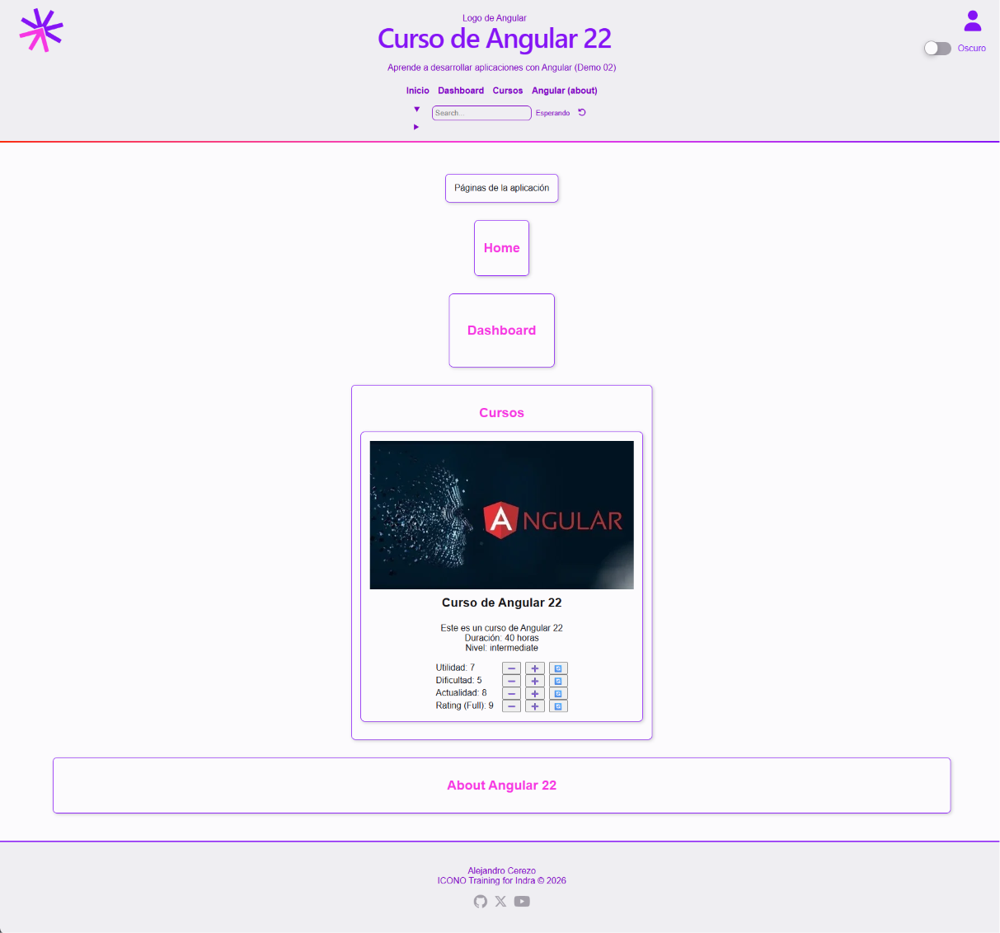
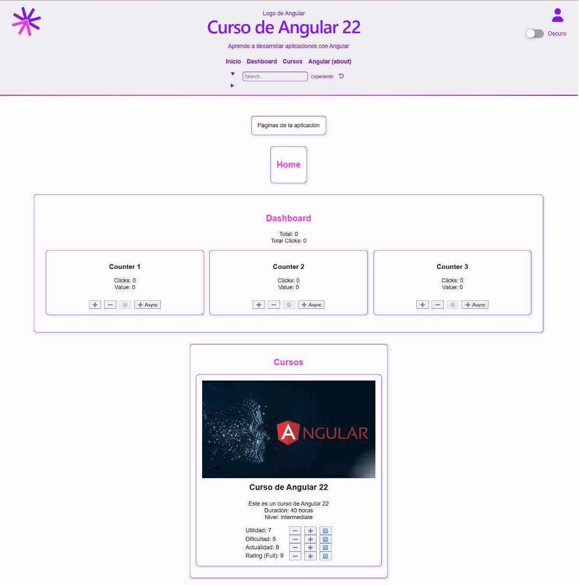

- [Features y pages (🌐)](#features-y-pages-)
  - [Páginas iniciales](#páginas-iniciales)
    - [🌐Home Page](#home-page)
      - [👁️‍🗨️Test del componente Home Page](#️️test-del-componente-home-page)
    - [🌐About Page](#about-page)
      - [👁️‍🗨️Test del componente About Page](#️️test-del-componente-about-page)
    - [🌐Dashboard Page](#dashboard-page)
      - [👁️‍🗨️Test del componente Dashboard Page](#️️test-del-componente-dashboard-page)
    - [🌐Courses Page](#courses-page)
      - [👁️‍🗨️Test del componente Courses Page](#️️test-del-componente-courses-page)
    - [Uso de las páginas](#uso-de-las-páginas)
  - [Resultados: Páginas iniciales (sin router)](#resultados-páginas-iniciales-sin-router)
- [📕Comunicación entre componentes: inputs](#comunicación-entre-componentes-inputs)
- [🧿Componente App: Inputs hacia Header y Menu](#componente-app-inputs-hacia-header-y-menu)
  - [Test de los componentes que reciben inputs: Header y Menu](#test-de-los-componentes-que-reciben-inputs-header-y-menu)
- [🌐Dashboard: counter](#dashboard-counter)
  - [🧿Componente Counter `alc-counter`: contador inicial](#componente-counter-alc-counter-contador-inicial)
        - [👁️‍🗨️Test interactivo en Angular: Componente Counter](#️️test-interactivo-en-angular-componente-counter)
  - [📕Renderizados alternativos: atributos y estructuras de control](#renderizados-alternativos-atributos-y-estructuras-de-control)
  - [🧿Componente CounterPro `alc-counter-pro`: contador mejorado](#componente-counterpro-alc-counter-pro-contador-mejorado)
    - [Aspecto de los valores negativos](#aspecto-de-los-valores-negativos)
    - [Valores límite y botones disabled](#valores-límite-y-botones-disabled)
    - [Renderizado condicional de mensajes](#renderizado-condicional-de-mensajes)
    - [👁️‍🗨️Test del componente CounterPro](#️️test-del-componente-counterpro)
- [📕Comunicación entre componentes: Output Signals](#comunicación-entre-componentes-output-signals)
- [🌐Dashboard: counter list](#dashboard-counter-list)
  - [🧿Componente CounterList `alc-counters-list`: lista de contadores](#componente-counterlist-alc-counters-list-lista-de-contadores)
      - [👁️‍🗨️Test del componente CountersList](#️️test-del-componente-counterslist)
  - [Resultados: Páginas dashboard con contadores](#resultados-páginas-dashboard-con-contadores)
- [📕LinkedSignals](#linkedsignals)
- [Componentes para selección de filtros](#componentes-para-selección-de-filtros)
  - [🧿Componente FilterOptions](#componente-filteroptions)
    - [👁️‍🗨️Test del componente FilterOptions](#️️test-del-componente-filteroptions)
  - [🧿Componente Filter](#componente-filter)
    - [👁️‍🗨️Test del componente FilterOptions](#️️test-del-componente-filteroptions-1)
- [Signals y race conditions \[ToDo\]](#signals-y-race-conditions-todo)
  - [🧿Componente Pointers](#componente-pointers)
    - [👁️‍🗨️Test del componente Pointers](#️️test-del-componente-pointers)
- [🌐Página about (Angular). Componentización (Opcional)](#página-about-angular-componentización-opcional)
  - [🧿Componente SeparatorRwd `alc-separator-rwd`](#componente-separatorrwd-alc-separator-rwd)
    - [👁️‍🗨️Test del componente SeparatorRwd](#️️test-del-componente-separatorrwd)
  - [🧿Componente Pills `alc-pills`](#componente-pills-alc-pills)
    - [👁️‍🗨️Test del componente Pills](#️️test-del-componente-pills)
  - [Refactorizando: 🧿Componente Pill-Item](#refactorizando-componente-pill-item)
    - [👁️‍🗨️Test del componente Pills](#️️test-del-componente-pills-1)
    - [🧿Componente Pills refactorizado](#componente-pills-refactorizado)
  - [🧿Componente LogoNg `alc-logo-angular`](#componente-logong-alc-logo-angular)
    - [👁️‍🗨️Test del componente LogoNg](#️️test-del-componente-logong)
- [📕Testing y coverage](#testing-y-coverage)
  - [Doble binding](#doble-binding)
  - [viewChild()](#viewchild)
  - [Overrides en TestBed](#overrides-en-testbed)


## Features y pages (🌐)

En la carpeta features se pueden crear subcarpetas para cada una de las funcionalidades principales de la aplicación, y dentro de ellas los componentes que representan las páginas (views) y los componentes secundarios (children).

NO existen como tal las páginas
Podemos llamar así a los componentes invocados directamente en las rutas y usarlos como contenedores

Desde el cli le podemos indicar la ruta completa y el nombre de la pagina para crear el componente en la ubicación deseada, usando el modificador --flat para evitar que se cree una subcarpeta con el nombre del componente:

Para  preparar el uso de distintas features, ligadas a la navegación entre páginas, se crean las páginas de ejemplo, `home`, `dashboard`  y `about`, que se incorporan una tras otra en app.

```shell
ng g c features/home/home-page --flat --project demo-02
ng g c features/dashboard/dashboard-page --flat --project demo-02
ng g c features/courses/courses-page --flat --project demo-02
ng g c features/about/about-page --flat --project demo-02
```

Opcionalmente, se puede añadir el modificador --skip-selector para evitar que se genere el selector del componente, que no es necesario en las páginas, ya que serán accedida como ruta y en ningún caso consumida desde otro template

```shell
ng g c pages/home -t -s --skip-selector
ng g c pages/about  -t -s --skip-selector
```

Sin embargo suele mantenerse el selector para facilitar la identificación del componente en el DOM.

Para facilitar posteriormente su uso en las rutas, las páginas se exportan como **default**, y este cambio se recoge en sus test para evitar que den error.

Por el momento cargamos de forma estática la página home a continuación del router-outlet del componente App.

### Páginas iniciales

En cada página:

- Se cambia el export a default y se actualiza el correspondiente import en el test
- se crea una propiedad de tipo signal, pageTitle para el título de la página, q
- se muestra en un heading <h2>

Todas las páginas comparten un archivo de estilos `pages.css` que define estilos comunes para todas ellas, como el color de los encabezados.

#### 🌐Home Page

```ts
import { Component, signal } from '@angular/core';

@Component({
  selector: 'alc-home-page',
  imports: [],
  template: `
    <h2>{{ pageTitle() }}</h2>
  `,
  styleUrls: ['../pages.css'],
  styles: ``,
})
export default class HomePage {
  protected readonly pageTitle = signal('Home');
}
```

##### 👁️‍🗨️Test del componente Home Page

Por el momento la página solo incluye un título, por lo que el test se limita a comprobar que se crea correctamente y que el título se muestra en la vista.

```ts
import { ComponentFixture, TestBed } from '@angular/core/testing';
import { By } from '@angular/platform-browser';
import HomePage from './home-page';

describe("HomePage", () => {
  let component: HomePage;
  let fixture: ComponentFixture<HomePage>;
  let debugElement: DebugElement;

  beforeEach(async () => {
    await TestBed.configureTestingModule({
      imports: [HomePage],
    }).compileComponents();

    fixture = TestBed.createComponent(HomePage);
    component = fixture.componentInstance;
    await fixture.whenStable();
    debugElement = fixture.debugElement;
  });

  it("should create", () => {
    expect(component).toBeTruthy();
  });

  it("should render the title", () => {
    const debugHeading = fixture.debugElement.query(By.css('h2'))
    const elementHeading = debugHeading.nativeElement as HTMLElement;
    expect(elementHeading.textContent).toBe('Home');
  });
});
```

#### 🌐About Page

```ts
import { Component, signal } from '@angular/core';
@Component({
  selector: 'alc-about-page',
  imports: [],
  template: `
    <h2>{{ pageTitle() }}</h2>
  `,
  styleUrls: ['../pages.css'],
  styles: ``,
})
export default class AboutPage {
  protected readonly pageTitle = signal('About Angular');
}
```

##### 👁️‍🗨️Test del componente About Page

Igual que en el caso anterior, la página solo incluye un título, por lo que el test se limita a comprobar que se crea correctamente y que el título se muestra en la vista.

```ts
describe("AboutPage", () => {
  let component: AboutPage;
  let fixture: ComponentFixture<AboutPage>;
  let debugElement: DebugElement;

  beforeEach(async () => {
    await TestBed.configureTestingModule({
      imports: [AboutPage],
    }).compileComponents();

    fixture = TestBed.createComponent(AboutPage);
    component = fixture.componentInstance;
    await fixture.whenStable();
    debugElement = fixture.debugElement;
  });

  it("should create", () => {
    expect(component).toBeTruthy();
  });

  it("should render the title", () => {
    const debugHeading = fixture.debugElement.query(By.css('h2'))
    const elementHeading = debugHeading.nativeElement as HTMLElement;
    expect(elementHeading.textContent).toBe('About');
  });
});
```

#### 🌐Dashboard Page

```ts dashboard-page.ts
import { Component, signal } from '@angular/core';

@Component({
  selector: 'alc-dashboard-page',
  template: `
    <h2>{{ pageTitle() }}</h2>
  `,
  styleUrls: ['../pages.css'],
  styles: `
    :host {
      display: block;
      width: 100%;
      padding: 1rem;
    }
  `,
})
export default class DashboardPage {
    protected readonly pageTitle = signal('Dashboard');
}
```

##### 👁️‍🗨️Test del componente Dashboard Page

Igual que en el caso anterior, la página solo incluye un título, por lo que el test se limita a comprobar que se crea correctamente y que el título se muestra en la vista.

```ts
describe('DashboardPage', () => {
  let component: DashboardPage;
  let fixture: ComponentFixture<DashboardPage>;

  beforeEach(async () => {
    await TestBed.configureTestingModule({
      imports: [DashboardPage],
    }).compileComponents();

    fixture = TestBed.createComponent(DashboardPage);
    component = fixture.componentInstance;
    await fixture.whenStable();
  });

  it('should create', () => {
    expect(component).toBeTruthy();
  });

    it('should have render the correct page title', () => {
    const debugHeading = fixture.debugElement.query(By.css('h2'))
    const elementHeading = debugHeading.nativeElement as HTMLElement;
    expect(elementHeading.textContent).toContain('Dashboard');
  });
});
```

#### 🌐Courses Page

```ts courses-page.ts
import { Component, signal } from '@angular/core';
@Component({
  selector: 'alc-courses-page',
  imports: [],
  template: `
    <h2>{{ pageTitle() }}</h2>
  `,
  styleUrls: ['../pages.css'],
  styles: ``,
})
export default class CoursesPage {
  protected readonly pageTitle = signal('Cursos');
}
```

En la página courses se incorpora el componente CourseItemPro que teníamos como ejemplo inicial y que habíamos renderizado directamente en la aplicación:

- `alc-course-item-pro`

Aplicamos algunas refactorizaciones al componente:

- eliminando los template y css en archivos separados, y pasando a inline (como en todos nuestros componetes)
- eliminando el handle de botones incorrecto que habíamos incluido previamente para comprobar la forma correcta de manipular las signals


Ya no seguimos mostrando los otros componentes, más incompletos

- `alc-course-item`
- `alc-course-item-signals`

Por lo que también refactorizamos el código de la página de Cursos 
  
```ts
@Component({
  selector: 'alc-courses-page',
  imports: [CourseItem, CourseItemSignals, Card],
  template: `
    <h2>{{ pageTitle() }}</h2>
    <alc-card>
      <alc-course-item-pro />
    </alc-card>
    <!-- <details>
      <summary>Ejemplo básico del componente</summary>
      <alc-course-item />
    </details>
    <details>
      <summary>Ejemplo del uso de signals en el componente</summary>
      <alc-course-item-signals />
    </details> -->
  `,
  styleUrls: ['../pages.css'],
  styles: ``,
})
export default class CoursesPage {
  protected readonly pageTitle = signal('Courses');
}
```

##### 👁️‍🗨️Test del componente Courses Page

Igual que en el caso anterior, podemos testar que se renderiza un título, y en este caso que también que se renderiza el componente CourseItemPro, que es el único que se muestra en la página.

```ts
describe('CoursesPage', () => {
  let component: CoursesPage;
  let fixture: ComponentFixture<CoursesPage>;

  beforeEach(async () => {
    await TestBed.configureTestingModule({
      imports: [CoursesPage],
    }).compileComponents();

    fixture = TestBed.createComponent(CoursesPage);
    component = fixture.componentInstance;
    await fixture.whenStable();
  });

  it('should create', () => {
    expect(component).toBeTruthy();
  });

  it('should have render the correct page title', () => {
    const debugHeading = fixture.debugElement.query(By.css('h2'));
    const elementHeading = debugHeading.nativeElement as HTMLElement;
    expect(elementHeading.textContent).toContain('Cursos');
  });

  it('should have render the course item pro component', () => {
    const debugCourseItemPro = fixture.debugElement.query(By.directive(CourseItemPro));
    expect(debugCourseItemPro).toBeTruthy();
    expect(debugCourseItemPro.nativeElement).toBeInstanceOf(HTMLElement);
  });
});
```

#### Uso de las páginas

Por el momento, hasta disponer de un router, se incorporan las páginas en app, una tras otra, para mostrar el contenido de cada una de ellas, añadiéndoles un id y envolviendo cada una en un `alc-card`.

```ts app.ts
@Component({
  selector: 'alc-root',
  imports: [RouterOutlet, Header, Footer, Menu, Card, HomePage, DashboardPage, AboutPage],
  template: `
    <alc-header />
      <alc-menu />
    </alc-header>
    <main class="container">
      <router-outlet />
      <alc-card>
        <p>Páginas de la aplicación</p>
      </alc-card>
      <alc-card>
        <alc-home-page id="home" />
      </alc-card>
      <alc-card>
        <alc-dashboard-page id="dashboard" />
      </alc-card>
      <alc-card>
        <alc-courses-page id="courses" />
      </alc-card>
      <alc-card class="wide">
        <alc-about-page id="about" />
      </alc-card>
    </main>
    <alc-footer />
  `,
  styles: `...`
})
export class App {}
```


Se modifican las opciones de menú definidas en `app.routes.ts` para que correspondan a las tres páginas creadas

```ts
export const MENU_OPTIONS: MenuOption[] = [
  { label: 'Inicio', path: '#home' },
  { label: 'Dashboard ', path: '#dashboard' },
  { label: 'Cursos', path: '#courses' },
  { label: 'Angular (about)', path: '#about' },
];
```

En el test de App no es necesario incluir todas las páginas, porque más adelante desapareceran al usar el router, pero seria muy sencillo hacerlo, igual que con los otros componentes que ahora testamos.

### Resultados: Páginas iniciales (sin router)



## 📕Comunicación entre componentes: inputs

En Angular es bidireccional pero asimétrica

- hacia abajo: paso de parámetros a los hijos
- hacia arriba: envío de eventos hacia el padre

La comunicación hacia abajo se realiza mediante **inputs**, que permiten pasar información desde un componente padre a un componente hijo, y la comunicación hacia arriba se realiza mediante **outputs**, que permiten enviar eventos desde un componente hijo a un componente padre.

En versiones anteriores de Angular, la comunicación hacia abajo se realizaba mediante el decorador **@Input()**, que permitía definir propiedades en el componente hijo que podían recibir valores desde el componente padre. 

Sin embargo, desde Angular 20 ya se dispone de forma estable de un nuevo mecanismo de comunicación hacia abajo mediante **inputSignals**, que permite pasar información desde un componente padre a un componente hijo de forma más eficiente y reactiva.

Opciones de los inputs:

- required: indica que el input es obligatorio y debe ser proporcionado por el componente padre
- alias: permite definir un nombre alternativo para el input, que puede ser diferente al nombre de la propiedad en el componente hijo
- transform: permite definir una función de transformación que se aplica al valor recibido antes de asignarlo a la propiedad del componente hijo

```ts
readonly upperCaseTitle = input.required<string>(
  {
    alias: 'title',
    transform: (value: unknown) => {
      if (typeof value === 'string') {
        return value.toUpperCase();
      }
      throw new Error('Invalid value for title input');
    },
  }
);

```

Utilizando la capacidad de comunicación entre los componentes mediante inputSignals, se puede lograr un mejor **reparto de responsabilidades** entre los componentes: 

- el componente padre se encarga de gestionar la información y el estado de la aplicación
- el componente hijo se encarga de mostrar la información y manejar la interacción con el usuario.

## 🧿Componente App: Inputs hacia Header y Menu 

En nuestro primer ejemplo, el componente app es responsable de los valores del estado de la aplicación: 

- título y subtítulo en app
- opciones de menu en app

Mediante inputs estos valores llegan al componente responsable de mostrar el header, que a su vez los pasa a los componentes hijos que se encargan de mostrar el logo, el menu y el título.

```ts app.ts
@Component({
  selector: 'alc-root',
  imports: [RouterOutlet, Header, Footer, Menu, Card, ...],
  template: `
    <alc-header [title]="title()" [subtitle]="subtitle()">
      <alc-menu [options]="menuOptions()" />
    </alc-header>
    <main class="container">
      <router-outlet />
      ...
    </main>
    <alc-footer />
  `,
  styles: `...`
})
export class App {
  protected readonly title = signal('Curso de Angular 22');
  protected readonly subtitle = signal('Aprende a desarrollar aplicaciones con Angular');
  protected readonly menuOptions = signal<MenuOption[]>(MENU_OPTIONS);
}
```

En los componentes hijo solo cambia la forma en que se recibe valor en los propiedades, mientras que su uso es completamente igual.

Al definir los inputs como required, se asegura que el componente hijo no pueda ser utilizado sin recibir los valores necesarios desde el componente padre, lo que ayuda a evitar errores y a mantener la consistencia de la aplicación.

```ts header.ts
@Component({
  selector: 'alc-header',
  imports: [MenuMobile, Separator, LogoNg, LogoCoders, User, Toggle, Search, SearchRef],
  template: `...`,
  styles: `...` 
  ],
})
export class Header {
  readonly title = input.required<string>();
  readonly subtitle = input.required<string>();
}
```

```ts menu.ts
@Component({
  selector: 'alc-menu',
  imports: [],
  template: `...`,
  styles: `...`,
})
export class Menu {
  readonly options = input.required<MenuOption[]>();
}
```
Esto también permite personalizar el comportamiento y la apariencia del componente hijo según las necesidades del componente padre, como veremos más adelante.

### Test de los componentes que reciben inputs: Header y Menu 

Cuando en un componente se define un input requerido, es imprescindible propoecionarselo en el test, de lo contrario el test fallará al intentar crear el componente.


Como el tipo `SignalInput` es un tipo de signal de solo lectura, no dispone de los métodos set() y update() que permitirían cambiar su valor, debemos usar una características del entorno de testing de Angular.

La `fixture` incluida en la clase `DebugElement` dispone de una propiedad `componentRef` que tiene método `setInput() `que permite cambiar el valor de un input en tiempo de ejecución, y que se puede usar en los test para asignar el valor inicial a los inputs, manteniendo el resto del test como estaba.

Esta forma de "inyección de dependencia" nos da el control del valor proporcionado, permitiendo que el test sea más independientes de los valores que en la aplicación recibirá el componente.

```ts
describe('Menu', () => {
  //...
  beforeEach(async () => {
    //...
    fixture = TestBed.createComponent(Menu);
    component = fixture.componentInstance;
    fixture.componentRef.setInput('options', [
      { label: 'Home', route: '/home' },
      { label: 'About', route: '/about' },])
    await fixture.whenStable();
  });

  // Los tests no cambian
});
```

En el menu, podemos decidir las opciones que queremos mostrar en el test, y comprobar que se renderizan correctamente, sin necesidad de depender de los valores que en la aplicación real se pasaran desde el componente padre.

```ts
describe('Header', () => {
  //...
  beforeEach(async () => {
    //...
    fixture = TestBed.createComponent(Header);
    component = fixture.componentInstance;
    fixture.componentRef.setInput('title', 'Curso de Angular');
    fixture.componentRef.setInput('subtitle', 'Aprende a desarrollar aplicaciones con Angular');
    await fixture.whenStable();
  });

  // Los tests no cambian
});
```

## 🌐Dashboard: counter

Creamos los componentes correspondientes a un contador de tres botones y una lista de contadores

```shell
  ng g c features/dashboard/components/counter
  ng g c features/dashboard/components/counters-list
```

- `alc-counters-list`
  - `alc-counter`
  - `alc-counter`
  - `alc-counter`

El componente `alc-counters-list` se incorpora a la página `dashboard-page`, para mostrar una lista de contadores, cada uno con su propio estado y funcionalidad. En el se incluyen tres contadores.

### 🧿Componente Counter `alc-counter`: contador inicial

En el componente `alc-counter` se implementa un contador con tres botones: incrementar, decrementar y resetear.

- En la clase de define el estado con propiedades de tipo signal: sus cambios se reflejan en la vista 
  
```ts
protected readonly clicks = signal(0);
protected readonly count = signal(0);
```

- En la vista podemos definir la respuesta a los eventos con el operador () 

```ts
<div>
  <button (click)="changeCount(1)" title="Increment">➕</button>
  <button (click)="changeCount(-1)" title="Decrement">➖</button>
  <button (click)="resetCount()" title="Reset">🟣</button>
  <button (click)="changeCountAsync()" title="Increment Async">➕ Async</button>
</div>
```

- En esa respuesta podemos hacer directamente cambios en el estado,
que automáticamente actualizaran la vista 

  ```ts
  changeCount(delta: number) {
    this.clicks.update((value) => value + 1);
    this.count.update((value) => value + delta);
  }

  resetCount() {
    this.clicks.set(0);
    this.count.set(0);
  }
  changeCountAsync() {
    setTimeout(() => {
      this.changeCount(1);
      console.log(`Clicks: ${this.clicks}`);
    }, 1000);
  }
  ```

El método asíncrono nos permite comprobar como las operaciones asíncronas se gestionan correctamente si usamos signal(). 

Si la variable no es reactiva en un proyecto ZoneLess y con la estrategia de detección del cambio OnPush, cuando su valor cambia desde un callback asíncrono, la vista no se actualiza automáticamente. Como ya hemos visto.

###### 👁️‍🗨️Test interactivo en Angular: Componente Counter

Como tenemos botones, debemos comprobar su funcionalidad.

El debugElement dispone para es del método triggerEventHandler() para disparar el click del botón.
Después de usarlo es importante lanzar **fixture.detectChanges()** para que la vista refleje los cambios en el componente. 
O usar métodos asíncronos con **fixture.whenStable()** para esperar a que se actualice la vista.
El proceso de detección del cambio automático en los componentes de Angular no lo es en el entorno de test, por lo que hay que ejecutar el correspondiente método de la fixture

```ts
describe("When we use the buttons", () => {
  let outputElements: HTMLOutputElement[];
  let buttonDebugElements: DebugElement[];
  
  beforeEach(() => {
    outputElements = debugElement.queryAll(By.css('output')).map((el) => el.nativeElement);
    buttonDebugElements = debugElement.queryAll(By.css('button'));
  });

  it('should increase the display when the button ➕ is clicked', async () => {
    component['count'].set(0);
    component['clicks'].set(0);
    expect(buttonDebugElements[0].nativeElement.title).toBe('Increment');
    buttonDebugElements[0].triggerEventHandler('click');
    await fixture.whenStable();
    expect(outputElements[0].textContent).toBe('1');
    expect(outputElements[1].textContent).toBe('1');
  });

  it('should decrease the display when the button ➖ is clicked', async () => {
    component['count'].set(0);
    component['clicks'].set(0);
    expect(buttonDebugElements[1].nativeElement.title).toBe('Decrement');
    buttonDebugElements[1].triggerEventHandler('click');
    await fixture.whenStable();
    expect(outputElements[0].textContent).toBe('1');
    expect(outputElements[1].textContent).toBe('-1');
  });

  it('should reset the display when the button 🟣 is clicked', async () => {
    component['count'].set(5);
    component['clicks'].set(10);
    buttonDebugElements[2].triggerEventHandler('click');
    await fixture.whenStable();
    expect(outputElements[0].textContent).toBe('0');
    expect(outputElements[1].textContent).toBe('0');
  });
});
```

En el botón que funciona de forma asíncrona utilizaremos `vi.useFakeTimers()`, que nos permitira simular un paso del tiemplo con  `vi.advanceTimersByTime(1100)` después del click del contador, para comprobar el resultado.

```ts
  afterEach(() => {
  vi.useRealTimers();
});

it('should increase the display when the button ➕ Async is clicked', async () => {
  component['count'].set(0);
  component['clicks'].set(0);
  vi.useFakeTimers();
  expect(buttonDebugElements[3].nativeElement.title).toBe('Increment Async');
  buttonDebugElements[3].triggerEventHandler('click');
  vi.advanceTimersByTime(1100);
  await fixture.whenStable();
  expect(outputElements[0].textContent).toBe('1');
  expect(outputElements[1].textContent).toBe('1');
});
```

### 📕Renderizados alternativos: atributos y estructuras de control

Desde Las primeras versiones de AngularJS existían las **directivas de atributo** para manipular el aspecto de los elementos del DOM en función de ciertas condiciones o eventos, como es le caso de `ngClass` o `ngStyle`.

En Angular moderno se ha reducido el uso de estas directivas en favor del uso directo de los atributos del DOM junto con el operador [] para vincularlos a expresiones del componente.

En la guía de estilo de Angular actual se recomienda **evitar** el uso de directivas de atributo como ngClass y ngStyle en favor del uso directo de los atributos del DOM con el operador [].

Para usar las directivas en un componente es necesario importar en él CommonModule. En el caso de los [atributos del DOM] no es necesario importar ningún módulo, ya que son parte del estándar HTML y están disponibles en todos los navegadores.

Entre los atributos del DOM que se pueden vincular a expresiones del componente para cambiar el aspecto con el que se renderiza se encuentran:

- [class]: permite aplicar clases CSS de forma condicional
- [style]: permite aplicar estilos CSS de forma condicional
- [disabled]: permite habilitar o deshabilitar elementos de formulario de forma condicional
- [hidden]: permite ocultar o mostrar elementos de forma condicional

Por otro lado, Angular, desde la versión 17, proporciona **estructuras de control** que permiten renderizar elementos de forma condicional o iterativa, como son:

- @if: permite renderizar elementos de forma condicional
- @for: permite renderizar elementos de forma iterativa
- @switch: permite renderizar elementos de forma condicional según un valor

El renderizado condicional no supone que se vea o se deje de ver un elemento, sino que el elemento se crea o se destruye en el DOM según la condición que se cumpla. Esto permite optimizar el rendimiento de la aplicación y evitar problemas de accesibilidad.

### 🧿Componente CounterPro `alc-counter-pro`: contador mejorado

#### Aspecto de los valores negativos

El atributo [class] se puede utilizar para aplicar una clase de css de forma condicional. Creamos una clase `.negative` que se aplica cuando el valor del contador es negativo, para cambiar el color del texto.

El atributo [class] se vincular con un objeto en el que

- los nombres de las propiedades corresponden a clases CSS
- su valor boolean determina si se aplican

```html
<output [class]="{'negative': counter < 0}">{{counter()}}</output>
```
Alternativamente, se puede utilizar el atributo [class.nombre] con lo que el nombre de la clase se especifica directamente en el atributo y su valor boolean determina si se aplica.

```html
<output [class.negative]="counter < 0">{{counter}}</output>
```

Los mismos mecanismos pueden usarse para aplicar estilos en línea mediante el atributo style, pero como siempre en el Frontend, es preferible usar clases CSS para mantener la separación de responsabilidades.

#### Valores límite y botones disabled

Si definimos como límites -5 y 5 almacenándolo en una propiedad del componente de tipo signal, podemos deshabilitar el botón que ya no es valido dando al atributo `disable` un valor booleano. Vemos de nuevo como el operador [] permite vincular un atributo a una expresión

```html
<div>
  <button (click)="changeCount(1)" [disabled]="count() >= limit()" title="Increment">
    ➕
  </button>
  <button (click)="changeCount(-1)" [disabled]="count() <= -limit()" title="Decrement">
    ➖
  </button>
  <button (click)="resetCount()" [disabled]="count() === 0" title="Reset">
    🟣
  </button>
  <button (click)="changeCountAsync()" [disabled]="count() >= limit()" title="Increment Async">
    ➕ Async
  </button>
</div>
```

#### Renderizado condicional de mensajes

Pero ademas, podemos añadir información al usuario que se renderizará condicionalmente
Para ello tenemos también un nuevo flow control, @if, que viene a sustituir a la directiva estructural ng-if

```html
@if (count() >= limit()) {
  <p class="limit-reached">Alcanzaste el límite de {{ limit() }}</p>
} @else if (count() <= -limit()) {
  <p class="limit-reached">Alcanzaste el límite de -{{ limit() }}</p>
} @else {
  <p class="limit-reached">&nbsp;</p>
}
```

La última condición reserva el espacio cuando no hay mensajes, para evitar un salto en la pantalla cuando aparece alguno de aquellos

#### 👁️‍🗨️Test del componente CounterPro

En este caso, además de comprobar el funcionamiento de los botones, que ya hemos visto en la versión inicial del componente, podemos verificar que el atributo disabled se aplica correctamente en los botones cuando se alcanzan los límites y que se muestra el mensaje correspondiente en la vista.

Para el límite superior:

- llevamos al valor del contador más alla del límite
- disparamos el evento click
- comprobamos el disabled de los botones que deben tenerlo
- comprobamos el mensaje que se muestra en la vista

```ts
describe('When the MAX limit is reached', () => {
  beforeEach(() => {
    component['count'].set(6);
    component['clicks'].set(1);
    buttonDebugElements[0].triggerEventHandler('click');
  });

  it('should be disable the button + y +Asyn', async () => {
    await fixture.whenStable();
    expect(buttonDebugElements[0].nativeElement.disabled).toBe(true);
    expect(buttonDebugElements[3].nativeElement.disabled).toBe(true);
  });

  it('should be enable the button - y Reset', async () => {
    await fixture.whenStable();
    expect(buttonDebugElements[1].nativeElement.disabled).toBe(false);
    expect(buttonDebugElements[2].nativeElement.disabled).toBe(false);
  });

  it('should show the message "Alcanzaste el límite de 5"', async () => {
    await fixture.whenStable();
    const messageElement = debugElement.query(By.css('.limit-reached')).nativeElement;
    expect(messageElement.textContent).toBe('Alcanzaste el límite de 5');
  });
});
```

El mismo patrón seguiremos para el límite inferior

```ts
describe('When the MIN limit is reached', () => {
  beforeEach(() => {
    component['count'].set(-6);
    component['clicks'].set(1);
    buttonDebugElements[1].triggerEventHandler('click');
  });

  it('should be disable the button - y ', async () => {
    await fixture.whenStable();
    expect(buttonDebugElements[1].nativeElement.disabled).toBe(true);
  });

  it('should be enable the button +, +Asyn y Reset', async () => {
    await fixture.whenStable();
    expect(buttonDebugElements[0].nativeElement.disabled).toBe(false);
    expect(buttonDebugElements[2].nativeElement.disabled).toBe(false);
    expect(buttonDebugElements[3].nativeElement.disabled).toBe(false);
  });

  it('should show the message "Alcanzaste el límite de -5"', async () => {
    await fixture.whenStable();
    const messageElement = debugElement.query(By.css('.limit-reached')).nativeElement;
    expect(messageElement.textContent).toBe('Alcanzaste el límite de -5');
  });
});
```

Por último, si el valor es cero, comprobamos que el botón de reset debe estar deshabilitado, y los otros habilitados.

```ts
describe('When the Value is ZERO', () => {
  beforeEach(() => {
    component['count'].set(0);
    component['clicks'].set(1);
  });

  it('should be disable the button Reset', async () => {
    await fixture.whenStable();
    expect(buttonDebugElements[2].nativeElement.disabled).toBe(true);
  });

  it('should be enable the button +, +Asyn y -', async () => {
    await fixture.whenStable();
    expect(buttonDebugElements[0].nativeElement.disabled).toBe(false);
    expect(buttonDebugElements[1].nativeElement.disabled).toBe(false);
    expect(buttonDebugElements[3].nativeElement.disabled).toBe(false);
  });
});
```

## 📕Comunicación entre componentes: Output Signals

Como ya hemos visto, la comunicación entre componentes en Angular es bidireccional pero asimétrica.

En la comunicación hacia arriba, el componente hijo emite eventos mediante **outputs**, que son manejados por el componente padre para actualizar su propio estado y reflejar los cambios en la vista.

Tradicionalmente, este proceso dependía de dos elementos:

- el decorador **@Output()**, peu permite dirigir eventos hacia el nivel anterior (padre)
- la clase **EventEmitter**, que permite crear y emitir eventos con cualquier contenido, Esta clase extiende de la clase **Subject** de **RxJS**, por lo que permite emitir eventos de forma reactiva y suscribirse a ellos para recibir notificaciones cuando se producen.

Desde Angular 20 se dispone de un nuevo mecanismo de comunicación hacia arriba mediante **outputSignals**, que permite enviar eventos desde un componente hijo a un componente padre de forma más eficiente y reactiva.

El enfoque de Angular ha sido mantener el proceso de emisión de eventos, aunque ahora depende se signals y no de RxJS, lo que permite que la respuesta a nivel del componente padre sea exactamente la misma, sin tener que modificar el código, utilizando la misma notación de eventos con el **operador ()** y el mismo tipo de datos que se emite, aunque ahora se hace mediante signals y no mediante RxJS.

## 🌐Dashboard: counter list

### 🧿Componente CounterList `alc-counters-list`: lista de contadores

El componente `alc-counters-list` se encarga de mostrar una lista de contadores, cada uno con su propio estado y funcionalidad.

- permitirá que cada contador se identifique con un id, que se pasa como input al componente `alc-counter`
- permitirá definir el valor inicial de cada uno de los contadores
- llevara la cuentas del número total de clicks y del valor total acumulado en todos los contadores

Para ello, se define un array de contadores, cada uno con su id y su valor inicial, que se itera en el template para crear un componente `alc-counter` por cada elemento del array.

```ts

interface CounterState {
  id: number;
  value: number;
}

const COUNTERS: CounterState[] = [
  { id: 1, value: 0 },
  { id: 2, value: 0 },
  { id: 3, value: 0 },
];
@Component({
  selector: 'alc-counters-list',
  imports: [Counter, Card],
  template: `
    <p>Total: {{ total() }}</p>
    <p>Total Clicks: {{ totalClicks() }}</p>
    <div>
      @for (item of counters(); track $index) {
        <alc-card>
          <alc-counter [id]="item.id" (clickEvent)="handleClicks($event)" />
        </alc-card>
      }
    </div>
  `,
  styles: `
    div {
      display: grid;
      grid-template-columns: repeat(auto-fit, minmax(225px, 1fr));
      gap: 1rem;
    }
  `,
})
export class CountersList {
 protected readonly counters = signal<CounterState[]>(COUNTERS);
}
```

Para actualizar el estado de los totales se define el manejador del evento clickEvent que se emite desde cada contador, que actualiza el total de clicks y el total acumulado.

```ts
handleClicks(delta: number) {
  this.totalClicks.update((value) => value + 1);
  this.total.update((value) => value + delta);
}
```

De acuerdo con el modelo asíncrono de comunicación entre componentes que implementa Angular

- el componente padre define el estado y lo pasa a los componentes hijos mediante inputs
- los componentes hijos emiten eventos cuando su estado cambia, que son manejados por el componente padre para actualizar su propio estado y reflejar los cambios en la vista.

En el contador creamos una output-signal (`OutputEmitterRef<number>`) `clickEvent` que emite el valor del cambio en el contador

```ts
protected readonly clickEvent = output<number>();
```

En cada cambio de valor del contador, se emite el evento con el valor del cambio (delta) que se recibe en el manejador del evento en el componente padre.

```ts
this.clickEvent.emit(delta);
```

El resultado final del componente counter sería el siguiente

```ts  
import { Component, input, output, signal } from '@angular/core';

@Component({
  selector: 'alc-counter',
  imports: [],
  template: `
    <h3>Counter {{ id() }}</h3>
    <p>
      Clicks: <output class="clicks">{{ clicks() }}</output>
    </p>
    <!-- <p>Value: <output [class]="count() < 0 ? 'negative' : ''" class="value">{{ count() }}</output></p> -->
    <!-- <p>Value: <output [class]="{negative: count() < 0}" class="value">{{ count() }}</output></p> -->
    <p>
      Value: <output [class.negative]="count() < 0" class="value">{{ count() }}</output>
    </p>

    @if (count() >= limit()) {
      <p class="limit-reached">Alcanzaste el límite de {{ limit() }}</p>
    } @else if (count() <= -limit()) {
      <p class="limit-reached">Alcanzaste el límite de -{{ limit() }}</p>
    } @else {
      <p class="limit-reached">&nbsp;</p>
    }

    <div>
      <button (click)="changeCount(1)" [disabled]="count() >= limit()" title="Increment">➕</button>
      <button (click)="changeCount(-1)" [disabled]="count() <= -limit()" title="Decrement">
        ➖
      </button>
      <button (click)="resetCount()" [disabled]="count() === 0" title="Reset">🟣</button>
      <button (click)="changeCountAsync()" [disabled]="count() >= limit()" title="Increment Async">
        ➕ Async
      </button>
    </div>
  `,
  styles: `
    div {
      display: flex;
      justify-content: center;
      gap: 0.5rem;
      margin-top: 0.5rem;
    }

    .limit-reached {
      color: var(--color-primary-hot);
    }

    .negative {
      color: var(--color-tertiary-hot);
    }
  `,
})
export class Counter {
  readonly id = input.required<number>();
  readonly initialValue = input<number>(0, { alias: 'value' });

  protected readonly clickEvent = output<number>();

  protected readonly limit = signal(5);
  protected readonly clicks = signal(0);
  protected readonly count = signal(0);

  // GETTER de la signal
  // this.clicks()
  // SETTERS de la signal
  // this.clicks.set()
  // this.clicks.update()

  changeCount(delta: number) {
    this.clicks.update((value) => value + 1);
    this.clickEvent.emit(delta);
    if (delta > 0 && this.count() >= this.limit()) {
      return;
    }
    if (delta < 0 && this.count() <= -this.limit()) {
      return;
    }
    this.count.update((value) => value + delta);
  }

  resetCount() {
    const delta = -this.count();
    this.clickEvent.emit(delta);
    this.clicks.set(0);
    this.count.set(0);
  }
  changeCountAsync() {
    setTimeout(() => {
      this.changeCount(1);
      console.log(`Clicks: ${this.clicks}`);
    }, 1000);
  }
}
```

##### 👁️‍🗨️Test del componente CountersList

El test de esta nueva versión del componente debe cubrir los cambios introducidos:

- comprobar que se renderizan los números negativos con la clase CSS correspondiente (en rojo)
- comprobar que los botones se deshabilitan cuando se alcanzan los límites
- comprobar que aparece el correspondiente mensaje cuando se alcanzan los límites
- comprobar que se emite el evento clickEvent con el valor correcto cuando se hace click en los botones

Para esto último, podemos usar un espía (spy) para interceptar la llamada al método emit() del output-signal clickEvent y comprobar que se llama con el valor esperado.

```ts
beforeEach(() => {
  // Añadimos u spy para el output()
  spyEvents = vi.spyOn(component['clickEvent'], 'emit');
});
```

En lo demás. los diversos niveles de describe() nos permiten organizar los tests de forma clara y comprensible, agrupando los tests relacionados con cada funcionalidad del componente.

Por ejemplo para el botón de incremento, podemos agrupar los tests relacionados con el click en el botón ➕ en un describe() anidado, y dentro de él, definir los tests individuales para comprobar el comportamiento esperado.

```ts
describe('When we use the buttons', () => {
  // ...
  describe('And the button ➕ is clicked', () => {
    beforeEach(() => {
      component['count'].set(0);
      component['clicks'].set(0);
      buttonDebugElements[0].triggerEventHandler('click');
    });

    it('should increase the display when ', async () => {
      await fixture.whenStable();
      expect(outputElements[0].textContent).toBe('1');
      expect(outputElements[1].textContent).toBe('1');
    });

    // Comprobamos que se emite el evento clickEvent con el valor correcto
    it('should emit the event clickEvent with the correct value', async () => {
      expect(spyEvents).toHaveBeenCalledWith(1);
    });
  });
  //...
});
```

Lo mismo para los otros botones

```ts
describe('And the button ➖ is clicked', () => {
  beforeEach(() => {
    component['count'].set(0);
    component['clicks'].set(0);
    buttonDebugElements[1].triggerEventHandler('click');
  });

  it('should decrease the display', async () => {
    await fixture.whenStable();
    expect(outputElements[0].textContent).toBe('1');
    expect(outputElements[1].textContent).toBe('-1');
  });

  // Comprobamos que los valores negativos se muestran en color rojo
  it('should show the negative value in red color', async () => {
    await fixture.whenStable();
    const valueOutputElement = outputElements[1];
    expect(valueOutputElement.classList.contains('negative')).toBe(true);
  });

  // Comprobamos que se emite el evento clickEvent con el valor correcto
  it('should emit the event clickEvent with the correct value', async () => {
    expect(spyEvents).toHaveBeenCalledWith(-1);
  });
});

describe('And the button 🟣 is clicked', () => {
  const ACTUAL_VALUE = 5;

  beforeEach(() => {
    component['count'].set(ACTUAL_VALUE);
    component['clicks'].set(10);
    buttonDebugElements[2].triggerEventHandler('click');
  });

  it('should reset the display', async () => {
    await fixture.whenStable();
    expect(outputElements[0].textContent).toBe('0');
    expect(outputElements[1].textContent).toBe('0');
  });

  // Comprobamos que se emite el evento clickEvent con el valor correcto
  it('should emit the event clickEvent with the correct value', async () => {
    expect(spyEvents).toHaveBeenCalledWith(-ACTUAL_VALUE);
  });
});
```

Y finalmente testaremos los valores límites

```ts
describe('And the MAX limit is reached', () => {
  beforeEach(() => {
    component['count'].set(6);
    component['clicks'].set(1);
    buttonDebugElements[0].triggerEventHandler('click');
  });

  it('should be disable the button + y +Asyn', async () => {
    await fixture.whenStable();
    expect(buttonDebugElements[0].nativeElement.disabled).toBe(true);
    expect(buttonDebugElements[3].nativeElement.disabled).toBe(true);
  });

  it('should be enable the button - y Reset', async () => {
    await fixture.whenStable();
    expect(buttonDebugElements[1].nativeElement.disabled).toBe(false);
    expect(buttonDebugElements[2].nativeElement.disabled).toBe(false);
  });

  it('should show the message "Alcanzaste el límite de 5"', async () => {
    await fixture.whenStable();
    const messageElement = debugElement.query(By.css('.limit-reached')).nativeElement;
    expect(messageElement.textContent).toBe('Alcanzaste el límite de 5');
  });
});

describe('And the MIN limit is reached', () => {
  beforeEach(() => {
    component['count'].set(-6);
    component['clicks'].set(1);
    buttonDebugElements[1].triggerEventHandler('click');
  });

  it('should be disable the button - y ', async () => {
    await fixture.whenStable();
    expect(buttonDebugElements[1].nativeElement.disabled).toBe(true);
  });

  it('should be enable the button +, +Asyn y Reset', async () => {
    await fixture.whenStable();
    expect(buttonDebugElements[0].nativeElement.disabled).toBe(false);
    expect(buttonDebugElements[2].nativeElement.disabled).toBe(false);
    expect(buttonDebugElements[3].nativeElement.disabled).toBe(false);
  });

  it('should show the message "Alcanzaste el límite de -5"', async () => {
    await fixture.whenStable();
    const messageElement = debugElement.query(By.css('.limit-reached')).nativeElement;
    expect(messageElement.textContent).toBe('Alcanzaste el límite de -5');
  });
});

describe('And theValue is ZERO', () => {
  beforeEach(() => {
    component['count'].set(0);
    component['clicks'].set(1);
  });

  it('should be disable the button Reset', async () => {
    await fixture.whenStable();
    expect(buttonDebugElements[2].nativeElement.disabled).toBe(true);
  });

  it('should be enable the button +, +Asyn y -', async () => {
    await fixture.whenStable();
    expect(buttonDebugElements[0].nativeElement.disabled).toBe(false);
    expect(buttonDebugElements[1].nativeElement.disabled).toBe(false);
    expect(buttonDebugElements[3].nativeElement.disabled).toBe(false);
  });
});
```


### Resultados: Páginas dashboard con contadores


 

## 📕LinkedSignals

En Angular, linkedSignal crea una señal derivada escribible (WritableSignal) que se puede usar para leer y escribir un valor

- basada en una o más dependencias. 
- que combina una o mas señales existentes en único interface reactivo, es decir una nueva señal que puede ser leída y escrita. 

Te permite:

- Leer de señales dependientes
- Escribir de nuevo una actualización consistente en todas ellas, de manera atómica
- En ambos casos de manera sincronizada,
- Prevenir un estado inconsistente en actualizaciones asíncronas o concurrentes
- Es ideal para manejar estados complejos que dependen de múltiples señales y para desacoplar la lógica de multiples instancias de signals en una sola API reactiva.

Las linkedSignals y las computed comparten el character de derivadas, pero con dos importantes diferencias

- las `linkedSignals` son de escritura, por lo que el valor derivado puede ser sobre-escrito en cualquier momento
- las `linkedSignals` proporcionan acceso a sus valores previos

## Componentes para selección de filtros

Rama feature/filters (al finalizar: desde main rebase feature/filters)

Añadimos en la página Courses los componentes necesarios para definir los filtros en una futura búsqueda de los cursos

```shell
ng g c features/courses/components/filter --project course-01
ng g c features/courses/components/filter/filter-options --flat --project course-01
```

### 🧿Componente FilterOptions 

Empezamos por el componente que permite seleccionar entre varias opciones para crear un filtro para una determinada categoría

(1) Creamos un componente que permite elegir un filtro de cursos por categoría, con una serie de botones que representan las distintas categorías de cursos, que se definen en un array de strings en el componente padre. 

El componente hijo, con el que estamos, recibe el array de categorías como input y emite un evento cuando se selecciona una categoría, que es manejado por el componente padre para actualizar su estado y reflejar los cambios en la vista.

```ts
@Component({
  selector: 'alc-filter-options',
  imports: [],
  template: `
    <div class="filter-options">
      @for (option of options(); track option) {
        <button
          [class.selected]="option === selectedOption()"
          (click)="selectOption(option)"
        >
          {{ option }}
        </button>
      }
    </div>
  `,
  styles: `
    .filter-options {
      display: flex;
      gap: 0.5rem;
    }

    button.selected {
      background-color: var(--color-primary);
      color: white;
    }
  `,
})
export class FilterOptions {
  readonly options = input.required<string[]>();
  protected readonly selectedOption = signal<string>('');
  protected readonly optionEmitter = output<string>();

  selectOption(option: string) {
    this.selectedOption.set(option);
    this.optionEmitter.emit(option);
  }
}
``` 

La idea es que el componente padre pueda tener más de una instancia del selector de categorías (`FilterOptions`), unas dependientes de otras, reutilizando nuestro componente.

Por tanto el inputs con las opciones podrá cambiar, y nuestro componente deberá reaccionar modificando el valor de la señal `selectedOption` para reflejar el cambio en la vista.

Una primera idea podría ser crear una computedSignal que dependa de la inputSignal `options`, para actualizar el valor de la señal `selectedOption` cuando cambie el valor de `options`. 

```ts
protected readonly selectedOption = computed(() =>
  this.options().length > 0 ? this.options()[0] : '',
);
```

El problema es que la computedSignal no es escribible, por lo que no podemos actualizar su valor cuando el usuario selecciona una opción diferente.

Una alternativan sería definir un effect que observe el cambio en el input `options` y actualice la señal `selectedOption` en consecuencia. 

```ts
constructor() {
  effect(() => {
    const options = this.options();
    if (options.length > 0 && !options.includes(this.selectedOption())) {
      this.selectedOption.set(options[0]);
    }
  });
}
```

El problema es qu el equipo de Angular recomienda limitar al máximo el uso de los effects, que pueden llevar a diversos problemas , incluyendo la creación de bucles infinitos.

Para poder evitar ese uso, entre otras razones, han incorporado una nueva primitiva de signals, los linkedSignal.

```ts
export class FilterOptions {
  readonly options = input.required<string[]>();
  readonly optionEmitter = output<string>();
  // protected readonly selectedOption = signal('');
  protected readonly selectedOption = linkedSignal(() =>
    this.options().length > 0 ? this.options()[0] : '',
  );
```

En esta primera firma, linkedSignal recibe la función de computo, que ejecutará cuando cambien los valores signal implicada en la función, y devolverá el valor de la computación.

Hay una firma alternativa que permite definir en un objeto 

- la fuente o fuentes cuyo cambio desencadenara el computo
- una función de computo que recibe como parámetros la source y el valor previo, y devuelve el valor derivado  

```ts
protected readonly selectedOption = linkedSignal({
  source: this.options,
  computation: (options, prev): string => {
    if (!options.length) {
      return '';
    }      
    if (!prev || 
      (!options.includes(prev.value as string))
    ) {
        return options[0];
    }
    return prev.value;
  },
});
```

#### 👁️‍🗨️Test del componente FilterOptions

Recordemos que para dar valor al input utilizamos el método `setInput()` del objeto `fixture.componentRef`, que podremos invocar en diversas ocasiones, para ver la respuesta del componente a los cambios en el input, siempre seguido de `await fixture.whenStable()` para esperar a que se actualice la vista.

Como caso iniciales, podemos comprobar que el componente se renderiza correctamente con un conjunto de opciones iniciales, y que la primera opción se selecciona por defecto.

```ts
 it('should render the options initially', () => {
  fixture.detectChanges();
  const buttons = fixture.nativeElement.querySelectorAll('button');
  expect(buttons.length).toBe(3);
  expect(buttons[0].textContent.trim()).toBe('Option 1');
  expect(buttons[1].textContent.trim()).toBe('Option 2');
  expect(buttons[2].textContent.trim()).toBe('Option 3');
});

it('should select the first option by default, applying the correct class', () => {
  fixture.detectChanges();
  const buttons = fixture.nativeElement.querySelectorAll('button');
  expect(buttons[0].classList).toContain('selected');
  expect(buttons[1].classList).not.toContain('selected');
  expect(buttons[2].classList).not.toContain('selected');
});
```

Como en cualquier componente con interactividad, comprobamos que el click en un botón selecciona la opción correspondiente y emite el evento con el valor correcto.

```ts
it('should select an option when clicked and emit the selected option', () => {
  vi.spyOn(component.optionEmitter, 'emit');

  fixture.detectChanges();
  const buttons = fixture.nativeElement.querySelectorAll('button');
  buttons[1].click(); // Click on the second option
  fixture.detectChanges();
  expect(buttons[1].classList).toContain('selected');
  expect(buttons[0].classList).not.toContain('selected');
  expect(component.optionEmitter.emit).toHaveBeenCalledWith('Option 2');
});
```

Finalmente , comprobamos que cuando el input `options` cambia, el componente actualiza la opción seleccionada correctamente. Teniendo en cuenta la lógica de nuestra linkedSignal, comprobaremos

- que si la opción previamente seleccionada sigue estando en el nuevo conjunto de opciones, se mantiene la selección
- si la opción previamente seleccionada ya no está en el nuevo conjunto de opciones, se selecciona la primera opción del nuevo conjunto
- si el nuevo conjunto de opciones está vacío, no se selecciona ninguna opción, estableciando a cadena vacia el valor de la propiedad

```ts
describe('when options are updated', () => {
  describe('And the updated options NOT include the previously selected option', () => {
    it('should update the rendered options and select the first one', async () => {
      fixture.componentRef.setInput('options', ['New Option 1', 'New Option 2']);
      await fixture.whenStable();
      fixture.detectChanges();
      const buttons = fixture.nativeElement.querySelectorAll('button');
      expect(buttons.length).toBe(2);
      expect(buttons[0].textContent.trim()).toBe('New Option 1');
      expect(buttons[1].textContent.trim()).toBe('New Option 2');
      expect(buttons[0].classList).toContain('selected');
      expect(buttons[1].classList).not.toContain('selected');
      // The selected option should be the first one
      expect(component['selectedOption']()).toBe('New Option 1'); 
    });
  });

  describe('And the updated options include the previously selected option', () => {
    it('should maintain the selected option if it is still available after options update', async () => {
      fixture.componentRef.setInput('options', ['Option 1', 'Option 2', 'Option 3']);
      await fixture.whenStable();
      fixture.detectChanges();
      const buttons = fixture.nativeElement.querySelectorAll('button');
      buttons[2].click(); 
      // Select the third option
      fixture.detectChanges();
      expect(buttons[2].classList).toContain('selected');

      // Update options, keeping the previously selected option
      fixture.componentRef.setInput('options', ['Option 2', 'Option 3', 'Option 4']);
      await fixture.whenStable();
      fixture.detectChanges();
      const updatedButtons = fixture.nativeElement.querySelectorAll('button');
      expect(updatedButtons.length).toBe(3);
      expect(updatedButtons[1].textContent.trim()).toBe('Option 3');
      // The previously selected option should still be selected
      expect(updatedButtons[1].classList).toContain('selected'); 
      // The selected option should remain the same
      expect(component['selectedOption']()).toBe('Option 3'); 
    });
  });

  describe('And the updated options are empty', () => {
    it('should not show any options if the options array is empty', async () => {
      fixture.detectChanges();
      const buttons = fixture.nativeElement.querySelectorAll('button');
      expect(buttons.length).toBe(3);
      
      fixture.componentRef.setInput('options', []);
      await fixture.whenStable();
      fixture.detectChanges();
        const updatedButtons = fixture.nativeElement.querySelectorAll('button');
      expect(updatedButtons.length).toBe(0);
      // The selected option should be reset to an empty string
      expect(component['selectedOption']()).toBe(''); 
    });
  });
});
```

### 🧿Componente Filter

El componente padre:

- contiene todo el conjunto de opciones válidas, que podrían refactorizarse en un fichero de datos externo, 

```ts
const COURSES = [
  {
    name: 'Angular',
    levels: ['Beginner', 'Intermediate', 'Advanced'],
    topics: ['Web Development', 'Mobile Development'],
  },
  {
    name: 'React',
    levels: ['Beginner', 'Intermediate'],
    topics: ['Web Development', 'Mobile Development'],
  },
  {
    name: 'Node.js',
    levels: ['Intermediate', 'Advanced'],
    topics: ['Web Development', 'Data Science'],
  },
];

const COURSE_NAMES = COURSES.map((course) => course.name);

interface Course {
  name: string;
  level: string
}
```

- renderiza dos instancias del componente hijo `FilterOptions`, una por cada nivel de filtro, pasando las opciones correspondientes como input
- contiene el estado con los filtros activos
- lo muestra en la vista

```ts
@Component({
  selector: 'alc-filter',
  imports: [Card, FilterOptions],
  template: `
    <alc-card>
      <alc-filter-options [options]="courses()" (optionEmitter)="onCourseSelect($event)" />
      <alc-filter-options [options]="levels()" (optionEmitter)="onLevelSelect($event)" />

      <p>Selected Course: {{ selectedCourse().name }}</p>
      <p>Selected Level: {{ selectedCourse().level }}</p>
    </alc-card>
  `,
  styles: ``,
})
```

- cuando cambia una opción de primer nivel, actualiza el input que recibe la instancia correspondiente al segundo nivel.
- maneja los eventos emitidos por el componente hijo `FilterOptions` para actualizar su estado y reflejar los cambios en la vista.

```ts
export class Filter {
  protected readonly courses = signal(COURSE_NAMES);
  protected readonly selectedCourse = signal<Course>({
    name: COURSE_NAMES[0],
    level: this.getCourseFirstLevel(COURSE_NAMES[0])
  });

  protected readonly levels = computed(
    () => this.getCourseLevels(this.selectedCourse().name),
  );

  private getCourseLevels(courseName: string): string[] {
    return COURSES.find((course) => course.name === courseName)?.levels || [];
  }
  private getCourseFirstLevel(courseName: string): string {
    return COURSES.find((course) => course.name === courseName)?.levels[0] || '';
  } 

  onCourseSelect(courseName: string) {
    this.selectedCourse.set({
      name: courseName,
      level: this.getCourseFirstLevel(courseName)
    });
  }

  onLevelSelect(level: string) {
    this.selectedCourse.update((current) => ({ ...current, level }));
  }
}
```

El primer nivel de filtro (curso) es independiente, mientras que el segundo nivel (nivel del curso) depende del primero, por lo que se utiliza una `computedSignal`: cuando cambia el primer nivel, el segundo debe actualizarse para reflejar las opciones válidas correspondientes al curso seleccionado.

#### 👁️‍🗨️Test del componente FilterOptions

La responsabilidad de este componente es

- renderizar correctamente las opciones de filtro para cada nivel
- actualizar el estado de los filtros activos cuando se recibe un evento desde los hijos `FilterOptions`, y reflejar los cambios en la vista.

Nos abstraemos completamente del comportamiento interno de los componentes hijos (opciones, botones, lógica), que ya han sido testados en el correspondiente test unitario, y nos centramos en la interacción entre el componente padre y los hijos.

```ts
it('should render 2 instances of alc-filter-options', () => {
  fixture.detectChanges();
  const debugFilterElements = fixture.debugElement.queryAll(By.directive(FilterOptions));
  expect(debugFilterElements.length).toBe(2);
});
```

En el segundo de nuestros casos de prueba, simulamos la selección de un curso y un nivel, emitiendo directamente los eventos en los componentes hijos, y comprobamos que el estado del componente padre se actualiza correctamente y que los cambios se reflejan en la vista.

```ts
it('should update view when event is emitted from alc-filter-options', () => {
  fixture.detectChanges();
  const debugFilterElements = fixture.debugElement.queryAll(By.directive(FilterOptions));
  const firstFilterOptionsComponent = debugFilterElements[0].componentInstance as FilterOptions;
  const secondFilterOptionsComponent = debugFilterElements[1].componentInstance as FilterOptions;

  // Simulate selecting a course and level
  firstFilterOptionsComponent.optionEmitter.emit('React');
  secondFilterOptionsComponent.optionEmitter.emit('Intermediate');

  fixture.detectChanges();

  const selectedCourseElement = fixture.debugElement.query(By.css('p:nth-of-type(1)')).nativeElement;
  const selectedLevelElement = fixture.debugElement.query(By.css('p:nth-of-type(2)')).nativeElement;

  expect(selectedCourseElement.textContent).toContain('Selected Course: React');
  expect(selectedLevelElement.textContent).toContain('Selected Level: Intermediate');
});
```

Para completar el coverage, añadimos un test que interacciona directamente con los métodos privados, para incluir los casos de respuestas por defecto, incluidas para respetar el tipado de typescript

```ts
it('have private methods for get levels and firstLevel', () => {
  const courseName = '';
  const levels = component['getCourseLevels'](courseName);
  expect(levels).toEqual([]);
  const FirstLevel = component['getCourseFirstLevel'](courseName);
  expect(FirstLevel).toEqual('');
});
```

## Signals y race conditions [ToDo]

Rama feature/linkedSignal (al finalizar: desde main rebase feature/linkedSignal)

Una de las situaciones en que podemos aprovechar las primitivas de signals es cuando nos enfrentamos a una **race condition** (o condición de carrera). Es un fallo de programación que ocurre cuando varios procesos o hilos compiten por acceder y modificar un mismo recurso compartido al mismo tiempo. El resultado final depende de qué proceso termine primero, lo que genera comportamientos impredecibles y datos corrupto

### 🧿Componente Pointers 

Para comprobarlo, añadimos en nuestro dashboard un componente `Pointers` que simula una operación asíncrona que actualiza el estado de un punto en un plano cartesiano, con coordenadas x e y, que se renderiza en la vista, y que puede ser actualizado por botones que simulan dos procesos asíncronos que compiten por actualizar el mismo estado.

```shell
ng g c features/dashboard/components/pointer --project course-01
```

Tenemos un punto definido como una signal con un objeto `{ x: number, y: number }`, que se renderiza en la vista, y dos botones que simulan procesos asíncronos que compiten por actualizar el mismo estado.

```html
    <alc-card>
      <h3>Pointers & Signals</h3>
      <div class="pointer-container">
        <div>
          <p>point = <output>{{ point() | json }}</output></p>
          <button (click)="moveConcurrentlyBad(1, 1)">Move 4 Concurrently (+1, +1) with set</button>
          <button (click)="moveConcurrently(1, 1)">Move 4 Concurrently (+1, +1) with update</button>
        </div>
      </div>
    </alc-card>
  `,
  ```
  ```css
  .pointer-container {
  display: flex;
  flex-direction: row;
  justify-content: center;
  gap: 2rem;

  div {
    display: flex;
    flex-direction: column;
    gap: 1rem;
  }

  p {
    border-bottom: 1px solid var(--color-primary);
    padding-bottom: 0.5rem;

    output {
      font-family: monospace;
      font-size: 1.1rem;
      color: var(--color-primary);
    }
  }
}
```

- el método badMove simula un proceso asíncrono que actualiza las coordenadas x e y del punto, usando `set()` para actualizar las señales. Esto provoca que las actualizaciones se pierdan y no se reflejen correctamente en la señal derivada point.

- el método move simula un proceso asíncrono que actualiza las coordenadas x e y del punto, usando `update()` para actualizar las señales. Esto asegura que las actualizaciones se acumulen correctamente y se reflejen en la señal derivada point.


los manejadores de los botones disparan cuatro procesos asíncronos que compiten por actualizar el mismo estado, para simular una race condition, y comprobar que la implementación con `update()` funciona correctamente, mientras que la implementación con `set()` no.

```ts
export class Pointer {
  // 1Two independent base signals for X and Y
  readonly x = signal(0);
  readonly y = signal(0);

  readonly point = computed(() => ({ x: this.x(), y: this.y() }));

  // Primera implementación de la race condition en moveConcurrently
  // No funciona correctamente porque se usan set en lugar de update.
  // Esto provoca que las actualizaciones se pierdan y
  // no se reflejen correctamente en la señal derivada point.

  protected moveConcurrentlyBad(dx: number, dy: number) {
    this.badMove(dx, dy);
    this.badMove(dx, dy);
    this.badMove(dx, dy);
    this.badMove(dx, dy);
  }

  private badMove(dx: number, dy: number) {
    const currentX = this.x();
    const currentY = this.y();
    setTimeout(() => this.x.set(currentX + dx), Math.random() * 50);
    setTimeout(() => this.y.set(currentY + dy), Math.random() * 50);
  }

  // Segunda implementación de la race condition
  // Esta implementación funciona correctamente porque se usan update en lugar de set.
  // Esto asegura que las actualizaciones se acumulen correctamente y
  // se reflejen en la señal derivada point.

  protected moveConcurrently(dx: number, dy: number) {
    this.move(dx, dy);
    this.move(dx, dy);
    this.move(dx, dy);
    this.move(dx, dy);
  }
  private move(dx: number, dy: number) {
    setTimeout(() => this.x.update((x) => x + dx), Math.random() * 50);
    setTimeout(() => this.y.update((y) => y + dy), Math.random() * 50);
  }
```

Añadimos en el componente una nueva implementación, con sus propias variables, y su representación en la vista.

```html
<div>
  <p>
    pointLinked = <output>{{ pointLinked() | json }}</output>
  </p>
  <button (click)="moveConcurrentlyLinked(1, 1)">
    Move 4 Concurrently (+1, +1) with linkedSignal
  </button>
</div>
```

En este caso utilizamos una `linkedSignal` para definir el estado del punto, que depende de las señales x e y, y que se actualiza de manera atómica y consistente cuando cualquiera de las señales cambia.

```ts
export class Pointer {
  readonly x1 = signal(0);
  readonly y1 = signal(0);
  readonly pointLinked = linkedSignal(() => ({ x: this.x(), y: this.y() }));

  protected moveConcurrentlyLinked(dx: number, dy: number) {
    this.moveLinked(dx, dy);
    this.moveLinked(dx, dy);
    this.moveLinked(dx, dy);
    this.moveLinked(dx, dy);
  }

  private moveLinked(dx: number, dy: number) {
    setTimeout(
      () => this.pointLinked.update((point) => ({ x: point.x + dx, y: point.y + dy })),
      Math.random() * 50,
    );
  }
}
```

#### 👁️‍🗨️Test del componente Pointers

Debemos comprobar la interacción con cada uno de los botones y como se actualiza la vista, resolviendo correctamente o no la race condition.

En los tres casos, temnemos un prceso asíncrono, mediado por un setTimeout, por lo que debemos usar `useFakeTimers()` y `advanceTimersByTime()` para simular el paso del tiempo y permitir que los procesos asíncronos se completen antes de hacer las comprobaciones.

En el primer botón, comprobamos que qese a la 4 ejecuciones, el valor de las corordnadas solo se incrementea un vez, porque las actualizaciones se pierden al usar `set()`.

```ts
type PointerComponent = Pointer & {
  moveConcurrentlyBad: (dx: number, dy: number) => void;
  moveConcurrently: (dx: number, dy: number) => void;
  moveConcurrentlyLinked: (dx: number, dy: number) => void;
};

describe('Pointer', () => {
  // ...

   beforeEach(async () => {
    await TestBed.configureTestingModule({
      imports: [Pointer],
    }).compileComponents();

    fixture = TestBed.createComponent(Pointer);
    component = fixture.componentInstance;
    await fixture.whenStable();
    debugButtons = fixture.debugElement.queryAll(By.css('button'));
  });

  it('should move point concurrently with first button', async () => {
    vi.useFakeTimers();
    vi.spyOn(component as PointerComponent, 'moveConcurrentlyBad')
    const button = debugButtons[0].nativeElement;
    button.click();
    vi.advanceTimersByTime(100);
    await fixture.whenStable();
    expect(component['moveConcurrentlyBad']).toHaveBeenCalled();
    expect(component.point()).toEqual({ x: 1, y: 1 });
  });
  // ...
});
```

Para poder espiar los métodos protegidos del componente, los incorporamos en un interface y hacemos un casting de tipos.

De esa forma nuestras expectativas pueden comprobar 

- que se han invocado los métodos correctos
- que el valor de la señal point() es el esperado.

En los otros test, el procedimiento es el mismo y comprobamos que usando `update()` los valores se actualizan correctamente.

```ts
it('should move point concurrently with second button', async () => {
  vi.useFakeTimers();
  vi.spyOn(component as PointerComponent, 'moveConcurrently')
  const button = debugButtons[1].nativeElement;
  button.click();
  vi.advanceTimersByTime(100);
  await fixture.whenStable();
  expect(component['moveConcurrently']).toHaveBeenCalled();
  expect(component.point()).toEqual({ x: 4, y: 4 });
});

it('should move pointLinked concurrently with third button', async () => {
  vi.useFakeTimers();
  vi.spyOn(component as PointerComponent, 'moveConcurrentlyLinked');
  const button = debugButtons[2].nativeElement;
  button.click();
  vi.advanceTimersByTime(100);
  await fixture.whenStable();
  expect(component.pointLinked()).toEqual({ x: 4, y: 4 });
});
```

## 🌐Página about (Angular). Componentización (Opcional)

Se incorporan los componentes creados a partir del proyecto ejemplo que se incluye en la instalación estándar de Angular (workspace + project):

```shell
ng g c features/about/components/logo-ng --project course-01
ng g c features/about/components/pills --project course-01
ng g c features/about/components/separator-rwd --project course-01
```


Estos componentes incluyen

- `alc-logo-ng`
- `alc-pills`
- `alc-separator-rwd`

### 🧿Componente SeparatorRwd `alc-separator-rwd`

Un elemento gráfico que oscila entre horizontal y vertical, según cambia la disposición de los elementos en respuesta al tamaño de la pantalla

```ts
import { Component } from '@angular/core';

@Component({
  selector: 'alc-separator-rwd',
  imports: [],
  template: ` <div role="separator" aria-label="Divider" class="divider"></div> `,
  styles: `
    .divider {
      width: 100%;
      height: 1.5px;
      background: var(--red-to-pink-to-purple-horizontal-gradient);
      margin-block: 1rem;
    }

    @media (width > 800px) {
      :host {
       align-self: stretch;
      }
      .divider {
        width: 1.5px;
        height: 90%;
        background: var(--red-to-pink-to-purple-vertical-gradient);
      }
    }
  `,
})
export class SeparatorRwd {}
```

#### 👁️‍🗨️Test del componente SeparatorRwd

En un componente que se limita a renderizar un elemento HTML solo podemos comprobar que se renderiza correctamente y que el elemento tiene los atributos esperados, especialmente los que tienen importancia desde el punto de vista de la accesibilidad, como el role y el aria-label.

```ts
it('should render the separator', () => {
  const debugElement = fixture.debugElement.query(By.css('div[role="separator"]'));
  const separator = debugElement.nativeElement;
  expect(separator).toBeTruthy();
  expect(separator).toBeInstanceOf(HTMLElement);
  expect(separator.getAttribute('aria-label')).toBe('Divider');
});
```

### 🧿Componente Pills `alc-pills`

Un elemento gráfico que muestra un conjunto de "pills" generados iterando un array, con distintos colores, definidos en css según el orden de los elementos, que se muestran en horizontal o vertical según el tamaño de la pantalla. 

Para los datos definimos un interface `types/pill` y desde el mismo fichero exportamos el array de datos

```ts
export interface Pill {
  title: string;
  link: string;
}

export const INFO_ITEMS: Pill[] = [
  { title: 'Explore the Docs', link: 'https://angular.dev' },
  { title: 'Learn with Tutorials', link: 'https://angular.dev/tutorials' },
  {
    title: 'Prompt and best practices for AI',
    link: 'https://angular.dev/ai/develop-with-ai',
  },
  { title: 'CLI Docs', link: 'https://angular.dev/tools/cli' },
  { title: 'Angular Language Service', link: 'https://angular.dev/tools/language-service' },
  { title: 'Angular DevTools', link: 'https://angular.dev/tools/devtools' },
];
```

Todos los elementos incluyen un svg como icono y un enlace a páginas de la web de Angular con más información sobre cada uno de ellos.

```ts
import { Component, signal } from '@angular/core';

@Component({
  selector: 'alc-pills',
  imports: [],
  template: `
    <div class="pill-group">
      @for (item of items(); track item.title) {
        <a class="pill" [href]="item.link" target="_blank" rel="noopener">
          <span>{{ item.title }}</span>
          <svg
            xmlns="http://www.w3.org/2000/svg"
            height="14"
            viewBox="0 -960 960 960"
            width="14"
            fill="currentColor"
          >
            <path
              d="M200-120q-33 0-56.5-23.5T120-200v-560q0-33 23.5-56.5T200-840h280v80H200v560h560v-280h80v280q0 33-23.5 56.5T760-120H200Zm188-212-56-56 372-372H560v-80h280v280h-80v-144L388-332Z"
            />
          </svg>
        </a>
      }
    </div>
  `,
  styles: `
    :host {
      --pill-accent-light: var(--bright-blue);
      --pill-accent-dark: var(--gray-100);
      --bg-color-light: color-mix(in srgb, var(--pill-accent-light) 5%, transparent);
      --bg-color-dark: color-mix(in srgb, var(--pill-accent-dark) 70%, transparent);
      --bg-color: light-dark(var(--bg-color-light), var(--bg-color-dark));

      --pill-hover-light: color-mix(in srgb, var(--pill-accent-light) 15%, transparent);
      --pill-hover-dark: color-mix(in srgb, var(--pill-accent-dark) 100%, transparent);
      --pill-hover: light-dark(var(--pill-hover-light), var(--pill-hover-dark));
    }

    .pill-group {
      display: flex;
      flex-direction: column;
      align-items: start;
      flex-wrap: wrap;
      gap: 1.25rem;
    }

    .pill {
      display: flex;
      align-items: center;

      background: var(--bg-color);
      color: var(--pill-accent);
      padding-inline: 0.75rem;
      padding-block: 0.375rem;
      border-radius: 2.75rem;
      border: 0;
      transition: background 0.3s ease;
      font-family: var(--inter-font);
      font-size: 0.875rem;
      font-style: normal;
      font-weight: 500;
      line-height: 1.4rem;
      letter-spacing: -0.00875rem;
      text-decoration: none;
      white-space: nowrap;
    }

    .pill:hover {
      background: var(--pill-hover);
    }

    .pill-group .pill:nth-child(6n + 1) {
      --pill-accent: var(--bright-blue);
    }
    .pill-group .pill:nth-child(6n + 2) {
      --pill-accent: var(--electric-violet);
    }
    .pill-group .pill:nth-child(6n + 3) {
      --pill-accent: var(--french-violet);
    }

    .pill-group .pill:nth-child(6n + 4),
    .pill-group .pill:nth-child(6n + 5),
    .pill-group .pill:nth-child(6n + 6) {
      --pill-accent: var(--hot-red);
    }

    .pill-group svg {
      margin-inline-start: 0.25rem;
    }
  `,
})
export class Pills {
  readonly items = signal(INFO_ITEMS);
}
```

#### 👁️‍🗨️Test del componente Pills

En el test podemos comprobar que se está renderizando correctamente el número de elementos esperado, y que cada uno de ellos tiene el contenido esperado, incluyendo el enlace y el texto.

```ts
it('should render the correct number of pills', () => {
  const pillDebugElements = fixture.debugElement.queryAll(By.css('.pill'));
  expect(pillDebugElements.length).toBe(INFO_ITEMS.length);
});

it('should render each pill with correct title and link', () => {
  const pillDebugElements = fixture.debugElement.queryAll(By.css('.pill'));
  pillDebugElements.forEach((debugElement, index) => {
    const pillElement = debugElement.nativeElement;
    const item = INFO_ITEMS[index];

    expect(pillElement.querySelector('span').textContent).toBe(item.title);
    expect(pillElement.getAttribute('href')).toBe(item.link);
  });
});
```

Tener que iterar la lista en el test confirma la idea de que una buena refactorización sería separar el componente en dos, uno para la lista y otro para cada pill individual, que se renderizaría desde la lista.

### Refactorizando: 🧿Componente Pill-Item

Este componente puede dar lugar a dos componentes diferentes, la lista de pills y cada pill individual, que se puede renderizar de forma independiente, pero por el momento nos limitamos a mostrar la lista completa.

```shell
ng g c features/about/components/pill-item --project course-01
```

El componete recibe como input un objeto de tipo Pill, y renderiza el contenido de la pill individual, incluyendo el enlace y el icono.

```ts
  template: `
    <a class="pill" [href]="item().link" target="_blank" rel="noopener">
      <span>{{ item().title }}</span>
      <svg
        xmlns="http://www.w3.org/2000/svg"
        height="14"
        viewBox="0 -960 960 960"
        width="14"
        fill="currentColor"
      >
        <path
          d="M200-120q-33 0-56.5-23.5T120-200v-560q0-33 23.5-56.5T200-840h280v80H200v560h560v-280h80v280q0 33-23.5 56.5T760-120H200Zm188-212-56-56 372-372H560v-80h280v280h-80v-144L388-332Z"
        />
      </svg>
    </a>
  `,
```

Igualmente incorporamos al componente los estilos css que solo le afectan a él,

```ts
  styles: `
    .pill {
      display: flex;
      align-items: center;

      background: var(--bg-color);
      color: var(--pill-accent);
      padding-inline: 0.75rem;
      padding-block: 0.375rem;
      border-radius: 2.75rem;
      border: 0;
      transition: background 0.3s ease;
      font-family: var(--inter-font);
      font-size: 0.875rem;
      font-style: normal;
      font-weight: 500;
      line-height: 1.4rem;
      letter-spacing: -0.00875rem;
      text-decoration: none;
      white-space: nowrap;

      svg {
        margin-inline-start: 0.25rem;
      }

      &:hover {
        background: var(--pill-hover);
      }
    }
  `,
```

#### 👁️‍🗨️Test del componente Pills

En el test del componete podemos 

- usar un Mock de un Pill, 
- inyectarlo en el input utilizando `fixture.componentRef.setInput('item', PILL_MOCK)`, como ya hemos visto
- comprobar que se renderiza correctamente el contenido del pill individual, incluyendo el enlace y el texto.

```ts
const PILL_MOCK: Pill = {
  title: 'Mock Pill',
  link: 'https://mocklink.com',
};

describe('PillItem', () => {
  let component: PillItem;
  let fixture: ComponentFixture<PillItem>;

  beforeEach(async () => {
    await TestBed.configureTestingModule({
      imports: [PillItem],
    }).compileComponents();

    fixture = TestBed.createComponent(PillItem);
    component = fixture.componentInstance;
    fixture.componentRef.setInput('item', PILL_MOCK);
    await fixture.whenStable();
  });

  it('should create', () => {
    expect(component).toBeTruthy();
  });

  it('should render each pill with correct title and link', () => {
    const pillElement = fixture.debugElement.nativeElement;
    expect(pillElement.querySelector('span').textContent).toBe(component.item().title);
    expect(pillElement.getAttribute('href')).toBe(component.item().link);
  });
});
```

#### 🧿Componente Pills refactorizado

El componente `alc-pills` se puede refactorizar para utilizar el componente `alc-pill-item` en lugar de renderizar directamente el contenido de cada pill, lo que mejora la separación de responsabilidades y facilita el mantenimiento del código.

```ts 
@Component({
  selector: 'alc-pills',
  imports: [PillItem],
  template: `
      <div class="pill-group">
        @for (item of items(); track item.title) {
          <alc-pill-item class="pill-item" [item]="item" />
        }
      </div>
    `,
  })
export class Pills {
  readonly items = signal(INFO_ITEMS);
}
```

El css se reduce al que afenta al conjunto de los pills

```css
:host {
  --pill-accent-light: var(--bright-blue);
  --pill-accent-dark: var(--gray-100);
  --bg-color-light: color-mix(in srgb, var(--pill-accent-light) 5%, transparent);
  --bg-color-dark: color-mix(in srgb, var(--pill-accent-dark) 70%, transparent);
  --bg-color: light-dark(var(--bg-color-light), var(--bg-color-dark));

  --pill-hover-light: color-mix(in srgb, var(--pill-accent-light) 15%, transparent);
  --pill-hover-dark: color-mix(in srgb, var(--pill-accent-dark) 100%, transparent);
  --pill-hover: light-dark(var(--pill-hover-light), var(--pill-hover-dark));
}

.pill-group {
  display: flex;
  flex-direction: column;
  align-items: start;
  flex-wrap: wrap;
  gap: 1.25rem;

  .pill-item:nth-child(6n + 1) {
    --pill-accent: var(--bright-blue);
  }
  .pill-item:nth-child(6n + 2) {
    --pill-accent: var(--electric-violet);
  }
  .pill-item:nth-child(6n + 3) {
    --pill-accent: var(--french-violet);
  }

  .pill-item:nth-child(6n + 4),
  .pill-item:nth-child(6n + 5),
  .pill-item:nth-child(6n + 6) {
    --pill-accent: var(--hot-red);
  }
}
```


### 🧿Componente LogoNg `alc-logo-angular`

Es un componente que muestra el logo de Angular junto con el nombre del framework en formato SVG, tal como se incluye en la aplicación ejemplo incluida en la instalación completa de Angular (workspace y project al tiempo)

Como el anterior, este SVGpuede utilizarse directamente com template, vinculándolo a la propiedad templateURL del decorador @Component, lo que permite mantener el código del componente más limpio y separado del código del SVG.

```svg logo-ng.svg
<svg
  xmlns="http://www.w3.org/2000/svg"
  viewBox="0 0 982 239"
  fill="none"
  class="angular-logo"
>
  <g clip-path="url(#a)">
    <path
      fill="url(#b)"
      d="M388.676 191.625h30.849L363.31 31.828h-35.758l-56.215 159.797h30.848l13.174-39.356h60.061l13.256 39.356Zm-65.461-62.675 21.602-64.311h1.227l21.602 64.311h-44.431Zm126.831-7.527v70.202h-28.23V71.839h27.002v20.374h1.392c2.782-6.71 7.2-12.028 13.255-15.956 6.056-3.927 13.584-5.89 22.503-5.89 8.264 0 15.465 1.8 21.684 5.318 6.137 3.518 10.964 8.673 14.319 15.382 3.437 6.71 5.074 14.81 4.992 24.383v76.175h-28.23v-71.92c0-8.019-2.046-14.237-6.219-18.819-4.173-4.5-9.819-6.791-17.102-6.791-4.91 0-9.328 1.063-13.174 3.272-3.846 2.128-6.792 5.237-9.001 9.328-2.046 4.009-3.191 8.918-3.191 14.728ZM589.233 239c-10.147 0-18.82-1.391-26.103-4.091-7.282-2.7-13.092-6.382-17.511-10.964-4.418-4.582-7.528-9.655-9.164-15.219l25.448-6.136c1.145 2.372 2.782 4.663 4.991 6.954 2.209 2.291 5.155 4.255 8.837 5.81 3.683 1.554 8.428 2.291 14.074 2.291 8.019 0 14.647-1.964 19.884-5.81 5.237-3.845 7.856-10.227 7.856-19.064v-22.665h-1.391c-1.473 2.946-3.601 5.892-6.383 9.001-2.782 3.109-6.464 5.645-10.965 7.691-4.582 2.046-10.228 3.109-17.101 3.109-9.165 0-17.511-2.209-25.039-6.545-7.446-4.337-13.42-10.883-17.757-19.474-4.418-8.673-6.628-19.473-6.628-32.565 0-13.091 2.21-24.301 6.628-33.383 4.419-9.082 10.311-15.955 17.839-20.7 7.528-4.746 15.874-7.037 25.039-7.037 7.037 0 12.846 1.145 17.347 3.518 4.582 2.373 8.182 5.236 10.883 8.51 2.7 3.272 4.746 6.382 6.137 9.327h1.554v-19.8h27.821v121.749c0 10.228-2.454 18.737-7.364 25.447-4.91 6.709-11.538 11.7-20.048 15.055-8.509 3.355-18.165 4.991-28.884 4.991Zm.245-71.266c5.974 0 11.047-1.473 15.302-4.337 4.173-2.945 7.446-7.118 9.573-12.519 2.21-5.482 3.274-12.027 3.274-19.637 0-7.609-1.064-14.155-3.274-19.8-2.127-5.646-5.318-10.064-9.491-13.255-4.174-3.11-9.329-4.746-15.384-4.746s-11.537 1.636-15.792 4.91c-4.173 3.272-7.365 7.772-9.492 13.418-2.128 5.727-3.191 12.191-3.191 19.392 0 7.2 1.063 13.745 3.273 19.228 2.127 5.482 5.318 9.736 9.573 12.764 4.174 3.027 9.41 4.582 15.629 4.582Zm141.56-26.51V71.839h28.23v119.786h-27.412v-21.273h-1.227c-2.7 6.709-7.119 12.191-13.338 16.446-6.137 4.255-13.747 6.382-22.748 6.382-7.855 0-14.81-1.718-20.783-5.237-5.974-3.518-10.72-8.591-14.075-15.382-3.355-6.709-5.073-14.891-5.073-24.464V71.839h28.312v71.921c0 7.609 2.046 13.664 6.219 18.083 4.173 4.5 9.655 6.709 16.365 6.709 4.173 0 8.183-.982 12.111-3.028 3.927-2.045 7.118-5.072 9.655-9.082 2.537-4.091 3.764-9.164 3.764-15.218Zm65.707-109.395v159.796h-28.23V31.828h28.23Zm44.841 162.169c-7.61 0-14.402-1.391-20.457-4.091-6.055-2.7-10.883-6.791-14.32-12.109-3.518-5.319-5.237-11.946-5.237-19.801 0-6.791 1.228-12.355 3.765-16.773 2.536-4.419 5.891-7.937 10.228-10.637 4.337-2.618 9.164-4.664 14.647-6.055 5.4-1.391 11.046-2.373 16.856-3.027 7.037-.737 12.683-1.391 17.102-1.964 4.337-.573 7.528-1.555 9.574-2.782 1.963-1.309 3.027-3.273 3.027-5.973v-.491c0-5.891-1.718-10.391-5.237-13.664-3.518-3.191-8.51-4.828-15.056-4.828-6.955 0-12.356 1.473-16.447 4.5-4.009 3.028-6.71 6.546-8.183 10.719l-26.348-3.764c2.046-7.282 5.483-13.336 10.31-18.328 4.746-4.909 10.638-8.59 17.511-11.045 6.955-2.455 14.565-3.682 22.912-3.682 5.809 0 11.537.654 17.265 2.045s10.965 3.6 15.711 6.71c4.746 3.109 8.51 7.282 11.455 12.6 2.864 5.318 4.337 11.946 4.337 19.883v80.184h-27.166v-16.446h-.9c-1.719 3.355-4.092 6.464-7.201 9.328-3.109 2.864-6.955 5.237-11.619 6.955-4.828 1.718-10.229 2.536-16.529 2.536Zm7.364-20.701c5.646 0 10.556-1.145 14.729-3.354 4.173-2.291 7.364-5.237 9.655-9.001 2.292-3.763 3.355-7.854 3.355-12.273v-14.155c-.9.737-2.373 1.391-4.5 2.046-2.128.654-4.419 1.145-7.037 1.636-2.619.491-5.155.9-7.692 1.227-2.537.328-4.746.655-6.628.901-4.173.572-8.019 1.472-11.292 2.781-3.355 1.31-5.973 3.11-7.855 5.401-1.964 2.291-2.864 5.318-2.864 8.918 0 5.237 1.882 9.164 5.728 11.782 3.682 2.782 8.51 4.091 14.401 4.091Zm64.643 18.328V71.839h27.412v19.965h1.227c2.21-6.955 5.974-12.274 11.292-16.038 5.319-3.763 11.456-5.645 18.329-5.645 1.555 0 3.355.082 5.237.163 1.964.164 3.601.328 4.91.573v25.938c-1.227-.41-3.109-.819-5.646-1.146a58.814 58.814 0 0 0-7.446-.49c-5.155 0-9.738 1.145-13.829 3.354-4.091 2.209-7.282 5.236-9.655 9.164-2.373 3.927-3.519 8.427-3.519 13.5v70.448h-28.312ZM222.077 39.192l-8.019 125.923L137.387 0l84.69 39.192Zm-53.105 162.825-57.933 33.056-57.934-33.056 11.783-28.556h92.301l11.783 28.556ZM111.039 62.675l30.357 73.803H80.681l30.358-73.803ZM7.937 165.115 0 39.192 84.69 0 7.937 165.115Z"
    />
    <path
      fill="url(#c)"
      d="M388.676 191.625h30.849L363.31 31.828h-35.758l-56.215 159.797h30.848l13.174-39.356h60.061l13.256 39.356Zm-65.461-62.675 21.602-64.311h1.227l21.602 64.311h-44.431Zm126.831-7.527v70.202h-28.23V71.839h27.002v20.374h1.392c2.782-6.71 7.2-12.028 13.255-15.956 6.056-3.927 13.584-5.89 22.503-5.89 8.264 0 15.465 1.8 21.684 5.318 6.137 3.518 10.964 8.673 14.319 15.382 3.437 6.71 5.074 14.81 4.992 24.383v76.175h-28.23v-71.92c0-8.019-2.046-14.237-6.219-18.819-4.173-4.5-9.819-6.791-17.102-6.791-4.91 0-9.328 1.063-13.174 3.272-3.846 2.128-6.792 5.237-9.001 9.328-2.046 4.009-3.191 8.918-3.191 14.728ZM589.233 239c-10.147 0-18.82-1.391-26.103-4.091-7.282-2.7-13.092-6.382-17.511-10.964-4.418-4.582-7.528-9.655-9.164-15.219l25.448-6.136c1.145 2.372 2.782 4.663 4.991 6.954 2.209 2.291 5.155 4.255 8.837 5.81 3.683 1.554 8.428 2.291 14.074 2.291 8.019 0 14.647-1.964 19.884-5.81 5.237-3.845 7.856-10.227 7.856-19.064v-22.665h-1.391c-1.473 2.946-3.601 5.892-6.383 9.001-2.782 3.109-6.464 5.645-10.965 7.691-4.582 2.046-10.228 3.109-17.101 3.109-9.165 0-17.511-2.209-25.039-6.545-7.446-4.337-13.42-10.883-17.757-19.474-4.418-8.673-6.628-19.473-6.628-32.565 0-13.091 2.21-24.301 6.628-33.383 4.419-9.082 10.311-15.955 17.839-20.7 7.528-4.746 15.874-7.037 25.039-7.037 7.037 0 12.846 1.145 17.347 3.518 4.582 2.373 8.182 5.236 10.883 8.51 2.7 3.272 4.746 6.382 6.137 9.327h1.554v-19.8h27.821v121.749c0 10.228-2.454 18.737-7.364 25.447-4.91 6.709-11.538 11.7-20.048 15.055-8.509 3.355-18.165 4.991-28.884 4.991Zm.245-71.266c5.974 0 11.047-1.473 15.302-4.337 4.173-2.945 7.446-7.118 9.573-12.519 2.21-5.482 3.274-12.027 3.274-19.637 0-7.609-1.064-14.155-3.274-19.8-2.127-5.646-5.318-10.064-9.491-13.255-4.174-3.11-9.329-4.746-15.384-4.746s-11.537 1.636-15.792 4.91c-4.173 3.272-7.365 7.772-9.492 13.418-2.128 5.727-3.191 12.191-3.191 19.392 0 7.2 1.063 13.745 3.273 19.228 2.127 5.482 5.318 9.736 9.573 12.764 4.174 3.027 9.41 4.582 15.629 4.582Zm141.56-26.51V71.839h28.23v119.786h-27.412v-21.273h-1.227c-2.7 6.709-7.119 12.191-13.338 16.446-6.137 4.255-13.747 6.382-22.748 6.382-7.855 0-14.81-1.718-20.783-5.237-5.974-3.518-10.72-8.591-14.075-15.382-3.355-6.709-5.073-14.891-5.073-24.464V71.839h28.312v71.921c0 7.609 2.046 13.664 6.219 18.083 4.173 4.5 9.655 6.709 16.365 6.709 4.173 0 8.183-.982 12.111-3.028 3.927-2.045 7.118-5.072 9.655-9.082 2.537-4.091 3.764-9.164 3.764-15.218Zm65.707-109.395v159.796h-28.23V31.828h28.23Zm44.841 162.169c-7.61 0-14.402-1.391-20.457-4.091-6.055-2.7-10.883-6.791-14.32-12.109-3.518-5.319-5.237-11.946-5.237-19.801 0-6.791 1.228-12.355 3.765-16.773 2.536-4.419 5.891-7.937 10.228-10.637 4.337-2.618 9.164-4.664 14.647-6.055 5.4-1.391 11.046-2.373 16.856-3.027 7.037-.737 12.683-1.391 17.102-1.964 4.337-.573 7.528-1.555 9.574-2.782 1.963-1.309 3.027-3.273 3.027-5.973v-.491c0-5.891-1.718-10.391-5.237-13.664-3.518-3.191-8.51-4.828-15.056-4.828-6.955 0-12.356 1.473-16.447 4.5-4.009 3.028-6.71 6.546-8.183 10.719l-26.348-3.764c2.046-7.282 5.483-13.336 10.31-18.328 4.746-4.909 10.638-8.59 17.511-11.045 6.955-2.455 14.565-3.682 22.912-3.682 5.809 0 11.537.654 17.265 2.045s10.965 3.6 15.711 6.71c4.746 3.109 8.51 7.282 11.455 12.6 2.864 5.318 4.337 11.946 4.337 19.883v80.184h-27.166v-16.446h-.9c-1.719 3.355-4.092 6.464-7.201 9.328-3.109 2.864-6.955 5.237-11.619 6.955-4.828 1.718-10.229 2.536-16.529 2.536Zm7.364-20.701c5.646 0 10.556-1.145 14.729-3.354 4.173-2.291 7.364-5.237 9.655-9.001 2.292-3.763 3.355-7.854 3.355-12.273v-14.155c-.9.737-2.373 1.391-4.5 2.046-2.128.654-4.419 1.145-7.037 1.636-2.619.491-5.155.9-7.692 1.227-2.537.328-4.746.655-6.628.901-4.173.572-8.019 1.472-11.292 2.781-3.355 1.31-5.973 3.11-7.855 5.401-1.964 2.291-2.864 5.318-2.864 8.918 0 5.237 1.882 9.164 5.728 11.782 3.682 2.782 8.51 4.091 14.401 4.091Zm64.643 18.328V71.839h27.412v19.965h1.227c2.21-6.955 5.974-12.274 11.292-16.038 5.319-3.763 11.456-5.645 18.329-5.645 1.555 0 3.355.082 5.237.163 1.964.164 3.601.328 4.91.573v25.938c-1.227-.41-3.109-.819-5.646-1.146a58.814 58.814 0 0 0-7.446-.49c-5.155 0-9.738 1.145-13.829 3.354-4.091 2.209-7.282 5.236-9.655 9.164-2.373 3.927-3.519 8.427-3.519 13.5v70.448h-28.312ZM222.077 39.192l-8.019 125.923L137.387 0l84.69 39.192Zm-53.105 162.825-57.933 33.056-57.934-33.056 11.783-28.556h92.301l11.783 28.556ZM111.039 62.675l30.357 73.803H80.681l30.358-73.803ZM7.937 165.115 0 39.192 84.69 0 7.937 165.115Z"
    />
  </g>
  <defs>
    <radialGradient
      id="c"
      cx="0"
      cy="0"
      r="1"
      gradientTransform="rotate(118.122 171.182 60.81) scale(205.794)"
      gradientUnits="userSpaceOnUse"
    >
      <stop stop-color="#FF41F8" />
      <stop offset=".707" stop-color="#FF41F8" stop-opacity=".5" />
      <stop offset="1" stop-color="#FF41F8" stop-opacity="0" />
    </radialGradient>
    <linearGradient id="b" x1="0" x2="982" y1="192" y2="192" gradientUnits="userSpaceOnUse">
      <stop stop-color="#F0060B" />
      <stop offset="0" stop-color="#F0070C" />
      <stop offset=".526" stop-color="#CC26D5" />
      <stop offset="1" stop-color="#7702FF" />
    </linearGradient>
    <clipPath id="a"><path fill="#fff" d="M0 0h982v239H0z" /></clipPath>
  </defs>
</svg>
```

```ts logo-angular.ts
import { Component } from '@angular/core';

@Component({
  selector: 'alc-logo-ng',
  imports: [],
  templateUrl: './logo-ng.svg',
  styles: `
    :host {
      display: block;
      max-width: 9.2rem;
      margin: 0 auto;
    }
  `,
})
export class LogoNg {}
```

Opcionalmente, el componente `alc-logo-ng` se incorpora en el `alc-header`, en el `hgroup`, para mostrar el logo de Angular junto con el nombre del framework integrado en el "título" de la app.

#### 👁️‍🗨️Test del componente LogoNg

Podemos testar que el svg se renderiza y que sus atributos son correctos, incluyendo el viewBox, las clases de css o cualquier atributo que tenga valor desde el punto de vista de la accesibilidad.

```ts
it('should render the logo', () => {
  const debugSvg = fixture.debugElement.query(By.css('svg'));
  const elementSvg: HTMLElement = debugSvg.nativeElement;
  expect(elementSvg).toBeTruthy();
  expect(elementSvg.getAttribute('viewBox')).toBe('0 0 982 239');
  expect(elementSvg.classList.contains('angular-logo')).toBe(true);
});
```

## 📕Testing y coverage

- En Angular es un valor que puede ser aun más engañosos que en otros entornos: el framework nos proporciona un "test de humo" que directamente cubre las lineas del template, sin realmente testar nada

- LA incorporación de Vitest al framework es muy reciente (Angular 21) y todavía no está del todo integrada, por lo que puede haber algunos problemas.

 - el coverage report se realiza con el plugin v8 y puede ser incompleto o incluso incorrecto en pequeños detalles

A partir de que Angular introdujo su propio builder oficial para Vitest (`@angular-devkit/build-angular:vitest`), la configuración de los tests no se lee de un archivo `vitest.config.ts` en la raíz como en otros proyectos de Node, sino que el compilador de Angular (basado en Esbuild) genera la configuración de Vitest de forma interna y dinámica.

Las modificaciones de esta configuración en `angular.json` no siempre están documentadas con detalle y puede ser difícil reproducir las configuraciones habituales de VItest.

### Doble binding

La sintaxis de doble binding `[(ngModel)]="miSignal"`, Angular realiza una transformación interna durante la compilación. A nivel de código generado, el compilador expande ese "banana-in-a-box" en dos partes de forma transparente:

- Una lectura del valor: `[ngModel]="miSignal()"`
- Una función de escritura/actualización: `(ngModelChange)="miSignal.set($event)"` o a través de un setter generado automáticamente.

El compilador de Angular genera código JS con bloques condicionales (por ejemplo, para verificar si la señal está definida antes de mutarla o comprobar tipos internamente).

Al ejecutar los tests unitarios con el flag de cobertura activado, herramientas como V8 intentan asociar ese código JS generado con tu línea original del HTML/TS. Como tu test probablemente interactúa con el input de una sola manera (o el motor no logra mapear el flujo alternativo del código autogenerado), detecta que una de las ramas lógicas (branches) del JS resultante nunca se ejecutó, marcándote esa línea o el cierre de un paréntesis como "untested branch".

El motor de V8 calcula la cobertura a nivel de bytes y opcodes directamente desde el motor de JavaScript de Chromium/Node, y cuando intenta cruzar esos datos con los source-maps que generó el compilador de Angular para las Signals, se vuelve un poco impreciso respecto a ramas ocultas.

### viewChild()

A partir de las últimas versiones de Angular, cuando declaras un `viewChild('referencia')` (u otras consultas del framework), Angular utiliza por debajo una función constructora de Signals o una función proveedora interna para inicializar esa propiedad antes de que el componente llegue a instanciarse del todo.

Cuando V8 analiza el código JavaScript compilado de tu componente, detecta esa función interna de inicialización que el propio framework ha inyectado en la declaración de tu variable. Si tu test unitario renderiza el componente pero el motor de cobertura no detecta que tú hayas invocado explícitamente esa micro-función constructora (porque la gestiona el ciclo de vida de Angular), V8 la marca con el temido "Function not covered".

### Overrides en TestBed

En los test con V-8, Angular genera un código JS que incluye funciones internas para manejar la inicialización de componentes, señales y bindings. Al mismo tiempo aporta los sourceMaps para que V8 pueda mapear esas funciones a tu código TypeScript original. Sin embargo, cuando se usan funciones de TestBed para hacer overrides de providers, templates o estilos, el motor de cobertura puede perder la referencia a esas funciones internas y marcarlas como "not covered".
