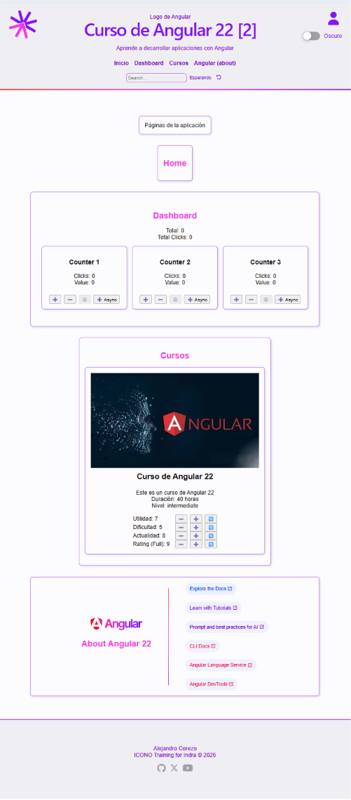

- [Introducción](#introducción)
  - [Nuevo proyecto](#nuevo-proyecto)
- [📕Routing. SPA y lazy loading en las rutas \[ToDo\]](#routing-spa-y-lazy-loading-en-las-rutas-todo)
- [🌐Routing de la aplicación](#routing-de-la-aplicación)
  - [Rutas](#rutas)
    - [Rutas lazy](#rutas-lazy)
    - [Completando las rutas](#completando-las-rutas)
    - [Opciones del menu leídas desde las rutas](#opciones-del-menu-leídas-desde-las-rutas)
  - [👁️‍🗨️Test de las rutas](#️️test-de-las-rutas)
  - [Renderizado de las páginas en App](#renderizado-de-las-páginas-en-app)
  - [Menu: navegación sin recarga para una SPA](#menu-navegación-sin-recarga-para-una-spa)
  - [👁️‍🗨️Test del componente Menu](#️️test-del-componente-menu)
- [📕Services](#services)
  - [Inyección de dependencia y providers](#inyección-de-dependencia-y-providers)
  - [Definición del provider](#definición-del-provider)
  - [Uso de los servicios](#uso-de-los-servicios)
- [Services básicos en la aplicación](#services-básicos-en-la-aplicación)
  - [🧿Componente Info](#componente-info)
    - [👁️‍🗨️Test del componente Info](#️️test-del-componente-info)
  - [🕸️Servicio Time](#️servicio-time)
    - [👁️‍🗨️Test del servicio Time](#️️test-del-servicio-time)
    - [🧿Componente TimeStamp](#componente-timestamp)
    - [Uso del servicio Time en los componentes](#uso-del-servicio-time-en-los-componentes)
- [Entornos y logging](#entornos-y-logging)
  - [Configuración de los entornos en Angular](#configuración-de-los-entornos-en-angular)
  - [🕸️Servicio Logger](#️servicio-logger)
    - [👁️‍🗨️Test del servicio Logger](#️️test-del-servicio-logger)
  - [🧿Componente LoggerDemo: Uso del servicio Logger](#componente-loggerdemo-uso-del-servicio-logger)
    - [👁️‍🗨️Test del componente LoggerDemo](#️️test-del-componente-loggerdemo)
      - [Problemas con el token de inyección en los tests](#problemas-con-el-token-de-inyección-en-los-tests)
      - [Test del componente con el token de inyección original](#test-del-componente-con-el-token-de-inyección-original)
      - [👁️‍🗨️Test del componente con el token de inyección modificado](#️️test-del-componente-con-el-token-de-inyección-modificado)
- [📕Pipes](#pipes)
- [Ejemplo de uso: DatePipe](#ejemplo-de-uso-datepipe)
  - [🧿Componente Info usando DatePipe](#componente-info-usando-datepipe)
    - [Valores "localizados": Locale](#valores-localizados-locale)
    - [👁️‍🗨️Test del componente Info con DatePipe](#️️test-del-componente-info-con-datepipe)
  - [Creación de Pipes personalizados](#creación-de-pipes-personalizados)
    - [⚒️Pipe Truncate](#️pipe-truncate)
      - [👁️‍🗨️Test del Pipe Truncate](#️️test-del-pipe-truncate)
      - [Uso del Pipe Truncate en el componente Info y su test](#uso-del-pipe-truncate-en-el-componente-info-y-su-test)
- [📕Directivas](#directivas)
- [Creación de directivas](#creación-de-directivas)
  - [Creación de directivas de atributo](#creación-de-directivas-de-atributo)
    - [🌐Directiva de atributo alcStick](#directiva-de-atributo-alcstick)
    - [Directiva con parámetros de entrada](#directiva-con-parámetros-de-entrada)
    - [👁️‍🗨️Test de las directiva de atributo alcStick](#️️test-de-las-directiva-de-atributo-alcstick)
      - [Enfoque final: providers y spies](#enfoque-final-providers-y-spies)
      - [Modificación de propiedades de entrada](#modificación-de-propiedades-de-entrada)
      - [InputSignal en detalle \[Extra\]](#inputsignal-en-detalle-extra)
    - [Uso de la directiva en el componente Info y su test](#uso-de-la-directiva-en-el-componente-info-y-su-test)
  - [Creación de directivas estructurales](#creación-de-directivas-estructurales)
    - [🌐Directiva Estructural ValidRole](#directiva-estructural-validrole)
      - [👁️‍🗨️Test de la directiva estructural ValidRole](#️️test-de-la-directiva-estructural-validrole)
      - [👁️‍🗨️Test de la directiva estructural ValidRole con un componente](#️️test-de-la-directiva-estructural-validrole-con-un-componente)

## Introducción

En esta continuación de la segunda parte veremos

- el **enrutamiento** entre componentes a los que vamos a denominar página
- la **carga diferida** (lazy loading) de esas **páginas** (componentes standalone)
- los **servicios**
- los **pipes**
- las **directivas**

### Nuevo proyecto

Para este bloque comenzamos creando una copia del proyecto anterior que denominaremos `course-02`

1. Creamos el proyecto. Angular lo reflejara en los ficheros de configuración `angular.json` y `tsconfig.json`.

```shell
ng g app course-02 --style css --ssr false -p alc -t -s
```

Creamos el proyecto seleccionando las opciones

- estilo CSS (`--style css`)
- sin SSR (`--ssr false`)
- prefijo de selector (`p alc`)
- template inline (`-t`)
- estilos inline (`-s`)  

El `linter` esta instalado a nivel del workspace, por lo que no es necesario instalarlo de nuevo en el proyecto course-02. Se genera automáticamente el fichero de configuración: `projects/course-02/eslint.config.js `

2. Sustituimos las carpetas 'public' y 'src' por las del proyecto course-01

3. Sustituimos los ficheros de configuración `tsconfig.app.json` y `tsconfig.spec.json` por los del proyecto course-01

4. Modificamos el title del fichero `index.html` y del fichero `app.component.ts` para reflejar el nombre del proyecto course-02.

Comprobamos que todo funciona correctamente

```shell
ng serve course-02 --port 4300
```

Podemos eliminar elementos que han servido de ejemplo o copias de ficheros iniciales que ya no se necesitan

- search-ref
- course-item / course-item-signals (queda el course-item-pro)
- counter (queda el counter-pro y counter-list)

Y las referencias a ellos en

- header
- courses-page

- No Hacemos in-line template y styles de `course-item-pro` (*)
  (*) Pendiente de iterar para los stats del curso, que se hará más adelante




## 📕Routing. SPA y lazy loading en las rutas [ToDo]

##  🌐Routing de la aplicación

### Rutas

En el fichero de rutas, añadimos las páginas incluyendo las re-direcciones para la url vacía o cualquier error

- home
- courses
- dashboard
- about (Angular)


```ts
export const routes: Routes = [
  { path: '', redirectTo: 'home', pathMatch: 'full' },
  { path: 'home', component: HomePage },
  { path: 'courses', component: CoursesPage },
  { path: 'dashboard', component: DashboardPage },
  { path: 'about', component: AboutPage},
  { path: '**', redirectTo: 'home' },
];
```

Comprobamos su funcionamiento escribiendo directamente las rutas en el navegador

#### Rutas lazy

Cambiamos las rutas para que carguen la páginas de forma lazy o diferida:
en el momento en el que son requeridas por primera vez

Para ello angular usa los import dinámicos soportados por el actual estándar de ES

El objeto Route disponía de la propiedad loadChildren, para referirse a los módulos en carga lazy;
en las últimas versiones se añade la propiedad **loadComponent**, con la misma funcionalidad para los componentes

Nos aseguramos de no importar los componentes de forma estática

```ts
[
  { path: '', pathMatch: 'full', redirectTo: 'home' },
  {
    path: 'home',
    title: 'Home',
    loadComponent: () =>
      import('./pages/home/home.component').then((c) => c.HomeComponent),
  },

  {
    path: 'about',
    title: 'Acerca de',
    loadComponent: () =>
      import('./pages/about/about.component').then((c) => c.AboutComponent),
  },
  { path: '**', redirectTo: 'home' },
```

Si los componentes usados como páginas **exportan** la clase como **default**,
no es necesario el método then para indicar el nombre del componente

```ts
[
  { path: '', redirectTo: 'home', pathMatch: 'full' },
  {
    path: 'home',
    title: 'Home | Demo 03',
    data: {
      label: 'Inicio',
    },
    loadComponent: () => import('./features/home/home-page'),
  },
  {
    path: 'courses',
    title: 'Cursos | Demo 03',
    data: {
      label: 'Cursos',
    },
    children: [
      {
        path: '',
        loadComponent: () => import('./features/courses/courses-page'),
      },
    ],
  },
  {
    path: 'dashboard',
    title: 'Dashboard | Demo 03',
    data: {
      label: 'Dashboard',
    },
    loadComponent: () => import('./features/dashboard/dashboard-page'),
  },
  {
    path: 'about',
    title: 'About | Demo 03',
    data: {
      label: 'Angular (about)',
    },
    loadComponent: () => import('./features/about/about-page'),
  },
  {
    path: '**',
    redirectTo: 'home',
  },
];
```

#### Completando las rutas

En el caso de los cursos, vemos como la misma ruta que a las otras páginas puede definirse como una ruta anidada, lo que permitirá luego una incorporación de las rutas relacionadas con ese path de forma más organizada

- la propiedad path define la ruta que se mostrará en el navegador
- la propiedad loadComponent define el componente que se cargará de forma perezosa (lazy loading) cuando se acceda a esa ruta. Tener estos componentes exportados `default` permite que Angular los cargue de forma más eficiente, ya que no necesita conocer el nombre del componente para importarlo.
- la propiedad title permite definir el título que mostrara el navegador en cada ruta
- la propiedad data permite definir información adicional que puede ser utilizada en la aplicación, en este caso para mostrar un label en el menú de navegación

- la primera ruta es la ruta por defecto, que redirige a la ruta home
- la última ruta es la ruta comodín, que redirige a la ruta home en caso de que no se encuentre ninguna ruta definida

#### Opciones del menu leídas desde las rutas

Al final del fichero de rutas, añadimos una función que nos permite obtener las rutas que queremos mostrar en el menú de navegación, filtrando aquellas que no tienen un label definido en su data.

```ts
export const getRoutes = (): MenuOption[] => {
  return [
    ...routes
      .filter((route) => route.data?.['label'] && route.path)
      .map((route) => ({
        label: route.data?.['label'] as string,
        path: route.path as string,
      })),
  ];
};
```

En App generamos las opciones del menu en el componente app leyéndolas de las rutas

```ts
  menuOptions: MenuOption[] = getRoutes(routes);
```

### 👁️‍🗨️Test de las rutas

El haber añadido en las rutas 

- la propiedad title, para luego leerla directamente en el componente,
- la función que carga las rutas lazy

hace que Vitest detecte en el test las líneas de llamada a los componentes como no cubiertas

Por tanto añadimos un test para el fichero routes, que incluirá un componente de prueba

```ts
@Component({
  template: "",
})
class TestComponent {
  private router = inject(Router);
  goto(route: string) {
    this.router.navigate([route]);
  }
}
```

En la preparación de los tests

- añadimos el `RouterModule` con las rutas de la aplicación
  (anteriormente se usaba `RouterTestingModule`, pero actualmente está deprecated)
- montamos el componente de prueba
- espiamos el método navigate del router

```ts
  beforeEach(async () => {
    await TestBed.configureTestingModule({
      imports: [
        // RouterTestingModule.withRoutes(routes)
        RouterModule.forRoot(routes),
      ],
    }).compileComponents();

    fixture = TestBed.createComponent(TestComponent);
    component = fixture.componentInstance;

    const router = TestBed.inject(Router);
    navigateSpy = vi.spyOn(router, 'navigate');
    await fixture.whenStable();
  });
```

En el test

- llamaremos al método goto del componente
- comprobaremos que el método navigate ha sido llamado con el argumento esperado

```ts
it('should navigate to HomePage', async () => {
  component.goto('home');
  await fixture.whenStable();
  expect(navigateSpy).toHaveBeenLastCalledWith(['home']);
});
```

Repetimos el mismo proceso para cada una de las rutas de la aplicación

### Renderizado de las páginas en App

Eliminamos todas las referencias a las páginas que incluía APP, dejando sólo el layout común a todas las páginas y el `router-outlet`, que es el encargado de renderizar las páginas según la ruta que se esté mostrando en el navegador.

```html
<alc-header [title]="title()" [subtitle]="subtitle()">
  <alc-logo-coders slot="logo" />
  <alc-menu slot="menu" [options]="menuOptions()" />
  <alc-menu slot="menu-vertical" [isVertical]="true" [options]="menuOptions()" />
</alc-header>
<main class="container">
  <router-outlet />
</main>
<alc-footer />
```

En el **test de App** nos aseguramos que no quede ninguna referencia a los componentes que ya no renderizamos, como el Card o la Pages

### Menu: navegación sin recarga para una SPA

En los enlaces del menú, eliminamos el atributo `href` y añadimos la directiva `routerLink`, que nos permite navegar entre las páginas de la app sin recargar la página completa, manteniendo el estado de la app y mejorando la experiencia de usuario.

```html
  <a [routerLink]="option.path" [routerLinkActive]="'active'">
    {{ option.label }}
  </a>
```

La segunda directiva utilizada, `routerLinkActive`, nos permite añadir una clase CSS al enlace cuando la ruta asociada está activa, lo que nos permite aplicar estilos diferentes a los enlaces activos.

Para ello es necesario que exista la clase css indicada, en este caso`active`, en el componente menu, que ya hemos definido en el fichero de estilos del componente.

```css
.active {
  display: inline-block;
  color: var(--color-primary-hot);
  border-bottom: 2px solid var(--color-primary-hot);
  transform: scale(1.1);
  transition: all 0.3s ease-in-out;
}
```

En los imports del componente también es necesario añadir las directivas `RouterLink` y `RouterLinkActive`, que son las que nos permiten usar las directivas en el template del componente.

```ts
@Component({
  selector: 'alc-menu',
  imports: [RouterLink, RouterLinkActive],
  template: `
    <nav>
      <ul [class.vertical]="isVertical()">
         @for (option of options(); track option.path) {
          <li>
            <a [routerLink]="option.path" [routerLinkActive]="'active'">
              {{ option.label }}
            </a>
          </li>
      </ul>
    </nav>
  `,
   styles: `...`,
})
```

### 👁️‍🗨️Test del componente Menu

En el entorno de testing se tienen poder producir las mismas importaciones que en el componente, 
que dependen de que hayamos configurado las rutas en app.config.ts, utilizando el método `provideRouter(routes)`.

En los test que utilizan rutas (Menu y App) añadiremos un provider de rutas en la configuración del TestBed, para que las directivas `RouterLink` y `RouterLinkActive` funcionen correctamente en los tests.

```ts
  beforeEach(async () => {
    await TestBed.configureTestingModule({
      imports: [Menu],
      providers: [provideRouter(routes)],
    }).compileComponents();
```

El resto sde os test en ambos casos se mantienen como estaban.

## 📕Services

Los servicios son clases que proporcionan funcionalidades específicas y se pueden inyectar en otros componentes o servicios de la aplicación. Son una parte fundamental de la arquitectura de Angular, ya que permiten separar la lógica de negocio de la presentación y facilitan la reutilización del código.

Hasta la versión 22 los servicios se creaban como clases decoradas con `@Injectable()`, lo que permitía inyectarlos en otros componentes o servicios mediante el sistema de inyección de dependencias de Angular.

```ts
@Injectable({
  providedIn: 'root',
})
export class MyService {}
```

En la version 22, Angular introduce un nuevo enfoque para crear servicios utilizando la función `@Service()`, que simplifica la creación de servicios y mejora la experiencia de desarrollo.

```ts
@Service()
export class MyService {}
```

El nuevo formato no permite configurar el proveedor, que será automáticamente el nivel global de la aplicación.

### Inyección de dependencia y providers

Ademas, Angular dispone de un mecanismo para proporcionar una instancia del servicio, a cualquier elemento que lo necesite, componente u otro servicio, mediante **inyección de dependencias**, de la que se ocupan los **inyectores** del framework

Los inyectores almacenan la instancia del servicio, que obtienen del **provider**, responsable a su vez de aplicar el **patrón singleton**, de modo que existirá una sola instancia del servicio en el ámbito de su provider.

Por defecto el provider es la aplicación, por lo que la instancia de cada servicio será única en toda ella.

Sin embargo veremos como, en algunos casos, nos interesa 

- un **componente como provider**
- una **ruta como provider**

Acercando la instancia de un servicio al punto en el que se va a utilizar, haciéndolo específico y parametrizable para ese componente en concreto

Los módulos, como los importados desde angular, juegan el papel de provider de sus propios servios.

### Definición del provider

En cualquiera que sea el punto en el que definamos el provider, la propiedad provider sera un array de objetos definen 
- el nombre del servicio que queremos proporcionar
- la forma en que se implementa el servicio, que puede ser una clase, un valor, una fábrica o un token de inyección:

  - useClass: proporciona una clase que se instanciará cuando se inyecte el servicio. Es la forma más común de definir un provider. Puede sustituirse el objeto por el nombre de la clase,
 
  - useValue: proporciona un valor específico que se utilizará cuando se inyecte el servicio.
  - useFactory: proporciona una función que se ejecutará para crear la instancia del servicio.
  - useExisting: proporciona una referencia a otro servicio existente.

```ts
providers: [
  MyService, // equivalente a { provide: MyService, useClass: MyService }
  { provide: MyService, useClass: MyService },
  { provide: MyService, useValue: new MyService() },
  { provide: MyService, useFactory: () => new MyService() },
  { provide: MyService, useExisting: OtherService },
]
```

### Uso de los servicios

Tanto los componentes como otros servicios pueden conseguir del sistema de inyectores una instancia del un servicio.

Tradicionalmente para esto bastaba con declarar una propiedad correspondiente a un tipo inyectable y añadir el correspondiente parámetro en el constructor

```ts
@Component({
  selector: 'alc-my-component',
  template: `...`,
})
export class MyComponent {
  constructor(private myService: MyService) {}
}
```

En versiones recientes angular recomienda como alternativa el uso de la función `inject`, lo que se convierte en obligatorio con los nuevos servicios declarados con el decorador `@Service()`

```ts
@Component({
  selector: 'alc-my-component',
  template: `...`,
})
export class MyComponent {
  private readonly myService = inject(MyService);
}
```

## Services básicos en la aplicación

### 🧿Componente Info

Para consumir los servicios que vamos a crear, añadimos un componente `features/home/info` que nos permitirá ver el resultado de su uso.

```shell
ng g c features/home/components/info --project course-02
```

Añadiendo simplemente un texto en el template mostrando información sobre la aplicación, y un footer con el autor y la fecha actual.

```html
<h3>Información del proyecto</h3>
<p>Este proyecto es un ejemplo de uso de Angular 22 y sus nuevas características.</p>
<ul>
  <li>Angular 22</li>
  <li>TypeScript 6.0</li>
  <li>ES2026</li>
</ul>
<footer>
  <ul>
    <li>Autor: {{ author() }}</li>
    <li>Fecha: {{ currentDate() }}</li>
  </ul>
</footer>
```

Como se ve accedemos a las dos propiedades definidas en el componente como señales (`signal`), que nos permiten reaccionar a los cambios de su valor y actualizar el template automáticamente.

```ts
export class Info {
  protected readonly author = signal('Alejandro Cerezo');
  protected readonly currentDate = signal(new Date().toLocaleDateString());
}
```

Finalmente, en el css definimos unos estilos mínimos del componente

```css
ul {
  list-style-type: none;
  padding: 0;
}

p {
  max-width: 23rem;
}

footer {
  font-size: 0.9em;
  background-color: var(--color-background-primary);
  color: var(--color-primary-hot);
  border-top: 2px solid var(--color-primary);
  border-radius: 0.5rem;
  margin-top: 1rem;
  
  display: flex;
  justify-content: center;
  align-items: center;
}
```

Y lo incorporaremos en el templete de la página home, para que se muestre en la misma.

```html
<h2>{{ pageTitle() }}</h2>
<alc-card>
  <alc-info />
</alc-card>
```

#### 👁️‍🗨️Test del componente Info

Sin ninguna diferencia con tests anteriores, nos limitamos a comprobar que se renderizan las propiedades `author` y `currentDate` en el template del componente, que son señales (`signal`) que hemos definido en el componente.

```ts
it('should render the correct author and date in the template', () => {
  const element = fixture.nativeElement as HTMLElement;
  const footerItems = element.querySelectorAll('footer ul li');
  const authorElement = footerItems[0];
  const dateElement = footerItems[1];

  expect(authorElement?.textContent).toContain('Autor: Alejandro Cerezo');
  expect(dateElement?.textContent).toContain(`Fecha: ${new Date().toLocaleDateString()}`);
});
``` 

### 🕸️Servicio Time

```shell
ng g s core/services/time --project course-02
```

En el servicio añadimos un método que nos devuelve la fecha y hora actual en formato timestamp

```ts
@Service()
export class Time {

  private _date: Date = new Date();

  getTime()  {
    return this._date.getTime();
  }

}
```

#### 👁️‍🗨️Test del servicio Time

En los tests de los servicios que Angular genera automáticamente, se utiliza el método `inject()` del `TestBed` para obtener una instancia del servicio, con un comportamiento similar a la función inject() que se usa en el código real. De ssa forma el código y los test se alinean coon un comportamiento equivalente.

A partir de ahí los test de los componentes son el ejemplo más claro de test unitario, limitándose a comprobar el funcionamiento de los métodos expuestos por el servicio.

En este caso vemos una diferencia importante entre los dos decoradores que definen un servicio.

Testando un servicio creado usando `@injectable`, es necesario declarar el propio servicio en los providers del `configureTestingModule` para que este actúe como proveedor del servicio.

```ts
  beforeEach(() => {
    TestBed.configureTestingModule({
      providers: [TimeOld],
    });
    service = TestBed.inject(TimeOld);
  });
```

Por el contrario, en un servicio creado con `@Service()`, no es necesario declararlo en los providers, ya que Angular lo gestionará automáticamente.

En este caso el test completo quedaría como sigue

```ts
describe('Time', () => {
  let service: Time;

  beforeEach(() => {
    TestBed.configureTestingModule({});
    service = TestBed.inject(Time);
  });

  it('should be created', () => {
    expect(service).toBeTruthy();
  });

  it('should return the current time', () => {
    const currentTime = service.getTime();
    expect(currentTime).toBeGreaterThan(0);
  });
});
```

#### 🧿Componente TimeStamp

Creamos un componente en el core para user el servicio.

```shell
ng g c core/components/time-stamp --project course-02
``` 

En el componente inyectamos el servicio y renderizamos el valor obtenido en el template.

```ts
@Component({
  selector: 'alc-time-stamp',
  imports: [],
  template: `<output>{{ time.getTime() }}</output> `,
  styles: `
  :host {
    display: inline-block;
    font-size: 0.9em;
    color: var(--color-primary-hot);
    background-color: var(--color-background-primary);
    border: 1px solid var(--color-primary);
    border-radius: 0.5rem;
    padding: 0.2rem 0.5rem;
    margin-left: 0.5rem;
  }
  `,
})
export class TimeStamp {
  protected readonly time = inject(Time)
}
```

En el **test** correspondiente, comprobamos que en efecto, se renderiza el valor del timestamp.
Como estamos usando la versión con @Service, no es necesario añadir el servicio a los providers del TestBed.

```ts
it('should render the time-stamp in the template', () => {
  const element = fixture.nativeElement as HTMLElement;
  const outputElement = element.querySelector('output');
  expect(outputElement?.textContent).toBe(component['time'].getTime());
});
```

#### Uso del servicio Time en los componentes

[1]. Si utilizamos el componente TimeStamp en 4 componentes,
  
- Info, incluido en HomePage (al final, el provider será `HomePage`)
- CoursesPage (al final el provider será la ruta `'courses'`)
- DashBBoardPage (el provider será el global, `App`)
- AboutPage (el provider será el global, `App`)
  
Veremos el mismo timestamp en los cuatro casos, lo que nos indica que estamos utilizando la misma instancia

[2]. Podemos definir el provider en un componente, de modo que cada vez que se inyecte el servicio en ese componente o en sus hijos, se creará una nueva instancia del servicio, independiente de la instancia global.

Por ejemplo, lo hacemos em HomePage

```ts home-page.ts
@Component({
  selector: 'alc-my-component',
  template: `...`,
  providers: [Time],
})
```

[3]. Podemos definir el provider en una ruta, de modo que cada vez que se acceda a esa ruta, se usará la instancia del servicio definida en el provider de la ruta, y no la instancia global.

Por ejemplo lo hacemos en la ruta `courses`, de modo que cada vez que se acceda a esa ruta, se usará siempre la misma instancia del servicio Time, independiente de la instancia global, proporcionada por los inyectores a nivel de la ruta.

```ts routes.ts
{
  path: 'courses',
  providers: [Time]
  // ....
}
```

## Entornos y logging

Vamos a incorporar un sistema de logging a la aplicación, que nos permita definir un nivel de log y mostrar mensajes de error, advertencia, información y log según el nivel definido.

- Nivel 0: No se muestran errores
- Nivel 1: Se muestran errores
- Nivel 2: Se muestran errores y advertencias
- Nivel 3: Se muestran errores, advertencias e información
- Nivel 4: Se muestran errores, advertencias, información y logs


En el entorno de desarrollo, podemos definir el nivel de log en 4, para que se muestren todos los mensajes, mientras que en el entorno de producción podemos definir el nivel de log en 1, para que solo se muestren los errores.

### Configuración de los entornos en Angular

Angular proporciona un sistema para definir variables para diversos entornos, pero no lo instala por defecto: debemos añadirlo en nuestra aplicación

```shell
  ng g environments --project course-02
```

El resultado será

```shell
CREATE projects/course-02/src/environments/environment.ts (31 bytes)
CREATE projects/course-02/src/environments/environment.development.ts (31 bytes)
UPDATE angular.json (7968 bytes)
```

El fichero environment.development.ts sera al que accederemos desde nuestro código

```ts
export const environment = {
  PRODUCTION: false,
  LOGGER_LEVEL: 4
};
```

Al fichero environment.ts accederá angular directamente cuando este en modo producción

```ts
export const environment = {
  PRODUCTION: true,
  LOGGER_LEVEL: 1
};
```

De esta forma podemos definir variables con diferentes valores en función del entorno

### 🕸️Servicio Logger

```shell
ng g s core/services/logger --project course-02
```

Definimos un tipo con los posibles niveles de error el la capeta de `types`

```ts /types/error.level.ts
export type ErrorLevel = 0 | 1 | 2 | 3 | 4

// Una alternativa es usar un enum, 
// enum ErrorLevel {
//   NONE = 0, // 0: No se muestran errores
//   ERROR = 1, // 1: Se muestran errores
//   WARN = 2, // 2: Se muestran errores y advertencias
//   INFO = 3, // 3: Se muestran errores, advertencias e información
//   LOG = 4 // 4: Se muestran errores, advertencias, información y logs
// }
```

Se crea un **token de inyección** para poder pasarle al servicio un parámetro que defina el nivel de log.

```ts
import { Service, InjectionToken, inject } from '@angular/core';
import { ErrorLevel } from '../types/error.level';

export const ERROR_LEVEL = new InjectionToken<ValidErrorLevel>('ERROR_LEVEL')
```

Se crea el **servicio** definiendo que puede recibir un parámetro correspondiente al token de inyección, que definirá el nivel de log, que será opcional y tendrá un valor por defecto de 4.

```ts
@Service()
export class Logger {
  readonly #level: ValidErrorLevel = inject(ERROR_LEVEL, { optional: true }) ?? 4

  // constructor(@Optional() @Inject(ERROR_LEVEL) level?: ValidErrorLevel) {
  //   this.#level = level ?? 4
  // }
}
```

En Angular moderno utilizamos la función `inject()` para inyectar dependencias en lugar de usar el constructor. En cualquier caso, nos permite definir valores por defecto y hacer que la inyección sea opcional.

Los métodos del servicio `Logger` son simplemente wrappers de `console`,  que implementan de la siguiente manera:

```ts

  get level(): ValidErrorLevel {
    return this.#level
  }

  public error(message: string): void {
    if (this.#level > 0) {
      console.error(message)
    }
  }

  public warn(message: string): void {
    if (this.#level > 1) {
      console.warn(message)
    }
  }

  public info(message: string): void {
    if (this.#level > 2) {
      console.info(message)
    }
  }

  public log(message: string): void {
    if (this.#level > 3) {
      console.log(message)
    }
  }
```

Para dar un valor al token de inyección, podemos hacerlo a nivel de la aplicación, en el provider del módulo App, o a nivel de un componente, en el provider del componente.

```ts
import { environment } from '../environments/environment';

providers: [
  { provide: ERROR_LEVEL, useValue: environment.LOGGER_LEVEL }
]
```

El environment lo importamos siempre desde `../environments/environment`, ya que angular se encargará de sustituirlo por el fichero correspondiente al entorno en el que estemos trabajando.

#### 👁️‍🗨️Test del servicio Logger

En el test del servicio Logger, comprobamos que los métodos del servicio funcionan correctamente según el nivel de log definido.

Para ello encada suite de test debemos redefinir a nivel del configureTestingModule el provider del token de inyección, para que el servicio Logger utilice el nivel de log que queremos probar.

```ts
beforeEach(() => {
  TestBed.resetTestingModule();
  TestBed.configureTestingModule({
    providers: [
      { provide: ERROR_LEVEL, useValue: ERROR_LEVEL_VALUE },
    ],
  });
  service = TestBed.inject(Logger);
});
```

El propio servicio `Logger` que estamos testando no necesitamos incluirlo en el provider, porque lo hemos creado con el decorador @Service, y como ya sabemos, Angular lo gestiona automáticamente.

Por otro lado necesitamos espiar los métodos de `console` para comprobar que se llaman correctamente según el nivel de log definido.

```ts
  vi.spyOn(console, 'error');
  vi.spyOn(console, 'warn');
  vi.spyOn(console, 'info');
  vi.spyOn(console, 'log');
```

Veamos el ejemplo de una suite completa. por ejemplo para el nivel 2

```ts
describe('When level is 2', () => {
  beforeEach(() => {
    TestBed.resetTestingModule();
    TestBed.configureTestingModule({
      providers: [{ provide: ERROR_LEVEL, useValue: 2 }],
    });
    service = TestBed.inject(Logger);
  });

  it('should log error messages ', () => {
    service.error('Test error');
    expect(console.error).toHaveBeenCalledWith('Test error');
  });

  it('should log warning messages ', () => {
    service.warn('Test warning');
    expect(console.warn).toHaveBeenCalledWith('Test warning');
  });

  it('should NOT log info messages ', () => {
    (console.info as Mock).mockClear();
    service.info('Test info');
    expect(console.info).not.toHaveBeenCalled();
  });

  it('should NOT log debug messages ', () => {
    (console.log as Mock).mockClear();
    service.log('Test debug');
    expect(console.log).not.toHaveBeenCalled();
  });
});
```

En las comprobaciones de que un método no ha sido llamado, es importante limpiar el mock antes de la comprobación, para evitar que tenga en cuenta que se haya llamado en otro test anterior.

### 🧿Componente LoggerDemo: Uso del servicio Logger

Creamos el componente `features/demos/logger-demo`

```shell
ng g c features/demos/components/logger-demo --project course-02
```

En el decorador del componente inyectamos el servicio `Logger`, definiendo el valor que será inyectado a partir del token de inyección. De esta forma no utilizamos la instancia de la aplicación, sino una específica para el componente, que nos permitirá comprobar el funcionamiento del servicio con un nivel de log diferente al global.

```ts
// Desde environment.development.ts se lee el valor de 4
const ERROR_LEVEL_VALUE = environment.LOGGER_LEVEL;
//const ERROR_LEVEL_VALUE = 2;

@Component({
  selector: 'alc-logger-demo',
  imports: [],
  providers: [
    // Sin Logger provider aquí, se usaría el valor por defecto 4
    Logger,
    { provide: ERROR_LEVEL, useValue: ERROR_LEVEL_VALUE },
  ],
})
export class LoggerDemo {
  private readonly errorLevelToken = inject(ERROR_LEVEL);
  protected readonly logger = inject(Logger);
  protected readonly errorLevel = signal(this.errorLevelToken);
}
```

AL hacer que el provider del servicio y del token de inyección sea el componente, se utilizará como parámetro del servicio el valor provisto a este mismo nivel para el token de inyección.

En el componente 

- inyectamos el servicio `Logger`, que nos permitirá utilizar sus métodos para mostrar mensajes de log en la consola según el nivel definido
- inyectamos el token para guardar su valor como signal, de modo que podamos mostrarlo en el template del componente, asegurándonos que sera el mismo valor que utiliza el servicio.

El templete es solo un ejemplo para comprobar el funcionamiento del servicio `Logger` y los niveles de log.

```html
<h3>Logger Demo</h3>
<div>
  <p title="Nivel de error en el token de inyección">ERROR_LEVEL_VALUE: {{ errorLevel }}</p>
  <p title="Nivel de error del servicio logger">logger.level: {{ logger.level }}</p>
</div>
<div>
  <button (click)="logger.error('Mensaje de error')">Error</button>
  <button (click)="logger.warn('Mensaje de advertencia')">Warn</button>
  <button (click)="logger.info('Mensaje de información')">Info</button>
  <button (click)="logger.log('Mensaje de log')">Log</button>
</div>
<div>
  <p>Ejemplo de uso de logger en la plantilla:</p>
</div>
 <ul>
  <!-- Alternativa sin crear un método en el componente 
   <li>Error: {{ logger.level > 0 ? 'Sí' : 'No' }}</li>
  <li>Warn: {{ logger.level > 1 ? 'Sí' : 'No' }}</li>
  <li>Info: {{ logger.level > 2 ? 'Sí' : 'No' }}</li>
  <li>Log: {{ logger.level > 3 ? 'Sí' : 'No' }}</li> -->

  <li>Error: {{ levelText(0) }}</li>
  <li>Warn: {{ levelText(1) }}</li>
  <li>Info: {{ levelText(2) }}</li>
  <li>Log: {{ levelText(3) }}</li>
</ul>
<p>Ver los mensajes en consola</p>

{{ logger.info('Mensaje de información') }}
```

Para manejar los clicks de los botones, podemos usar directamente el método del servicio, mientras que para escribir el `levelText` optamos por crear un método en el componente.

```ts
  protected levelText(level: number): string {
    return this.logger.nivel > level ? 'Sí' : 'No';
  }
```

En los estilos apenas definimos algunos detalles

```css
div {
  margin-bottom: 1rem;
}
button {
  margin-right: 0.5rem;
}
  ul {
  list-style-type: none;
  padding: 0;
}
li {
  margin-bottom: 0.5rem;
  &:nth-child(odd) {
    background-color: var(--color-background-primary);
  }
}
```

#### 👁️‍🗨️Test del componente LoggerDemo

Para testar un componente correctamente debemos entender claramente cuales son sus responsabilidades. En este caso, el componente LoggerDemo tiene dos responsabilidades:

- Mostrar el nivel de log actual, que se obtiene del token de inyección y se pasa al servicio Logger.
- Renderizar una serie de botones
- Mostrar en la plantilla el resultado de la función levelText, que depende del nivel de log definido en el servicio Logger.

- Permitir al usuario interaccionar con esos botones que hacen uso del servicio Logger. No es asunto de este componente que el servicio, por su parte, se use para mostrar mensajes en la consola según el nivel de log definido. Si la funcionalidad del servicio cambiará, manteniendo su interfaz, nuestro componente y su test no se deberían ver afectados

Esto implica, si nuestro test quiere ser unitario, que debemos **simular el servicio Logger** (Mock) y no usar el servicio real, que es responsabilidad de otro test.

Por su parte, el test del servicio Logger que ya se encarga de comprobar que los métodos del servicio funcionan correctamente según el nivel de log definido.

Para confirmar el carácter unitario del test, podemos invocarlo solo

```shell
ng test --coverage --project course-02 --filter LoggerDemo
```
Y comprobar que no se han cubierto las líneas del servicio Logger, que son responsabilidad de otro test.

```shell
--------------------|---------|----------|---------|---------|-------------------
| File | % Stmts | % Branch | % Funcs | % Lines | Uncovered Line #s |
| ---- | ------- | -------- | ------- | ------- | ----------------- |
 app/core/services                
  | logger.ts | 57.14 | 53.33 | 40  | 50  | 19-26,37-38 |
  | --------- | ----- | ----- | --- | --- | ----------- |
```

##### Problemas con el token de inyección en los tests

Otro aspecto de este componente es que el nivel de log se define en el token de inyección, que es un parámetro del servicio Logger. El problema es que el provider del token de inyección se define en el propio componente, por lo que no tendrá efecto el valor que proporcionemos desde el test, ya que el provider del componente tiene prioridad sobre el provider del test.

La solución nos la proporciona Angular mediante las funciones de `TestBed`, como `overrideProvider()` y `overrideComponent()`. La primera nos permite redefinir el provider del token de inyección en el test, para que el servicio Logger utilice el nivel de log que queremos probar.

```ts
  beforeEach(async () => {
    await TestBed.configureTestingModule({
      imports: [LoggerDemo],
    })
    // Redefinimos el provider del token de inyección para que el servicio Logger utilice el nivel de log que queremos probar
    .overrideProvider(ERROR_LEVEL, { useValue: ERROR_LEVEL_VALUE });
    .compileComponents();
    fixture = TestBed.createComponent(LoggerDemo);
    component = fixture.componentInstance;
    await fixture.whenStable();
  });
```

Sin embargo, la solución platea un nuevo problema a la hora de medir el coverage de los tests con v-8, ye que al sobrescribirse el componente, puede haber elementos del template que no se detecten como testados, aunque si lo están.

La solución a este nuevo problema ha sido dividir el test en dos partes

##### Test del componente con el token de inyección original

- No se altera la inyección de dependencias, por lo que el componente utiliza el valor del token de inyección definido en el provider del componente, que es 4, tal como se obtiene del ficheros de environment.

- El servicio sustituye parcialmente por un mock, espiando sus métodos y modificando su implementación para que no hagan nada, ya que no nos interesa que se muestren mensajes en la consola durante el test.

```ts
logLoggerSpy = vi.spyOn(component['logger'], 'log')
  .mockImplementation(() => undefined);
errorLoggerSpy = vi.spyOn(component['logger'], 'error')
  .mockImplementation(() => undefined);
warnLoggerSpy = vi.spyOn(component['logger'], 'warn')
  .mockImplementation(() => undefined);
infoLoggerSpy = vi.spyOn(component['logger'], 'info')
  .mockImplementation(() => undefined);
``` 

- Como solo espiamos eos métodos, el resto del servicio funciona correctamente, leyendo el valor del token de inyección y dándonos acceso a él

En los tests comprobamos que el componente se renderiza correctamente, que el valor del token de inyección es el esperado y que los métodos del servicio se llaman correctamente al hacer click en los botones.

```ts
it('should create', () => {
  expect(component).toBeTruthy();
});

it('should inject Logger with level 4', () => {
  expect(component['logger'].level).toBe(4);
});

it('should show all capabilities in the template', () => {
  expectLevels(['Sí', 'Sí', 'Sí', 'Sí']);
});

it('should log error, warning, info and log messages', () => {
  expect(errorLoggerSpy).toHaveBeenCalledWith('Mensaje de error');
  expect(warnLoggerSpy).toHaveBeenCalledWith('Mensaje de advertencia');
  expect(infoLoggerSpy).toHaveBeenCalledWith('Mensaje de información');
  expect(logLoggerSpy).toHaveBeenCalledWith('Mensaje de log');
});
```

##### 👁️‍🗨️Test del componente con el token de inyección modificado

Creamos una función setup que nos permita el override dol componente con distintos valores del token de inyección, que pasaremos como parámetros a la función. De esta forma podemos testar el componente con distintos valores del token de inyección, y por tanto del nivel de log del servicio Logger.

```ts
const setup = async (errorLevelValue: ErrorLevel) => {
  TestBed.resetTestingModule();

  await TestBed.configureTestingModule({
    imports: [LoggerDemo],
  })
    // .overrideComponent(LoggerDemo, {
    //   set: {
    //     providers: [Logger, { provide: ERROR_LEVEL, useValue: errorLevelValue }],
    //   },
    // })
    .overrideProvider(ERROR_LEVEL, { useValue: errorLevelValue })
    .compileComponents();

  fixture = TestBed.createComponent(LoggerDemo);
  component = fixture.componentInstance;
  await fixture.whenStable();

  const element = fixture.nativeElement as HTMLElement;
  debugButtons = fixture.debugElement.queryAll(By.css('button'));
  buttons = element.querySelectorAll('button');
  responseItems = element.querySelectorAll('ul li');
};
```

En cada suite, invocamos la función con un valor diferente del token de inyección, y comprobamos que el componente se renderiza correctamente. No es necesario y que los métodos del servicio se llaman correctamente al hacer click en los botones.

```ts
const expectLevels = (expected: ('Sí' | 'No')[]) => {
  expect(responseItems[0]?.textContent).toContain(expected[0]);
  expect(responseItems[1]?.textContent).toContain(expected[1]);
  expect(responseItems[2]?.textContent).toContain(expected[2]);
  expect(responseItems[3]?.textContent).toContain(expected[3]);
};

describe('Given ERROR_LEVEL = 4', () => {
  beforeEach(async () => {
    await setup(4);
  });

  it('should inject Logger with level 4', () => {
    expect(component['logger'].level).toBe(4);
  });

  it('should show all capabilities in the template', () => {
    expectLevels(['Sí', 'Sí', 'Sí', 'Sí']);
  });
});
```

Para no repetir el código donde comprobamos que el componente se renderiza correctamente, creamos una función expectLevels que recibe un array de strings con los valores esperados y comprueba que se renderizan correctamente en el template.

## 📕Pipes

Son funciones transformadoras de la salida de datos que se utilizan de forma declarativa, en los templates

Existen una serie de Built-in pipes

- **DatePipe**: Formats a date value according to locale rules.
- **UpperCasePipe**: Transforms text to all upper case.
- **LowerCasePipe**: Transforms text to all lower case.
- **CurrencyPipe**: Transforms a number to a currency string, formatted according to locale rules.
- **DecimalPipe**: Transforms a number into a string with a decimal point, formatted according to locale rules.
- **PercentPipe**: Transforms a number to a percentage string, formatted according to locale rules.
- **AsyncPipe**: Subscribe and unsubscribe to an asynchronous source such as an observable.
- **JsonPipe**: Display a component object property to the screen as JSON for debugging.

## Ejemplo de uso: DatePipe

El pipe `date` nos permite formatear fechas y horas de acuerdo a las reglas de localización, y es uno de los más utilizados.

Admite tres parámetros opcionales:

- Formato: Un string que define el formato de salida. Puede ser uno de los formatos predefinidos ('short', 'medium', 'long', 'full') o un formato personalizado usando patrones de fecha y hora.
- Zona horaria: Un string que define la zona horaria a utilizar. Si no se especifica, se utiliza la zona horaria local del navegador.
- Localización: Un string que define la localización a utilizar. Si no se especifica, se utiliza la localización predeterminada de la aplicación.

Para utilizarlo en un componente, debemos importar la clase DatePipe en el decorador del componente, en la propiedad `imports`.

```ts
@Component({
  selector: 'alc-my-component',
  imports: [DatePipe],
  template: `...`,
})
```

### 🧿Componente Info usando DatePipe

Para ver el uso de DatePipe, usamos la fecha y hora del **componente Info**, que hemos creado en la sección de servicios básicos, y que nos permite ver la información del proyecto, el autor y la fecha actual.

```ts
@Component({
  //...
  template: `
    <h3>Información del proyecto</h3>
    <p>Este proyecto es un ejemplo de uso de Angular 22 y sus nuevas características.</p>
    <ul>
      <li>Angular 22</li>
      <li>TypeScript 6.0</li>
      <li>ES2026</li>
    </ul>
    <footer>
      <ul>
        <li>Autor: {{ author() }}</li>
        <li>Fecha: {{ currentDate() }}</li>
      </ul>
      <alc-time-stamp />
    </footer>
  `,
  //...
export class Info {
  protected readonly author = signal('Alejandro Cerezo');
  protected readonly currentDate = signal(new Date());
}
```

Este sería el aspecto inicial:

```ui
Pagina cargada Thu Jan 11 2024 14:04:40 GMT+0100 (hora estándar de Europa central)
```

Y este cuando filtramos la salida para darle un formato

```html
  imports: [TimeStamp, DatePipe],

  <li>Fecha: {{ currentDate() | date : 'fullDate' }}</li>
```

```ui
Fecha: Monday, July 6, 2026
```

#### Valores "localizados": Locale

Los pipes con Date, Currency, Decimal y Percent pueden recibir un parámetro que les indica la localización a usar,
que debe haber sido previamente registrada en el fichero de configuración (app.config.ts)

```ts
import localeEs from "@angular/common/locales/es";
import { registerLocaleData } from "@angular/common";

registerLocaleData(localeEs);
```

A partir de ahí, podemos indicas la localización ES en los formatos de los pipes citados

```html
  <li>Fecha: {{ currentDate() | date : 'fullDate' : '' : 'ES' }}</li>
```

```ui
Fecha:  Lunes, 6 De Julio De 2026
```

Otra posibilidad es cambiar globalmente el locale que usa la aplicación, en el mismo app.config.ts

Importando el token de inyección LOCALE_ID y añadiéndolo al provider global de la aplicación con un valor 'es'

```ts
import { ApplicationConfig, LOCALE_ID } from '@angular/core';
...

export const appConfig: ApplicationConfig = {
  providers: [
      provideRouter(routes)
      // ...
      { provide: LOCALE_ID, useValue: 'es' }, 
    ],
};

```

#### 👁️‍🗨️Test del componente Info con DatePipe

Si queremos que el componente trabaje con la localización 'es', debemos registrar la localización en el test, de la misma forma que lo hacemos en el fichero de configuración de la aplicación, y modificar en los providers del TestBed el valor del token de inyección LOCALE_ID, para que el componente use la localización 'es'.

```ts
import { registerLocaleData } from '@angular/common';
import localeEs from '@angular/common/locales/es';

registerLocaleData(localeEs);

//...

beforeEach(async () => {
  await TestBed.configureTestingModule({
    imports: [Info],
    providers: [
      {
        provide: LOCALE_ID, useValue: 'es'
      }
    ]
  }).compileComponents();
//...
```

Por otro lado necesitamos crear el valor esperado, para lo que usaremos los pipes de forma imperativa, instanciando las clases para ejecutar el método `transform()` de cada pipe, que es el que se ejecuta cuando usamos el pipe en la plantilla.

```ts
const datePipe = new DatePipe('es');
const titleCasePipe = new TitleCasePipe();
let expectedDate = datePipe.transform(new Date(), 'fullDate');
expectedDate = titleCasePipe.transform(expectedDate);

expect(authorElement?.textContent).toContain('Autor: Alejandro Cerezo');
expect(dateElement?.textContent).toContain(`Fecha: ` + expectedDate);
```

Aparte del test, vemos como los pipes pueden usarse en cualquier momento como parte de la lógica del componente, y no solo en la plantilla.

### Creación de Pipes personalizados

Además de los pipes incorporados, Angular permite crear nuestros propios pipes personalizados, que nos permiten transformar datos de acuerdo a nuestras necesidades.

Para ello disponemos de un schematics `pipe` que nos genera un pipe básico, al que podemos añadir la lógica de transformación que necesitemos.

```shell
ng g pipe core/pipes/truncate --project course-02
```

En el caso de los pipes, el schematics de Angular, de acuerdo con la guía de estilos, mantiene el sufijo tanto en el fichero como en el nombre de la clase, respectivamente

- `truncate-pipe.ts` (en nuestro ejemplo `truncate.pipe.ts`)
- `TruncatePipe`

#### ⚒️Pipe Truncate

Como ya vimos en los tests, los pipes son una clase que implementa la interfaz `PipeTransform`, que define un método `transform()` que recibe un valor y devuelve un valor transformado.

En este caso añadimos al método la lógica para truncar un string a una longitud máxima, respetando palabras completas y añadiendo al final un sufijo (...) si se ha truncado.

```ts
import { Pipe, PipeTransform } from '@angular/core';

@Pipe({
  name: 'truncate'
})
export class TruncatePipe implements PipeTransform {    
  transform(value: string, length: number): string {
    if (!value) return '';
    if (length <= 0) return value;
    if (value.length <= length) return value;
    const truncated = value.slice(0, length - 3);
    const lastSpaceIndex = truncated.lastIndexOf(' ', length - 3);
    return lastSpaceIndex > 0 ? truncated.slice(0, lastSpaceIndex) + ' ...' : truncated + ' ...';
  }
}
```

##### 👁️‍🗨️Test del Pipe Truncate

Los test de los pipes son aún mas sencillos que los de los servicios, ya que solo necesitamos instanciar la clase del pipe y llamar al método `transform()` con los valores que queremos probar, comprobando que el resultado es el esperado.

```ts
describe('TruncatePipe', () => {
  it('create an instance', () => {
    const pipe = new TruncatePipe();
    expect(pipe).toBeTruthy();
  });


  it('should truncate text longer than the specified length', () => {
    const pipe = new TruncatePipe();
    const text = 'This is a long text that needs to be truncated.';
    const length = 20;
    const result = pipe.transform(text, length);
    expect(result).toBe('This is a long ...');
  })

   it('should truncate text without spaces longer than the specified length', () => {
    const pipe = new TruncatePipe();
    const text = 'This_is_a_long_text_that_needs_to_be_truncated.';
    const length = 20;
    const result = pipe.transform(text, length);
    expect(result).toBe('This_is_a_long_te ...');
  })

  it('should not truncate text shorter than the specified length', () => {
    const pipe = new TruncatePipe();
    const text = 'Short text';
    const length = 20;
    const result = pipe.transform(text, length);
    expect(result).toBe(text);
  })

   it('should not truncate text equal to the specified length', () => {
    const pipe = new TruncatePipe();
    const text = 'Exact length text';
    const length = text.length;
    const result = pipe.transform(text, length);
    expect(result).toBe(text);
  })

  it('should handle length less than or equal to 0', () => {
    const pipe = new TruncatePipe();
    const text = 'This is a long text that needs to be truncated.';
    const length = 0;
    const result = pipe.transform(text, length);
    expect(result).toBe(text);
  });

  it('should handle empty string', () => {
    const pipe = new TruncatePipe();
    const text = '';
    const length = 20;
    const result = pipe.transform(text, length);
    expect(result).toBe('');
  });

});
```

En los casos de uso tenemos en cuenta todas las guardas o condiciones que hemos incluido en el pipe, lo que  se refleje en un coverage del 100% de la clase y  más allá de ellos, permite asegurarnos de que la función se comporta correctamente en todos los casos.

##### Uso del Pipe Truncate en el componente Info y su test

En el componente Info, usamos el pipe `truncate` para truncar un texto de ejemplo, dandole varias longitudes máximas, y comprobando que el resultado es el esperado.

```ts
//...
    <h4>Uso del pipe Truncate</h4>
    <p>[30]: {{ message() | truncate: 30 }}</p>
    <p>[40]: {{ message() | truncate: 40 }}</p>
//..
})
export class Info {
  //...
  protected readonly message = signal('Esto es un ejemplo de texto largo, para mostrar solo una parte de él');
}
```

En el test del componente Info, comprobamos que el pipe `truncate` funciona correctamente, truncando el texto a la longitud máxima especificada y respetando palabras completas.

```ts
it('should render the truncated message correctly in the template', () => {
  const messageElement = fixture.debugElement
    .queryAll(By.css('p.truncated'))
    .map(de => de.nativeElement as HTMLElement);

  const message30Element = messageElement[0];
  const message40Element = messageElement[1];

  const expectedMessage30 = 'Esto es un ejemplo de ...';
  const expectedMessage40 = 'Esto es un ejemplo de texto largo, ...';

  expect(message30Element?.textContent).toContain(`[30]: ${expectedMessage30}`);
  expect(message40Element?.textContent).toContain(`[40]: ${expectedMessage40}`);
});
```

## 📕Directivas

Las directivas son clases en Angular que permiten manipular el DOM (Document Object Model) de una manera declarativa, agregar comportamientos personalizados a los elementos y reutilizar lógica en la vista.

Hay tres tipos principales de directivas en Angular:

- Directivas de atributo: Modifican la apariencia o el comportamiento de un elemento. Por ejemplo, `ngClass`, `ngStyle`.
- Directivas estructurales: Cambian la estructura del DOM. Por ejemplo, `*ngIf`, `*ngFor`.
- Componentes: Técnicamente son directivas con plantilla asociada.

Los componentes son en su origen directivas con una plantilla asociada, y se convirtieron como hemos visto en la clave de Angular. Sin embargo, las directivas siguen existiendo y permiten aplicar un comportamiento, incluyendo la modificación del DOM tanto en los componentes como a los elementos nativos de HTML.

## Creación de directivas

### Creación de directivas de atributo

En la clase de la directiva se utiliza el decorador `@Directive` para definir el selector de la directiva y otras propiedades opcionales.

- El selector de la directiva se define como un atributo, por lo que se usa entre corchetes `[]`.
- Se suelen inyectar servicios como `ElementRef` y `Renderer2` para manipular el DOM de manera segura.
  - `ElementRef`: Permite acceder al elemento del DOM al que está asociada la directiva, que se encuentra en la propiedad `nativeElement`. La inyección de dependencias de `ElementRef` proporciona una instancia asociada con el elemento anfitrión (host) de la directiva.
  - `Renderer2`: Proporciona una forma segura de manipular el DOM, evitando problemas de seguridad como XSS (Cross-Site Scripting). Debería ser la única forma de manipular el DOM en Angular.

El elemento anfitrión o host es el elemento del DOM al que está asociada la directiva. En un componente, el host es el propio componente.

Angular permite interactuar con el host de varias maneras:

- la propiedad `host` en el decorador `@Directive` o `@Component` permite definir propiedades y eventos del host.

```typescript
@Directive({
  selector: "[appMiDirectiva]",
  host: {
    "(click)": "onClick()",
    "[style.backgroundColor]": "backgroundColor",
  },
})
```

- Se pueden usar decoradores como `@HostListener` para escuchar eventos del DOM en el elemento al que está asociada la directiva.
- El decorador `@HostBinding` permite enlazar propiedades del host.

[medium.com/@saranipeiris17](https://medium.com/@saranipeiris17/what-is-hostbinding-in-angular-0a19873278ca)

#### 🌐Directiva de atributo alcStick

En este ejemplo, creamos una directiva llamada `Stick` (de stick out, resaltar) que cambia el color de fondo del elemento al que se aplica cuando el mouse entra y sale del mismo.

[1]. Crear una nueva directiva usando Angular CLI:


```shell
ng g d core/directives/stick --project course-02
# Alternativa:
# ng g d core/directives/highlight --project course-02
```

En el caso de las directivas se sigue la misma convención que para los componentes, eliminando cualquier sufijo que indique que es una directiva, tanto eln el nombre del archivo como en la clase, respectivamente 

- `stick.ts`
- `Stick`


[2]. Implementar la lógica de la directiva en el archivo generado.

```typescript
import { Directive, ElementRef, Renderer2, HostListener } from "@angular/core";

@Directive({
  selector: [alcStick],
})
export class Stick {
  readonly #el = inject(ElementRef);
  readonly #renderer = inject(Renderer2)

  @HostListener("mouseenter")
  onMouseEnter() {
    this.#renderer.setStyle(this.#el.nativeElement,cd "backgroundColor", "yellow");
  }

  @HostListener("mouseleave")
  onMouseLeave() {
    this.#renderer.removeStyle(this.#el.nativeElement, "backgroundColor");
  }
}
```

Los bindings de host en el decorador `@Directive` son equivalentes a usar los decoradores `@HostListener` en los métodos correspondientes y se recomiendan en Angular moderno.

```ts
@Directive({
  selector: [alcStick],
  host: {
    "(mouseenter)": "onMouseEnter()",
    "(mouseleave)": "onMouseLeave()",
  },
})
export class Stick {
  readonly #el = inject(ElementRef);
  readonly #renderer = inject(Renderer2);

  get el(): ElementRef {
    return this.#el;
  }

  get renderer(): Renderer2 {
    return this.#renderer;
  }

  onMouseEnter() {
    this.#renderer.setStyle(this.#el.nativeElement, "backgroundColor", "yellow");
  }

  onMouseLeave() {
    this.#renderer.removeStyle(this.#el.nativeElement, "backgroundColor");
  }
}
```

Los manejadores de eventos utilizan los métodos de `Renderer2` para cambiar el estilo del elemento anfitrión, estableciendo el color de fondo a amarillo cuando el mouse entra y eliminando el estilo cuando el mouse sale. Gracias a `Renderer2`, evitamos manipular directamente el DOM, lo que mejora la seguridad y la compatibilidad con diferentes plataformas.

Los getters de `el` y `renderer` nos permiten acceder a las propiedades privadas de la directiva desde los tests, ya que ni siquiera en tiempo de ejecución podemos acceder directamente a las propiedades privadas con el símbolo `#`.

#### Directiva con parámetros de entrada

Como el selector de la directiva es un atributo, podemos pasarle parámetros de entrada.

```typescript
import {
  Directive,
  ElementRef,
  Renderer2,
  HostListener,
  input,
} from "@angular/core";
@Directive({
  selector: "[alcStick]",
    host: {
    '(mouseenter)': 'onMouseEnter()',
    '(mouseleave)': 'onMouseLeave()',
  },
})
export class Stick {
  readonly #el = inject(ElementRef);
  readonly #renderer = inject(Renderer2);

  //....
  
  readonly alcStick = input("yellow");

  //@HostListener("mouseenter") 
  onMouseEnter() {
    this.#renderer.setStyle(
      this.#el.nativeElement,
      "backgroundColor",
      this.alcStick()
    );
  }

  //@HostListener("mouseleave") 
  onMouseLeave() {
    this.#renderer.removeStyle(this.#el.nativeElement, "backgroundColor");
  }
}
```

En lugar de obligarnos a que el nombre del input sea igual al del selector de la directiva, podemos usar un alias

```typescript
readonly color = input("yellow", { 
  alias: "alcStick",
  transform: (color: string | undefined) => color || 'yellow', });
```

La función de transformación soluciona un problema en la aplicación de la directiva a un componente: 

- en un test, al usar la directiva sin parámetro, se toma el valor por defecto 'yellow'
- al usar la directiva en un componente, el valor del input se pasa como string, y si no se pasa ningún valor, el valor del input es cadena vacía en lugar de `undefined`, que sobrescribe el valor por defecto. 
 
La función de transformación nos permite establecer un valor por defecto en caso de que llegue un valor undefined, en lugar de que no se pase ningún valor.

#### 👁️‍🗨️Test de las directiva de atributo alcStick

Al haber usado la función moderna `inject()`, el test pre-configurado por Angular para las directivas tiene varios errores:

- Error: NG0203: The `ElementRef` token injection failed. `inject()` function must be called from an injection context such as a constructor, a factory function, a field initializer, or a function used with `runInInjectionContext`.
- ɵNotFound: NG0201: No provider found for `ElementRef`.
- Error: NG0204: Can't resolve all parameters for ElementRef: (?).
- ɵNotFound: NG0201: No provider found for `Renderer2`.

Esto se debe a la forma en que Angular configura el entorno de inyección de dependencias en los tests,sin un provider que pueda proporcionarnos las instancias de `ElementRef` y `Renderer2`. Por ello, para poder probar la directiva podríamos 

- crear un mock de `Renderer2` y un `ElementRef` con un elemento HTML
- proveerlos en el `TestBed` para que la directiva pueda inyectarlos correctamente
- usar `TestBed.runInInjectionContext()` para crear la instancia de la directiva dentro del contexto de inyección de dependencias.

```typescript
const renderer2Mock = {
  setStyle: vi.fn(),
  removeStyle: vi.fn(),
};

const elementRefMock = new ElementRef<HTMLDivElement>(document.createElement('div'));

describe('Stick', () => {
  let directive: Stick;
  beforeEach((): void => {
    TestBed.configureTestingModule({
      providers: [
        { provide: ElementRef, useValue: elementRefMock },
        { provide: Renderer2, useValue: renderer2Mock },
      ],
    });
    TestBed.runInInjectionContext(() => {
      directive = new Stick();
    });
  });
});
```

Esta solución no es la más adecuada, ya que no estamos probando la directiva en un entorno real, y solo nos permite comprobar que la directiva se crea correctamente y que los métodos `onMouseEnter` y `onMouseLeave` llaman a los métodos del mock de `Renderer2`.

Una solución podrías ser crear un componente de prueba que use la directiva, y testar el comportamiento de la directiva a través del componente. Esto nos permitiría comprobar que la directiva funciona correctamente en un entorno real, y que los estilos se aplican y eliminan correctamente al pasar el mouse sobre el elemento.

##### Enfoque final: providers y spies

Finalmente, la solución más completa y unitaria sería utilizar realmente `ElementRef` y `Renderer2` en el test, espiándolos sin alterar su comportamiento real y suministrando un sencillo elemento del DOM (e.g. un div) para que la directiva pueda manipularlo. Esto nos permitiría comprobar que la directiva funciona correctamente en un entorno real, y que los estilos se aplican y eliminan correctamente al pasar el mouse sobre el elemento.

```typescript
describe('Stick', () => {
  let element: HTMLDivElement;
  let directive: Stick;
  let setStyleSpy: MockInstance;
  let removeStyleSpy: MockInstance;

  beforeEach((): void => {
    element = document.createElement('div');

    TestBed.configureTestingModule({
      providers: [
        { provide: ElementRef, useValue: new ElementRef(element) },
        {
          provide: Renderer2,
          deps: [RendererFactory2, ElementRef],
          useFactory: (rendererFactory: RendererFactory2, elementRef: ElementRef) =>
            rendererFactory.createRenderer(elementRef.nativeElement, null),
        },
      ],
    });

    TestBed.runInInjectionContext(() => {
      directive = new Stick();
    });

    setStyleSpy = vi.spyOn(directive.renderer, 'setStyle');
    removeStyleSpy = vi.spyOn(directive.renderer, 'removeStyle');
  });

  afterEach((): void => {
    vi.restoreAllMocks();
  });

  // Los tests
});
```

- creamos el elemento real (div) y se lo pasamos al provider de ElementRef para inyectarlo en la directiva.
- en el caso de Renderer2, este es sólo es el contrato que consume la directiva, pero la instancia útil la fabrica Angular mediante RendererFactory2. Pôr tanto, en el provider de Renderer2 usamos un factory que recibe el elemento y nos devuelve un renderer real, que es el que necesitamos para que la directiva funcione correctamente. 
- solo entonces podemos instanciar la directiva dentro de TestBed.runInInjectionContext. 

Ahí vi.spyOn() funciona porque recibe una implementación concreta, no el token/clase abstracta.

En los test podemos comprobar que:

- la directiva queda vinculada al elemento al que se aplicara (el.nativeElement es un HTMLDivElement)
- los métodos onMouseEnter y onMouseLeave llaman a los métodos del mock de Renderer2

```ts
it('should create an instance bind to an HTMLElement', () => {
  expect(directive).toBeTruthy();
  expect(directive.el.nativeElement).toBe(element);
  expect(element).toBeInstanceOf(HTMLDivElement);
});

it('should response to mouse movements', () => {
  directive.onMouseEnter();

  expect(setStyleSpy).toHaveBeenCalledWith(element, 'backgroundColor', 'yellow');
  expect(element.style.backgroundColor).toBe('yellow');

  directive.onMouseLeave();

  expect(removeStyleSpy).toHaveBeenCalledWith(element, 'backgroundColor');
  expect(element.style.backgroundColor).toBe('');
});

  it('should use the default color when input value is undefined', () => {
    setInputSignalValue(directive.color, undefined);

    directive.onMouseEnter();

    expect(setStyleSpy).toHaveBeenCalledWith(element, 'backgroundColor', 'yellow');
    expect(element.style.backgroundColor).toBe('yellow');
  });

  it('should use the default color when input value is empty', () => {
    setInputSignalValue(directive.color, '');

    directive.onMouseEnter();

    expect(setStyleSpy).toHaveBeenCalledWith(element, 'backgroundColor', 'yellow');
    expect(element.style.backgroundColor).toBe('yellow');
  });
```

Los dos últimos test comprueban las condiciones "default", cuando llega un valor undefined o cuando lo hace cadena vacía.

##### Modificación de propiedades de entrada

Finalmente, queremos testar un segundo caso de uso, en el que la directiva recibe un parámetro de entrada para cambiar el color de fondo al pasar el mouse. Para ello, añadimos un test que modifica la propiedad alcStick de la directiva y comprobamos que se llama a los métodos del mock de Renderer2 con el color especificado.

Esto plantea un problema, ya que la propiedad alcStick es un inputSignal de solo lectura, y no podemos modificarla directamente. 

En los componentes, la fixture nos proporciona el objeto componentRef que posee el método setInput() que nos permite modificar los inputs de un componente, pero en el caso de las directivas no tenemos esa opción, 

Para solucionar el problema podemos usa función helper, `setInputSignalValue()` para modificar el valor del inputSignal alcStick de la directiva, y comprobar que se llama a los métodos del mock de Renderer2 con el color especificado.

```ts
it('should use a custom color', () => {
  setInputSignalValue(directive.color, 'blue');

  directive.onMouseEnter();

  expect(setStyleSpy).toHaveBeenCalledWith(element, 'backgroundColor', 'blue');
  expect(element.style.backgroundColor).toBe('blue');
});
```
##### InputSignal en detalle [Extra]

En el código de la función helper abordamos el funcionamiento interno de la signal de Angular, de forma apropiada para tests muy controlados, y que nos ayuda explicar su funcionamiento, pero no es lo que usaríamos normalmente en producción.

```ts
import { ElementRef, Renderer2, RendererFactory2, ɵSIGNAL as SIGNAL } from '@angular/core';


interface InputSignalNode<T> {
  transformFn?: (value: unknown) => T;
  applyValueToInputSignal(node: InputSignalNode<T>, value: T): void;
}

function setInputSignalValue<T>(inputSignal: unknown, value: T): void {
  const node = (inputSignal as { [SIGNAL]: InputSignalNode<T> })[SIGNAL];
  const transformedValue = node.transformFn ? node.transformFn(value) : (value as T);
  node.applyValueToInputSignal(node, transformedValue);
}
```

- ɵSIGNAL es una propiedad especial simbolizada, es decir de tipo `Symbol`, que Angular usa internamente para asociar un nodo de señal a cada signal. El prefijo ɵ indica: “esto es interno de Angular”. No es una API pensada para código de aplicación. 

- en la const `node` guardamos el nodo interno que Angular asocia a este input signal, que contiene el valor actual y métodos internos para actualizarlo.

- `applyValueToInputSignal` es uno de esos métodos internos, que Angular llama cuando procesa un binding de input en la plantilla. Le pasamos el nodo y el nuevo valor, y Angular actualiza el valor del input signal y notifica a los observadores. En otras palabras, Angular aplica este nuevo valor como si Angular hubiera recibido un binding de input.

#### Uso de la directiva en el componente Info y su test

En el componente Info, usamos la directiva en la plantilla HTML:

```html
<h4>Uso de la directiva alcStick</h4>
<p alcStick>Este párrafo se resaltará al pasar el mouse sobre él, con el color de fondo 'default' (amarillo).</p>
<p [alcStick]="hightLightColor()">Este párrafo se resaltará al pasar el mouse sobre él, con un color de fondo azul claro.</p>
```

En el test del componente, podemos acceder a la instancia de la directiva y espiar los métodos onMouseEnter y onMouseLeave, para luego comprobar que se llaman correctamente al pasar el mouse sobre el elemento.

```ts
const directiveInstance = fixture.debugElement.query(By.directive(Stick)).injector.get(Stick);
vi.spyOn(directiveInstance, 'onMouseEnter')
vi.spyOn(directiveInstance, 'onMouseLeave')
```

Alternativamente, podríamos cambiar la implementación de los métodos espiados, independizándolos de la directiva real, para hacer más unitario el test del componente, y no depender de la implementación de la directiva. En nuestro caso, como la directiva es muy simple, no es necesario, pero en directivas más complejas podría ser útil.

```ts
vi.spyOn(directiveInstance, 'onMouseEnter').mockImplementation(() => {});
vi.spyOn(directiveInstance, 'onMouseLeave').mockImplementation(() => {});
```

Manteniendo la directiva intacta, comprobamos que funciona correctamente, simulando los eventos de mouseenter y mouseleave y comprobando 

- que se llaman a los métodos que espiamos en la directiva.
- que se aplican los estilos en el componete de forma correcrta

```ts
  it('should use de directive alcStick to change the background color on mouse enter and leave', () => {
    
    const directiveInstance = fixture.debugElement.query(By.directive(Stick)).injector.get(Stick);
    vi.spyOn(directiveInstance, 'onMouseEnter')
    vi.spyOn(directiveInstance, 'onMouseLeave')
    
    const elements = fixture.debugElement.queryAll(By.css('[alcStick]'))
    .map(de => de.nativeElement as HTMLElement);
  
    // Simulate mouse enter
    elements[0].dispatchEvent(new Event('mouseenter'));
    fixture.detectChanges();
    expect(directiveInstance.onMouseEnter).toHaveBeenCalled();
    expect(elements[0].style.backgroundColor).toBe('yellow');

    // Simulate mouse leave
    elements[0].dispatchEvent(new Event('mouseleave'));
    fixture.detectChanges();
    expect(directiveInstance.onMouseLeave).toHaveBeenCalled();
    expect(elements[0].style.backgroundColor).toBe('');

       // Simulate mouse enter
    elements[0].dispatchEvent(new Event('mouseenter'));
    fixture.detectChanges();
    expect(directiveInstance.onMouseEnter).toHaveBeenCalled();
    expect(elements[0].style.backgroundColor).toBe(directiveInstance['color']());

    // Simulate mouse leave
    elements[0].dispatchEvent(new Event('mouseleave'));
    fixture.detectChanges();
    expect(directiveInstance.onMouseLeave).toHaveBeenCalled();
    expect(elements[0].style.backgroundColor).toBe('');
  });
```

### Creación de directivas estructurales

Las directivas estructurales permiten añadir, manipular o eliminar elementos del DOM actuando sobre el elemento anfitrión. Las directivas estructurales más comunes en Angular son `*ngIf`, `*ngFor` y `*ngSwitch`.

En realidad la sintaxis con asterisco (`*`) es un azúcar sintáctico que Angular convierte en una forma más explícita usando `ng-template`. Por ejemplo, la directiva `*ngIf` se traduce a:

```html
<ng-template [ngIf]="condition">
  <div>Contenido visible</div>
</ng-template>
```

En las directivas estructurales, la inyección de dependencias nos proporciona dos servicios clave:

- `TemplateRef`: Representa una plantilla embebida en el DOM. Permite acceder al contenido de la plantilla que se va a manipular.
- `ViewContainerRef`: Representa un contenedor donde se pueden insertar vistas. Permite crear, eliminar o manipular vistas dentro del contenedor.

Usando el método `createEmbeddedView` de `ViewContainerRef`, podemos crear una instancia de la plantilla representada por `TemplateRef` y añadirla al contenedor. 

#### 🌐Directiva Estructural ValidRole

Creamos una directiva muy similar a ngIf, que muestra u oculta un elemento basado en una condición booleana, peor con el matiz semántico de que la condición corresponde a tener un role valido, por lo que la denominamos `ValidRole`.


[1]. Crear una nueva directiva usando Angular CLI:

```bash
ng g d core/directives/valid-role --project course-02
```

[2]. Implementar la lógica de la directiva en el archivo generado:

```typescript
import { Directive, Input, TemplateRef, ViewContainerRef } from "@angular/core";
@Directive({
  selector: "[appValidRole]",
})
export class ValidRole {
 readonly #templateRef = inject(TemplateRef);
  readonly #viewContainerRef = inject(ViewContainerRef);
  #isValid = false;

  alcValidRole = input<boolean>();

  get isValid(): boolean {
    return this.#isValid;
  }

  
  constructor() {
    effect(() => {
      if (this.alcValidRole() && !this.#isValid) {
        this.#viewContainerRef.createEmbeddedView(this.#templateRef);
        this.#isValid = true;
      } else {
        this.#viewContainerRef.clear();
        this.#isValid = false;
      }
    });
  }

  // @Input() set alcValidRole(isValid: boolean) {
  //   if (isValid && !this.#isValid) {
  //     this.#viewContainerRef.createEmbeddedView(this.#templateRef);
  //     this.#isValid = true;
  //   } else if (!isValid && this.#isValid) {
  //     this.#viewContainerRef.clear();
  //     this.#isValid = false;
  //   }
}
```

Como el input de la directiva es un signal, podemos usar la función `effect()` para reaccionar a los cambios en el valor del input y actualizar la vista en consecuencia.

La directiva utiliza `TemplateRef` para acceder a la plantilla (ng-template) y `ViewContainerRef` para manipular la vista.

- si la condición es true y la vista no está creada, se crea la vista embebida a partir de la plantilla y se marca como creada. Como hemos visto, para ello usamos el método `createEmbeddedView()` de `ViewContainerRef`, que crea una instancia de la plantilla representada por `TemplateRef` y la añade al contenedor de vistas.

- si la condición es false y la vista está creada, se elimina la vista del contenedor y se marca como no creada. Para ello usamos el método `clear()` de `ViewContainerRef`, que elimina todas las vistas del contenedor.

[3]. Usar la directiva en una plantilla HTML:

```html
<div *appValidRole="isValidRole">Role válido: Contenido visible</div>
<button (click)="isValidRole = !isValidRole">Toggle Role (Visibilidad)</button>
```

En este ejemplo, la directiva `*appMostrar` muestra u oculta el contenido basado en la condición booleana `isVisible`.

En realidad existe un ngTemplate implícito que Angular crea detrás de escena para manejar la directiva estructural.

```html
<ng-template [appValidRole]="isValidRole">
  <div>Role válido: Contenido visible</div>
</ng-template>
```

##### 👁️‍🗨️Test de la directiva estructural ValidRole


De forma similar a como hicimos con la directiva de atributo, podemos instanciar la directiva directamente en el entorno de `TestBed`, y comprobar que se crea correctamente y que los métodos de `ViewContainerRef` se llaman correctamente al cambiar la condición. 

Para ello necesitamos los providers de los servicios, `TemplateRef` y `ViewContainerRef`. 
- En las directivas de atributo, para Renderer2 teníamos un RendererFactory2 real que podía crear una instancia útil. 
- Para una directiva estructural, TemplateRef y ViewContainerRef nacen normalmente dentro de una vista Angular real, y no hay un factory público equivalente para fabricarlos sin plantilla. Por eso aquí lo razonable para un test unitario directo es usar mocks (dobles) mínimos de esas dependencias:

```ts
  templateRef = {} as TemplateRef<unknown>;
  viewContainerRef = {
    createEmbeddedView: vi.fn(),
    clear: vi.fn(),
  };
```

En la configuración del TestBed, proveemos esos mocks para que la directiva pueda inyectarlos correctamente.

```ts
  beforeEach((): void => {
    templateRef = {} as TemplateRef<unknown>;
    viewContainerRef = {
      createEmbeddedView: vi.fn(),
      clear: vi.fn(),
    };

    TestBed.configureTestingModule({
      providers: [
        { provide: TemplateRef, useValue: templateRef },
        { provide: ViewContainerRef, useValue: viewContainerRef },
      ],
    });

    TestBed.runInInjectionContext(() => {
      directive = new ValidRole();
    });
    TestBed.tick();

    createEmbeddedViewSpy = viewContainerRef.createEmbeddedView as unknown as MockInstance;
    clearSpy = viewContainerRef.clear as unknown as MockInstance;
    vi.clearAllMocks();
  });
```

Como precaución. al usar un effect() en la directiva, podemos ejecutar un tick para que se ejecute el effect y se inicialice correctamente la directiva.

Para poder modificar el input y testar diferentes casos usamos un helper similar a  incluido en el test de la directiva de atributo, que nos permite modificar el valor del inputSignal alcValidRole de la directiva.

```ts
interface InputSignalNode<T> {
  transformFn?: (value: unknown) => T;
  applyValueToInputSignal(node: InputSignalNode<T>, value: T): void;
}

function setInputSignalValue<T>(inputSignal: unknown, value: unknown): void {
  const node = (inputSignal as { [SIGNAL]: InputSignalNode<T> })[SIGNAL];
  const transformedValue = node.transformFn ? node.transformFn(value) : (value as T);

  node.applyValueToInputSignal(node, transformedValue);
  TestBed.tick();
}
```

Finalmente, los casos que testaremos serán:

- la directiva se crea correctamente
- la vista se muestra cuando alcValidRole es true
- la vista se oculta cuando alcValidRole es false
- la vista se actualiza correctamente cuando alcValidRole cambia

En todos los casos nos limitamos a comprobar que se llaman a los métodos de ViewContainerRef y que la propiedad isValid de la directiva refleja correctamente el estado de la vista.

```ts
 it('should create an instance', () => {
    expect(directive).toBeTruthy();
    expect(directive.isValid).toBe(false);
  });

  it('should create an embedded view when alcValidRole is true', () => {
    setInputSignalValue(directive.alcValidRole, true);

    expect(createEmbeddedViewSpy).toHaveBeenCalledOnce();
    expect(createEmbeddedViewSpy).toHaveBeenCalledWith(templateRef);
    expect(clearSpy).not.toHaveBeenCalled();
    expect(directive.isValid).toBe(true);
  });

  it('should clear the view when alcValidRole is false', () => {
    setInputSignalValue(directive.alcValidRole, true);
    vi.clearAllMocks();

    setInputSignalValue(directive.alcValidRole, false);

    expect(clearSpy).toHaveBeenCalledOnce();
    expect(createEmbeddedViewSpy).not.toHaveBeenCalled();
    expect(directive.isValid).toBe(false);
  });

  it('should create a new embedded view when alcValidRole changes from false to true', () => {
    setInputSignalValue(directive.alcValidRole, false);
    vi.clearAllMocks();

    setInputSignalValue(directive.alcValidRole, true);

    expect(createEmbeddedViewSpy).toHaveBeenCalledOnce();
    expect(createEmbeddedViewSpy).toHaveBeenCalledWith(templateRef);
    expect(directive.isValid).toBe(true);
  });
```

##### 👁️‍🗨️Test de la directiva estructural ValidRole con un componente


Alternativamente, podemos crear un componente de prueba que use la directiva, y testar el comportamiento de la directiva a través del componente. Esto nos permitiría comprobar que la directiva funciona correctamente en un entorno real, y que los elementos se muestran y ocultan correctamente al cambiar la condición.

en el componente incluimos una propiedad pública que permita cambiar el valor del input de la directiva fácilmente desde el código, ya que el comportamiento del componente de prueba en si mismo no nos interesa

```ts
@Component({
  template: `
    <div *alcValidRole="isValidRole()">
      <p>Test Valid Role</p>
    </div>
  `,
  imports: [ValidRole],
})
class TestHostComponent {
  isValidRole = signal(true);
}
```

La preparación del test es muy similar a la de cualquier componente, usando TestBed para configurar el módulo de pruebas y crear la fixture del componente de prueba.

Sin embargo hay algunos detalles importantes: 

- al usar la directiva estructural, Angular genera un ng-template detrás de escena, y el debugElement.queryAllNodes(By.directive(ValidRole)) nos devuelve un array de nodos que incluye ese ng-template. Por ello, para obtener la instancia de la directiva debemos usar el primer nodo del array.

- el final del proceso, lo pasamos de beforeEach a una función detectChanges() que encapsula la llamada a fixture.detectChanges() y TestBed.tick(), y que nos permite obtener la instancia de la directiva después de que Angular haya procesado la plantilla y creado el ng-template.


```ts
describe('ValidRole by component', () => {
  let component: TestHostComponent;
  let fixture: ComponentFixture<TestHostComponent>;
  let debugElement: DebugElement;
  let directiveInstance: ValidRole;

  beforeEach(async () => {
    await TestBed.configureTestingModule({
      imports: [TestHostComponent],
    }).compileComponents();

    fixture = TestBed.createComponent(TestHostComponent);
    component = fixture.componentInstance;
    debugElement = fixture.debugElement;
  });

  function detectChanges(): void {
    fixture.detectChanges();
    TestBed.tick();
    // queryAllNodes incluye el ng-template generado por la sintaxis estructural.
    const debugNodeDirective = debugElement.queryAllNodes(By.directive(ValidRole))[0];
    directiveInstance = debugNodeDirective.injector.get(ValidRole);
  }
});
```

En cada coso a estar:

- establecemos el valor de isValidRole a true o false
- llamamos a la función detectChanges() para que Angular procese la plantilla y actualice la vista
- comprobamos que la directiva se comporta correctamente, mostrando u ocultando el contenido según

```ts
it('should create the host component', () => {
  detectChanges();

  expect(component).toBeTruthy();
  expect(directiveInstance).toBeTruthy();
});

it('should show the content when role is valid', () => {
  component.isValidRole.set(true);
  detectChanges();

  const paragraph = debugElement.query(By.css('p'));

  expect(directiveInstance.isValid).toBe(true);
  expect(paragraph).toBeTruthy();
  expect(paragraph.nativeElement.textContent).toBe('Test Valid Role');
});

it('should hide the content when role is invalid', () => {
  component.isValidRole.set(false);
  detectChanges();

  expect(directiveInstance.isValid).toBe(false);
  expect(debugElement.query(By.css('p'))).toBeFalsy();
});

it('should update the view when role changes', () => {
  component.isValidRole.set(true);
  detectChanges();

  expect(directiveInstance.isValid).toBe(true);
  expect(debugElement.query(By.css('p'))).toBeTruthy();

  component.isValidRole.set(false);
  detectChanges();

  expect(directiveInstance.isValid).toBe(false);
  expect(debugElement.query(By.css('p'))).toBeFalsy();
});
```

A diferencia del primero de los enfoques, este segundo con un componente de pruebas nos permite comprobar que la directiva funciona correctamente en un entorno real, y que los elementos se muestran y ocultan correctamente al cambiar la condición.

En consecuencia, ni siquiera amos a usar esta directiva en los componentes de la aplicación, ya que no aporta ninguna funcionalidad distinta de @if, y su objetivo a sido únicamente entender el proceso de creación y test de directivas estructurales.

A partir de los elementos introducidos en este tema sobre `TemplateRef` y `ViewContainerRef` podríamos profundizar en el modelo mental de Angular respecto al **DOM** y en su uso a la hora de crear **componentes dinámicos**, pero serían temas más avanzados que no vamos a tratar en este curso, y que se pueden consultar en la documentación oficial de Angular.
